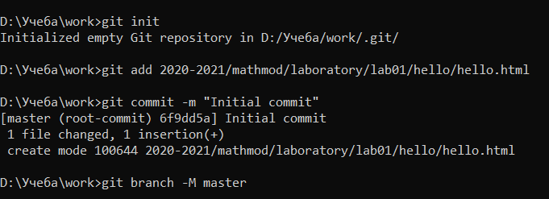

---
## Front matter
lang: ru-RU
title: "Отчет по лабораторной работе №1"
subtitle: "Дисциплина: Математическое моделирование"
author: "Дяченко Злата Константиновна, НФИбд-03-18"

## Formatting
toc: false
slide_level: 2
theme: metropolis
header-includes:
 - \metroset{progressbar=frametitle,sectionpage=progressbar,numbering=fraction}
 - '\makeatletter'
 - '\beamer@ignorenonframefalse'
 - '\makeatother'
aspectratio: 43
section-titles: true

---

## Прагматика выполнения лабораторной работы

 Данная лабораторная работа выполнялась мной для получения новых навыков и знаний в изучаемой области.

## Цель выполнения лабораторной работы

Научиться работать с системой конроля версий git, познакомиться с разметкой Markdown и научиться создавать отчеты и презентации.

##Задачи выполнения лабораторной работы

- Создание логина на GitHub
- Загрузка ssh-ключей на него
{#fig:003 width=70%}

##Задачи выполнения лабораторной работы
- Создание каталогов
- Создание репозитория
{#fig:005 width=70%}

##Задачи выполнения лабораторной работы
- Создание релиза
- Соблюдение правильных коммитов и семантических версий

## Результаты выполнения лабораторной работы

Результатом выполнения работы стал [репозиторий на GitHub] (https://github.com/ZlataDyachenko/workD), который отражает проделанную мной работу и полученные новые знания. Кроме того, имеется [скринкаст выполнения лабораторной работы] (https://www.youtube.com/watch?v=Gbjntgiafgg).
