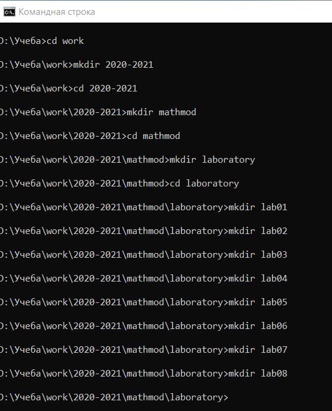
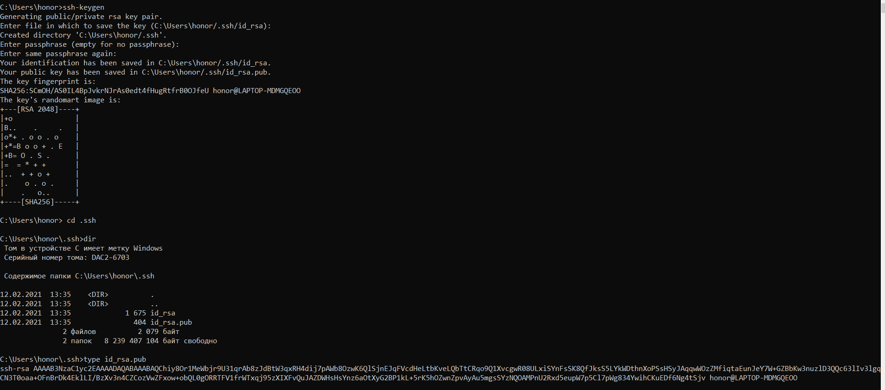
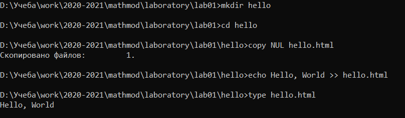
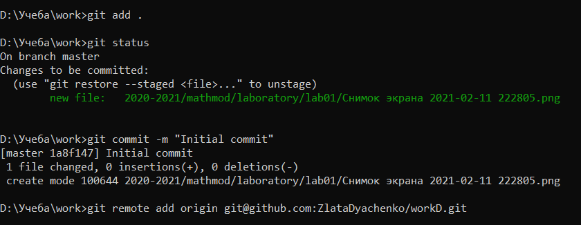
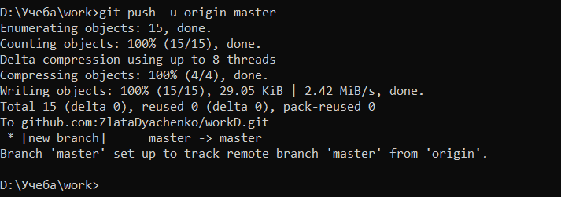
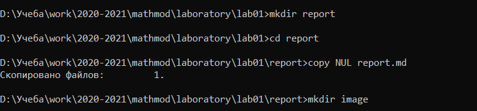
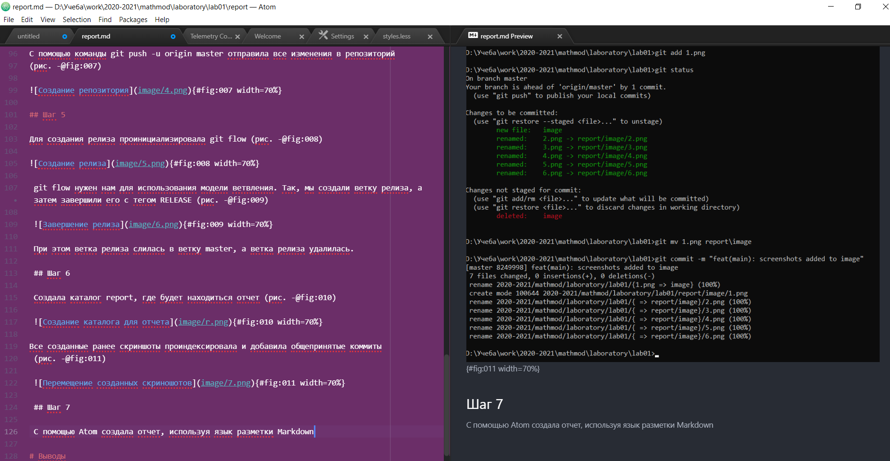

---
# Front matter
lang: ru-RU
title: "Отчет по лабораторной работе №1"
subtitle: "Дисциплина: Математическое моделирование"
author: "Дяченко Злата Константиновна, НФИбд-03-18"

# Formatting
toc-title: "Содержание"
toc: true # Table of contents
toc_depth: 2
lof: true # List of figures
lot: true # List of tables
fontsize: 12pt
linestretch: 1.5
papersize: a4paper
documentclass: scrreprt
polyglossia-lang: russian
polyglossia-otherlangs: english
mainfont: PT Serif
romanfont: PT Serif
sansfont: PT Sans
monofont: PT Mono
mainfontoptions: Ligatures=TeX
romanfontoptions: Ligatures=TeX
sansfontoptions: Ligatures=TeX,Scale=MatchLowercase
monofontoptions: Scale=MatchLowercase
indent: true
pdf-engine: lualatex
header-includes:
  - \linepenalty=10 # the penalty added to the badness of each line within a paragraph (no associated penalty node) Increasing the value makes tex try to have fewer lines in the paragraph.
  - \interlinepenalty=0 # value of the penalty (node) added after each line of a paragraph.
  - \hyphenpenalty=50 # the penalty for line breaking at an automatically inserted hyphen
  - \exhyphenpenalty=50 # the penalty for line breaking at an explicit hyphen
  - \binoppenalty=700 # the penalty for breaking a line at a binary operator
  - \relpenalty=500 # the penalty for breaking a line at a relation
  - \clubpenalty=150 # extra penalty for breaking after first line of a paragraph
  - \widowpenalty=150 # extra penalty for breaking before last line of a paragraph
  - \displaywidowpenalty=50 # extra penalty for breaking before last line before a display math
  - \brokenpenalty=100 # extra penalty for page breaking after a hyphenated line
  - \predisplaypenalty=10000 # penalty for breaking before a display
  - \postdisplaypenalty=0 # penalty for breaking after a display
  - \floatingpenalty = 20000 # penalty for splitting an insertion (can only be split footnote in standard LaTeX)
  - \raggedbottom # or \flushbottom
  - \usepackage{float} # keep figures where there are in the text
  - \floatplacement{figure}{H} # keep figures where there are in the text
---
# Цель работы

Научиться работать с системой конроля версий git, познакомиться с разметкой Markdown и научиться создавать отчеты и презентации.

# Задание

- Создание логина на GitHub
- Загрузка ssh-ключей на него
- Создание каталогов
- Создание репозитория
- Создание релиза
- Соблюдение правильных коммитов и семантических версий

# Объект и предмет исследования

Объектом исследований в данной лабораторной работе является система котроля версий git, а предметом исследования - взаимодействие с git и использование платформы GitHub для размещение git-репозиториев.

# Условные обозначения и термины

**Git** - это инструмент, позволяющий реализовать распределённую систему контроля версий.

**GitHub** - это сервис для проектов, использующих Git.

**Коммит** - сохранение состояния, фиксация изменений.

**Репозиторий Git** — каталог файловой системы, в котором находятся: файлы конфигурации, файлы журналов операций, выполняемых над репозиторием, индекс расположения файлов и хранилище, содержащее сами контролируемые файлы.

# Выполнение лабораторной работы

## Шаг 1

Сначала я создала необходимую структуру каталогов (рис. -@fig:001)

{ #fig:001 width=70% }

## Шаг 2

У меня уже был логин на GitHub, поэтому я перешла к созданию ssh ключа (рис. -@fig:002)

{#fig:002 width=70%}

После я добавила его в свой аккаунт (рис. -@fig:003)

{#fig:003 width=70%}

## Шаг 3

Следуя указаниям из файла git.pdf, для тренировки создала каталог hello и файл hello.html в нем (рис. -@fig:004)

{#fig:004 width=70%}

## Шаг 4

Создала репозиторий, добавила туда файл hello.html и сделала коммит (рис. -@fig:005)

{#fig:005 width=70%}  

После я добавила созданный скриншот и оставила коммит, после чего выполнила команду git remote add origin, чтобы установить подключение к серверу и репозиторию на нем   (рис. -@fig:006)

{#fig:006 width=70%}

С помощью команды git push -u origin master отправила все изменения в репозиторий
(рис. -@fig:007)

{#fig:007 width=70%}

## Шаг 5

Для создания релиза проинициализировала git flow (рис. -@fig:008)

{#fig:008 width=70%}

 git flow нужен нам для использования модели ветвления. Так, мы создали ветку релиза, а затем завершили его с тегом RELEASE (рис. -@fig:009)

 {#fig:009 width=70%}

 При этом ветка релиза слилась в ветку master, а ветка релиза удалилась.

 ## Шаг 6

 Создала каталог report, где будет находиться отчет (рис. -@fig:010)

 {#fig:010 width=70%}

Все созданные ранее скриншоты проиндексировала и добавила общепринятые коммиты
 (рис. -@fig:011)

 {#fig:011 width=70%}

 ## Шаг 7

 С помощью Atom создала отчет, используя язык разметки Markdown (рис. -@fig:012)

 {#fig:012 width=70%}

# Выводы

Я научилась работать с git и с разметкой Markdown. Результатом работы стал [репозиторий на GitHub] (https://github.com/ZlataDyachenko/workD) и [скринкаст выполнения лабораторной работы] (https://www.youtube.com/watch?v=Gbjntgiafgg). Кроме того имеется [скринкаст презентации] (https://www.youtube.com/watch?v=0BD89y7bghQ).
