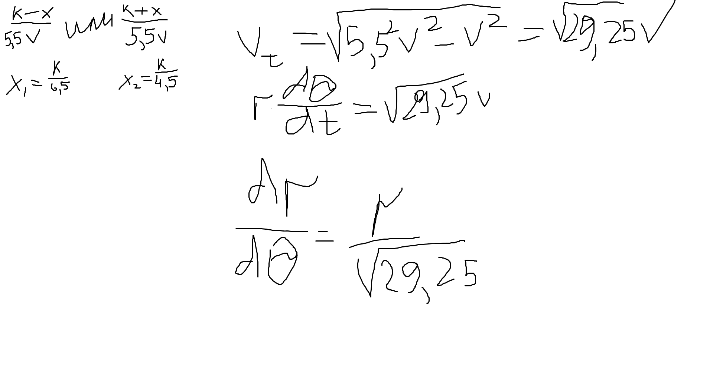
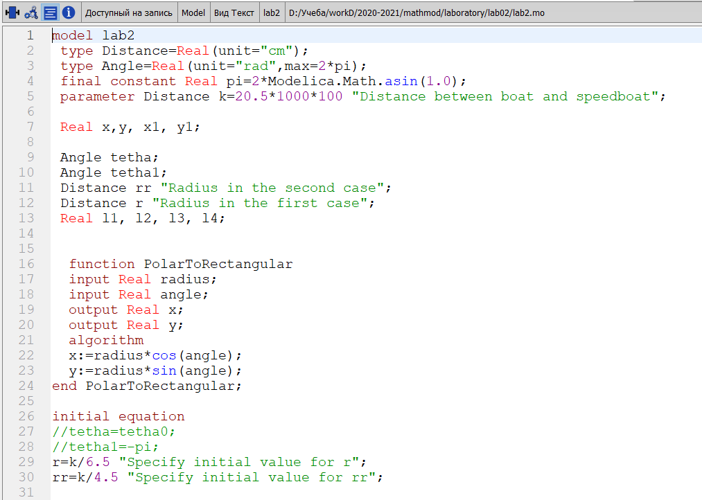
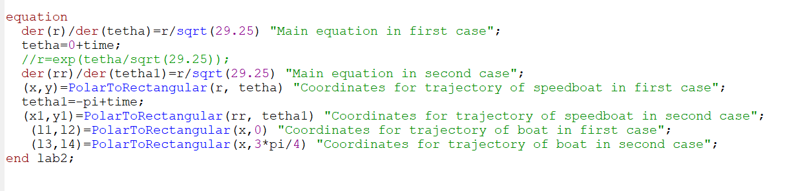
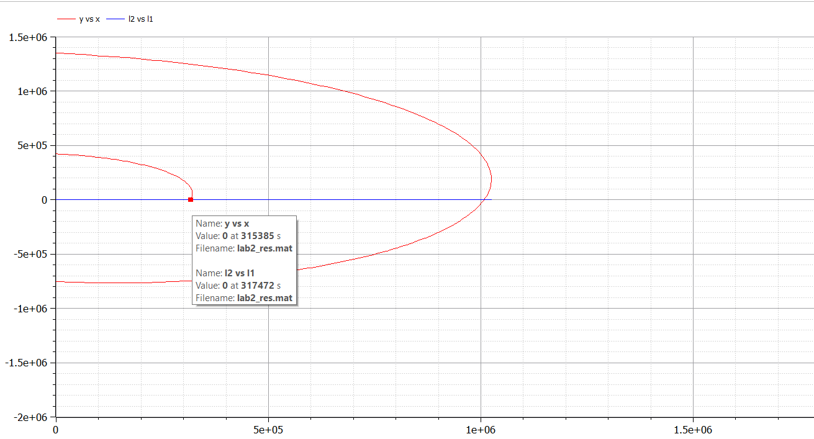
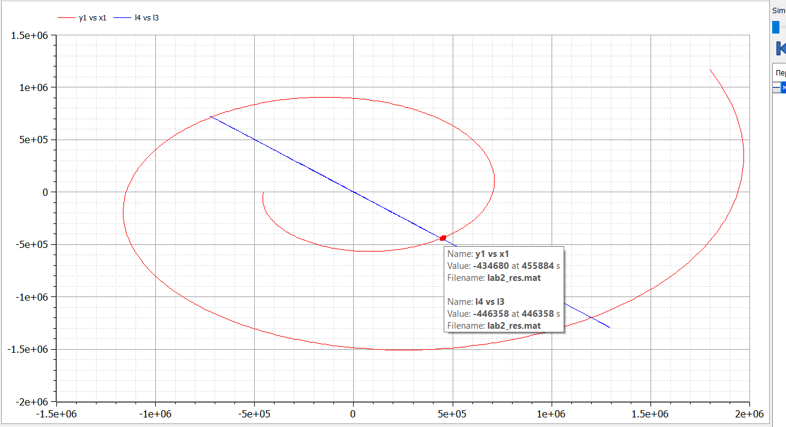

---
## Front matter
lang: ru-RU
title: "Отчет по лабораторной работе 2"
subtitle: "Дисциплина: Математическое моделирование"
author: "Дяченко Злата Константиновна, НФИбд-03-18"

## Formatting
toc: false
slide_level: 2
theme: metropolis
header-includes:
 - \metroset{progressbar=frametitle,sectionpage=progressbar,numbering=fraction}
 - '\makeatletter'
 - '\beamer@ignorenonframefalse'
 - '\makeatother'
aspectratio: 43
section-titles: true

---

## Прагматика выполнения лабораторной работы

 Данная лабораторная работа выполнялась мной для получения знаний в области математического моделирования и решения задачи о погоне.

## Цель выполнения лабораторной работы

Построить математическую модель для выбора правильной стратегии при решении задачи о погоне.

## Задачи выполнения лабораторной работы

- Провести рассуждения и вывод дифференциальных уравнений, если скорость катера больше скорости лодки в 5.5 раз.

$\frac{dr}{d\theta} = \frac{r}{\sqrt{29.25}}$, где первый случай начальных условий
$\begin{cases}
    \theta_{0} = 0 \\
    r_{0}=\frac{k}{6.5}
  \end{cases}$
, а второй случай

$\begin{cases}
    \theta_{0} = -\pi \\
    r_{0}=\frac{k}{4.5}
  \end{cases}$
(рис. -@fig:001)

{#fig:001 width=70%}

## Задачи выполнения лабораторной работы

- Построить траекторию движения катера и лодки для двух случаев.

Построила модель в Modelica (рис. -@fig:004)

{#fig:004 width=70%}

## Задачи выполнения лабораторной работы

(рис. -@fig:005)

{#fig:005 width=70%}

## Задачи выполнения лабораторной работы

- Определить по графику точку пересечения катера и лодки для первого случая.

(рис. -@fig:002).

{#fig:002 width=70%}

## Задачи выполнения лабораторной работы
- Определить по графику точку пересечения катера и лодки для второго случая.

 (рис. -@fig:003)

{#fig:003 width=70%}

## Результаты выполнения лабораторной работы

Результатом выполнения работы стала построенная математическая модель, которая отражает проделанную мной работу и полученные новые знания.
