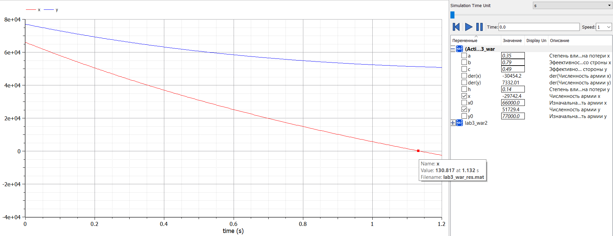

---
## Front matter
lang: ru-RU
title: "Отчет по лабораторной работе 3"
subtitle: "Дисциплина: Математическое моделирование"
author: "Дяченко Злата Константиновна, НФИбд-03-18"

## Formatting
toc: false
slide_level: 2
theme: metropolis
header-includes:
 - \metroset{progressbar=frametitle,sectionpage=progressbar,numbering=fraction}
 - '\makeatletter'
 - '\beamer@ignorenonframefalse'
 - '\makeatother'
aspectratio: 43
section-titles: true

---

## Прагматика выполнения лабораторной работы

 Данная лабораторная работа выполнялась мной для получения знаний в области математического моделирования и знакомства с простейшими моделями боевых действий.

## Цель выполнения лабораторной работы

Изучить и построить математические модели боевых действий.

## Задачи выполнения лабораторной работы

$$ \frac{dx}{dt} =  -0.35x(t)-0.79y(t)+\sin(t+1)+2 $$
$$ \frac{dy}{dt} =  -0.49x(t)-0.14y(t)+\cos(t+2)+1$$

{#fig:001 width=70%}

## Задачи выполнения лабораторной работы

- Построить графики изменения численности войск армии *X* и армии *Y* для боевых действий с участием регулярных войск и партизанских отрядов. (рис. -@fig:002)

$$\frac{dx}{dt} =  -0.258x(t)-0.67y(t)+\sin(2t)+1$$
$$\frac{dy}{dt} =  -0.46x(t)y(t)-0.31y(t)+\cos(t)+1$$

{#fig:002 width=70%}

## Результаты выполнения лабораторной работы

Результатом выполнения работы стали две построенные математические модели для двух случаев сражений и графики численности войск для каждого случая.
