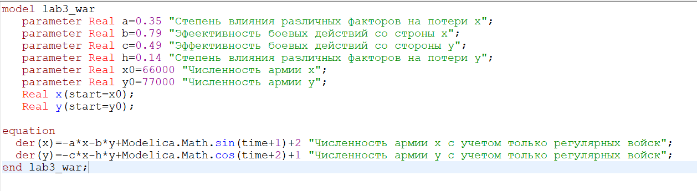
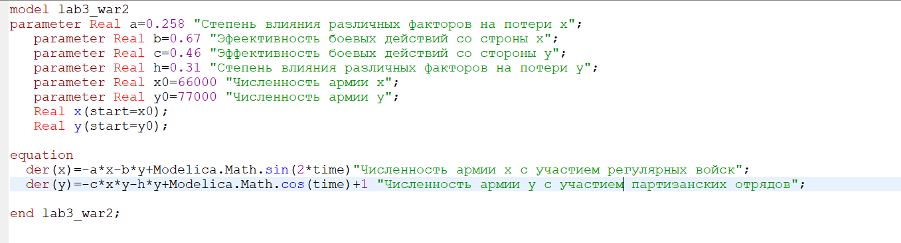

---
# Front matter
lang: ru-RU
title: "Отчет по лабораторной работе №3"
subtitle: "Дисциплина: Математическое моделирование"
author: "Выполнила Дяченко Злата Константиновна, НФИбд-03-18"

# Formatting
toc-title: "Содержание"
toc: true # Table of contents
toc_depth: 2
lof: true # List of figures
lot: true # List of tables
fontsize: 12pt
linestretch: 1.5
papersize: a4paper
documentclass: scrreprt
polyglossia-lang: russian
polyglossia-otherlangs: english
mainfont: PT Serif
romanfont: PT Serif
sansfont: PT Sans
monofont: PT Mono
mainfontoptions: Ligatures=TeX
romanfontoptions: Ligatures=TeX
sansfontoptions: Ligatures=TeX,Scale=MatchLowercase
monofontoptions: Scale=MatchLowercase
indent: true
pdf-engine: lualatex
header-includes:
  - \linepenalty=10 # the penalty added to the badness of each line within a paragraph (no associated penalty node) Increasing the value makes tex try to have fewer lines in the paragraph.
  - \interlinepenalty=0 # value of the penalty (node) added after each line of a paragraph.
  - \hyphenpenalty=50 # the penalty for line breaking at an automatically inserted hyphen
  - \exhyphenpenalty=50 # the penalty for line breaking at an explicit hyphen
  - \binoppenalty=700 # the penalty for breaking a line at a binary operator
  - \relpenalty=500 # the penalty for breaking a line at a relation
  - \clubpenalty=150 # extra penalty for breaking after first line of a paragraph
  - \widowpenalty=150 # extra penalty for breaking before last line of a paragraph
  - \displaywidowpenalty=50 # extra penalty for breaking before last line before a display math
  - \brokenpenalty=100 # extra penalty for page breaking after a hyphenated line
  - \predisplaypenalty=10000 # penalty for breaking before a display
  - \postdisplaypenalty=0 # penalty for breaking after a display
  - \floatingpenalty = 20000 # penalty for splitting an insertion (can only be split footnote in standard LaTeX)
  - \raggedbottom # or \flushbottom
  - \usepackage{float} # keep figures where there are in the text
  - \floatplacement{figure}{H} # keep figures where there are in the text
---
# Цель работы

Изучить и построить математические модели боевых действий.

# Задание

- Построить графики изменения численности войск армии *X* и армии *Y* для боевых действий между регулярными войсками.
- Построить графики изменения численности войск армии *X* и армии *Y* для боевых действий с участием регулярных войск и партизанских отрядов.

# Объект и предмет исследования

Объектом исследования в данной лабораторной работе являются простейшие модели боевых действий, а предметом исследования - конкретные два случая боевых действий и графики изменения численности войск для них.

# Теоретические вводные данные

В общем случае главной характеристикой соперников являются численности сторон. Если в какой-то момент времени одна из численностей обращается в нуль, то данная сторона считается проигравшей (при условии, что численность другой стороны в данный момент положительна).
Модель боевых действий между регулярными войсками описывается следующим образом

$$ \frac{dx}{dt} =  -a(t)x(t)-b(t)y(t)+P(t) $$
$$ \frac{dy}{dt} =  -c(t)x(t)-h(t)y(t)+Q(t)$$

Потери, не связанные с боевыми действиями, описывают члены $-a(t)x(t) и -h(t)y(t)$. Коэффициенты $a(t), h(t)$ характеризуют степень влияния различных факторов на потери. Члены $-b(t)y(t)$ и $-c(t)x(t)$ отражают потери на поле боя. Коэффициенты $b(t)$ и $c(t)$ указывают на эффективность боевых действий со строны $y$ и $x$ соответственно. Функции $P(t)$, $Q(t)$ учитывают возможность подхода подкрепления к войскам $X$ и $Y$ в течение одного дня.

Нерегулярные войска в отличии от постоянной армии менее уязвимы, так как действуют скрытно, в этом случае сопернику приходится действовать неизбирательно, по площадям, занимаемым партизанами. Поэтому считается, что темп потерь партизан, проводящих свои операции в разных местах на некоторой известной территории, пропорционален не только численности армейских соединений, но и численности самих партизан. В результате модель принимает вид:

$$\frac{dx}{dt} =  -a(t)x(t)-b(t)y(t)+P(t)$$
$$\frac{dy}{dt} =  -c(t)x(t)y(t)-h(t)y(t)+Q(t)$$

# Выполнение лабораторной работы

## Изначальные данные

Мой вариант 61. Между страной Х и страной У идет война. Численность состава войск исчисляется от начала войны, и являются временными функциями $x(t)$ и $y(t)$. В начальный момент времени страна $Х$ имеет армию численностью 66 000 человек, а в распоряжении страны $У$ армия численностью в 77 000 человек. Для упрощения модели считаем, что коэффициенты $a,b,c,h$ постоянны. Также считаем $P(t)$ и $Q(t)$ непрерывные функции.
Модель боевых действий между регулярными войсками

$$ \frac{dx}{dt} =  -0.35x(t)-0.79y(t)+\sin(t+1)+2 $$
$$ \frac{dy}{dt} =  -0.49x(t)-0.14y(t)+\cos(t+2)+1$$

Модель ведения боевых действий с участием регулярных войск и партизанских отрядов

$$\frac{dx}{dt} =  -0.258x(t)-0.67y(t)+\sin(2t)+1$$
$$\frac{dy}{dt} =  -0.46x(t)y(t)-0.31y(t)+\cos(t)+1$$

## Шаг 1

Я построила модель боевых действий между регулярными войсками (рис. -@fig:001)

{#fig:001 width=70%}

## Шаг 2

Построила графики изменения численности войск армии $X$ и армии $Y$ в этом случае (рис. -@fig:002)
Из графиков видно, что армия $X$ потерпит поражение.

{#fig:002 width=70%}

## Шаг 3

Построила модель боевых действий при условии, что у армии $X$ регулярные войска, а у армии  $Y$ партизанские отряды  (рис. -@fig:003)

{#fig:003 width=70%}

## Шаг 4

Построила графики изменения численности войск армии $X$ и армии $Y$ для этого случая (рис. -@fig:004)
Из графиков видно, что армия $Y$ потерпит поражение. Все дело в том, что при рассмотрении уравнения простейшей модели, где есть лишь коэффициенты $b$ и $c$, решение имеет вид $\frac{b}{2}x^2(0)-cy(0)=C_{1}$, откуда можно сделать вывод, что чтобы одержать победу партизанам необходимо увеличить коэффициент $c$ и повысить свою начальную численность на соответствующую величину. Причем это увеличение, с ростом начальной численности регулярных войск ($x(0)$), должно расти не линейно, а пропорционально второй степени x(0). Таким образом, регулярные войска находятся в более выгодном положении.

{#fig:004 width=70%}

# Выводы

Я построила математические модели сражений для двух случаев: борьбы регулярных отрядов и борьбы регулярного отряда и партизанских войск. Результаты работы находятся в [репозитории на GitHub] (https://github.com/ZlataDyachenko/workD), а также есть [скринкаст выполнения лабораторной работы] (https://www.youtube.com/watch?v=e6vSHGESWg8).
