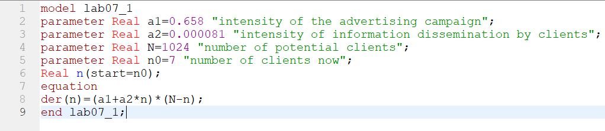
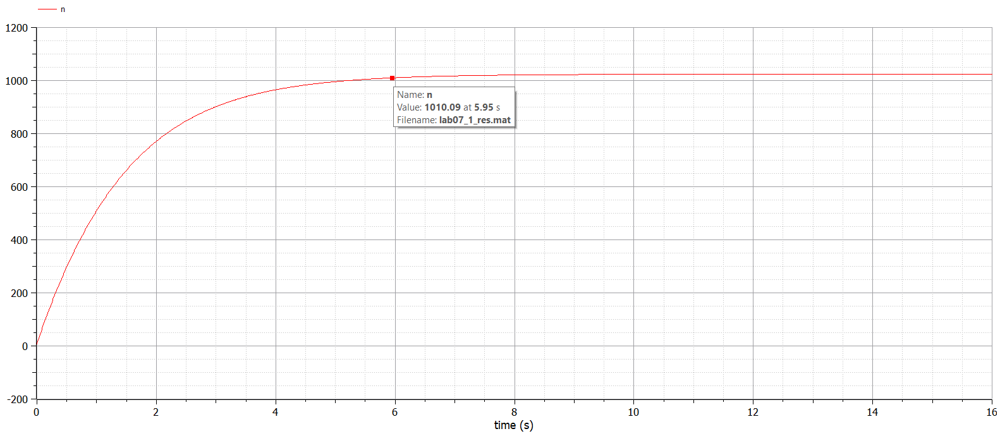
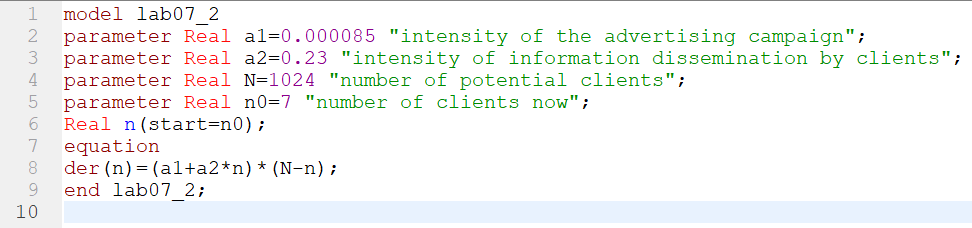
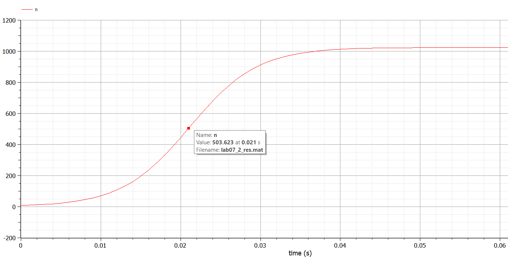
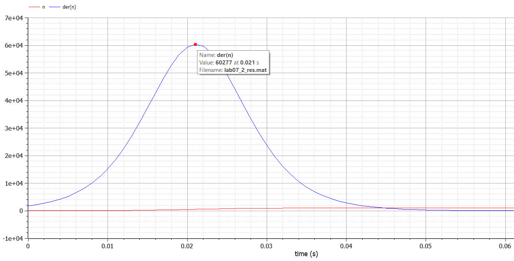
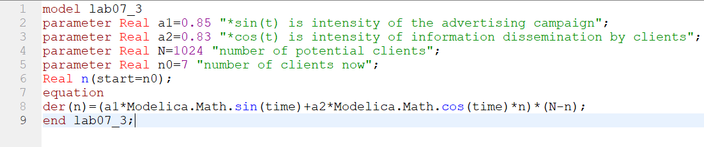
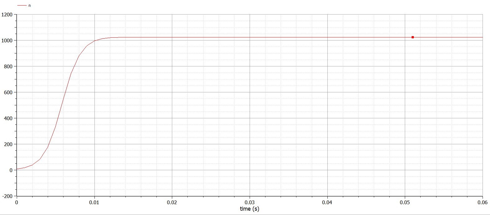

---
# Front matter
lang: ru-RU
title: "Отчет по лабораторной работе №7"
subtitle: "Дисциплина: Математическое моделирование"
author: "Выполнила Дяченко Злата Константиновна, НФИбд-03-18"
teacher: "Преподаватель: Кулябов Дмитрий Сергеевич"

# Formatting
toc-title: "Содержание"
toc: true # Table of contents
toc_depth: 2
lof: true # List of figures
lot: true # List of tables
fontsize: 12pt
linestretch: 1.5
papersize: a4paper
documentclass: scrreprt
polyglossia-lang: russian
polyglossia-otherlangs: english
mainfont: PT Serif
romanfont: PT Serif
sansfont: PT Sans
monofont: PT Mono
mainfontoptions: Ligatures=TeX
romanfontoptions: Ligatures=TeX
sansfontoptions: Ligatures=TeX,Scale=MatchLowercase
monofontoptions: Scale=MatchLowercase
indent: true
pdf-engine: lualatex
header-includes:
  - \linepenalty=10 # the penalty added to the badness of each line within a paragraph (no associated penalty node) Increasing the value makes tex try to have fewer lines in the paragraph.
  - \interlinepenalty=0 # value of the penalty (node) added after each line of a paragraph.
  - \hyphenpenalty=50 # the penalty for line breaking at an automatically inserted hyphen
  - \exhyphenpenalty=50 # the penalty for line breaking at an explicit hyphen
  - \binoppenalty=700 # the penalty for breaking a line at a binary operator
  - \relpenalty=500 # the penalty for breaking a line at a relation
  - \clubpenalty=150 # extra penalty for breaking after first line of a paragraph
  - \widowpenalty=150 # extra penalty for breaking before last line of a paragraph
  - \displaywidowpenalty=50 # extra penalty for breaking before last line before a display math
  - \brokenpenalty=100 # extra penalty for page breaking after a hyphenated line
  - \predisplaypenalty=10000 # penalty for breaking before a display
  - \postdisplaypenalty=0 # penalty for breaking after a display
  - \floatingpenalty = 20000 # penalty for splitting an insertion (can only be split footnote in standard LaTeX)
  - \raggedbottom # or \flushbottom
  - \usepackage{float} # keep figures where there are in the text
  - \floatplacement{figure}{H} # keep figures where there are in the text
---
# Цель работы

Изучить и построить модель рекламной кампании.

# Задание

Построить график распространения рекламы, математическая модель которой описывается следующим уравнением:

  1. $\frac{dn}{dt}=(0.658+0.000081n(t))(N-n(t))$    
  2. $\frac{dn}{dt}=(0.000085+0.23n(t))(N-n(t))$  
  3. $\frac{dn}{dt}=(0.85\sin(t)+0.83\cos(t)n(t))(N-n(t))$  

При этом объем аудитории $N=1024$, в начальный момент о товаре знает 7 человек. Для случая 2 определить, в какой момент времени скорость распространения рекламы будет иметь максимальное значение.  

# Объект и предмет исследования

Объектом исследования в данной лабораторной работе является модель рекламной кампании, а предметом исследования - графики распространения рекламы для трех случаев.

# Теоретические вводные данные

Предположим, что торговыми учреждениями реализуется некоторая продукция, о которой в момент времени $t$ из числа потенциальных покупателей $N$ знает лишь $n$ покупателей. Для ускорения сбыта продукции запускается реклама по радио, телевидению и других средств массовой информации. После запуска рекламной кампании информация о продукции начнет распространяться среди потенциальных покупателей путем общения друг с другом. Таким образом, после запуска рекламных объявлений скорость изменения числа знающих о продукции людей пропорциональна как числу знающих о товаре покупателей, так и числу покупателей о нем не знающих.

Модель рекламной кампании описывается следующими величинами. Считаем, что $\frac{dn}{dt}$ - скорость изменения со временем числа потребителей, узнавших о товаре и готовых его купить, $t$ - время, прошедшее с начала рекламной кампании, $n(t)$ - число уже информированных клиентов. Эта величина пропорциональна числу покупателей, еще не знающих о нем, это описывается следующим образом: $\alpha_1(t)(N-n(t))$, где $N$ - общее число потенциальных платежеспособных покупателей,  $\alpha_1(t)$- характеризует интенсивность рекламной кампании (зависит от затрат на рекламу в данный момент времени). Помимо этого, узнавшие о товаре потребители также распространяют полученную информацию среди потенциальных покупателей, не знающих о нем (в этом случае работает т.н. сарафанное радио). Этот вклад в рекламу описывается величиной $\alpha_2(t)n(t)(N-n(t))$, эта величина увеличивается с увеличением потребителей узнавших о товаре. Математическая модель распространения рекламы описывается уравнением:

$$\frac{dn}{dt}=(\alpha_1(t)+\alpha_2(t)n(t))(N-n(t))$$

# Выполнение лабораторной работы

## Шаг 1

Я построила модель для первого случая, когда $\alpha_1(t)>\alpha_2(t)$, с данными начальными условиями в Modelica. Увидеть это можно на Рисунке 1 (рис. -@fig:001).

{#fig:001 width=70%}

## Шаг 2

Построила график распространения информации о товаре. График изображен на следующем рисунке (рис. -@fig:002)

{#fig:002 width=70%}

## Шаг 3

Построила модель для второго случая, когда $\alpha_1(t)<\alpha_2(t)$ (рис. -@fig:003)  

{#fig:003 width=70%}

## Шаг 4

Построила график распространения информации о товаре, который изображен на Рисунке 4 (рис. -@fig:004)

{#fig:004 width=70%}

## Шаг 5

Построив график $\frac{dn}{dt}$, смогла определить, в какой момент времени скорость распространения рекламы имеет максимальное значение. При шаге в 0.001 это момент времени 0.021  

{#fig:005 width=85%}

## Шаг 6

Построила модель для третьего случая (рис. -@fig:006)  

{#fig:006 width=70%}

## Шаг 7

Построила график распространения информации о товаре, который изображена на Рисунке 7 (рис. -@fig:007). Эту модель можно назвать самой эффективной, так как число людей, знающих о товаре, достигает максимума намного быстрее, чем в первом и втором случаях.

{#fig:007 width=70%}

# Выводы

Я познакомилась с моделью рекламной кампании, рассмотрела ее для трех случаев, построив графики распространения информации о рекламе. Результаты работы находятся в [репозитории на GitHub](https://github.com/ZlataDyachenko/workD), а также есть [скринкаст выполнения лабораторной работы](https://www.youtube.com/watch?v=fLQt1SEeqtA).
