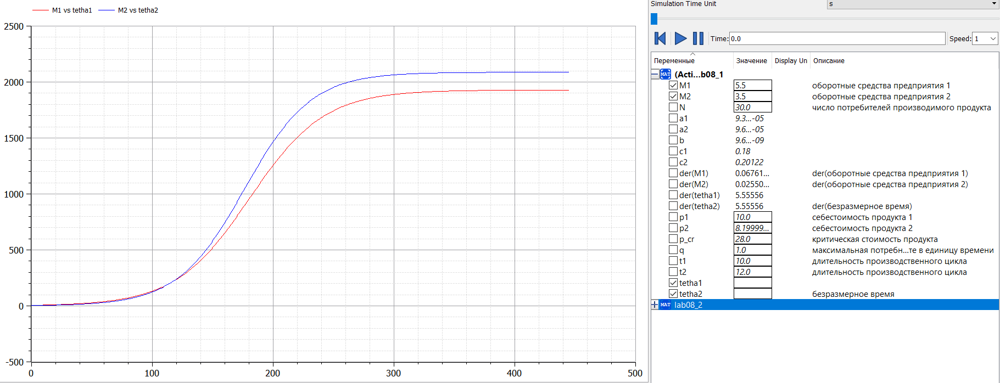
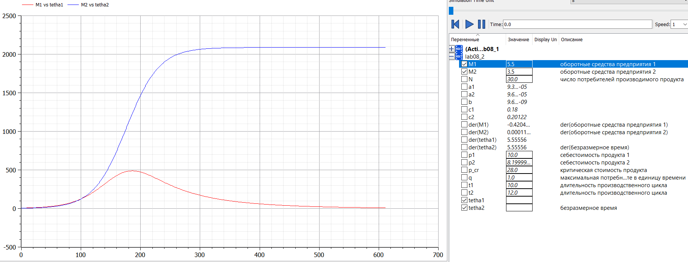

---
## Front matter
lang: ru-RU
title: "Отчет по лабораторной работе 8"
subtitle: "Дисциплина: Математическое моделирование"
author: "Дяченко Злата Константиновна, НФИбд-03-18"

## Formatting
toc: false
slide_level: 2
theme: metropolis
header-includes:
 - \metroset{progressbar=frametitle,sectionpage=progressbar,numbering=fraction}
 - '\makeatletter'
 - '\beamer@ignorenonframefalse'
 - '\makeatother'
aspectratio: 43
section-titles: true

---

## Прагматика выполнения лабораторной работы

 Данная лабораторная работа выполнялась мной для получения знаний в области математического моделирования и решения уравнений модели конкуренции двух фирм.

## Цель выполнения лабораторной работы

Изучить и построить математическую модель конкуренции двух фирм.

## Задачи выполнения лабораторной работы

Построить графики изменения оборотных средств фирмы 1 и фирмы 2 без учета постоянных издержек и с веденной нормировкой для случая, когда конкурентная борьба ведётся только рыночными методами. (рис. -@fig:001)
$$\frac{dM_1}{d\theta}=M_1-\frac{b}{c_1}M_1M_2-\frac{a_1}{c_1}M_1^2$$    
$$\frac{dM_2}{d\theta}=\frac{c_2}{c_1}M_2-\frac{b}{c_1}M_1M_2-\frac{a_2}{c_1}M_2^2$$
$M_0^1=5.5, M_0^2=3.5,  
p_{cr}=28, N=30, q=1,  
\tau_1=10, \tau_2=12, \tilde{p_1}=10, \tilde{p_2}=8.2$  
$a_1=\frac{p_{cr}}{\tau_1^2\tilde{p_1^2}Nq}, a_2=\frac{p_{cr}}{\tau_2^2\tilde{p_2^2}Nq}, b=\frac{p_{cr}}{\tau_1^2\tilde{p_1^2}\tau_2^2\tilde{p_2^2}Nq}, c_1=\frac{p_{cr}-\tilde{p_1}}{\tau_1\tilde{p_1}}, c_2=\frac{p_{cr}-\tilde{p_2}}{\tau_2\tilde{p_2}}$  
$t=c_1\theta$  

## Задачи выполнения лабораторной работы

{#fig:001 width=90%}

## Задачи выполнения лабораторной работы

Построить графики изменения оборотных средств фирмы 1 и фирмы 2 без учета постоянных издержек и с веденной нормировкой для случая, когда, помимо экономического фактора влияния, используются еще и социально-психологические факторы (рис. -@fig:002) . Начальные условия прежние.

$$\frac{dM_1}{d\theta}=M_1-(\frac{b}{c_1}+0.00061)M_1M_2-\frac{a_1}{c_1}M_1^2$$    
$$\frac{dM_2}{d\theta}=\frac{c_2}{c_1}M_2-\frac{b}{c_1}M_1M_2-\frac{a_2}{c_1}M_2^2$$

## Задачи выполнения лабораторной работы

{#fig:002 width=90%}

## Результаты выполнения лабораторной работы

Результатом выполнения работы стала построенная математическая модель конкуренции двух фирм, графики изменения оборотных средств этих фирм в двух случаях, которые отражают проделанную мной работу и полученные новые знания.
