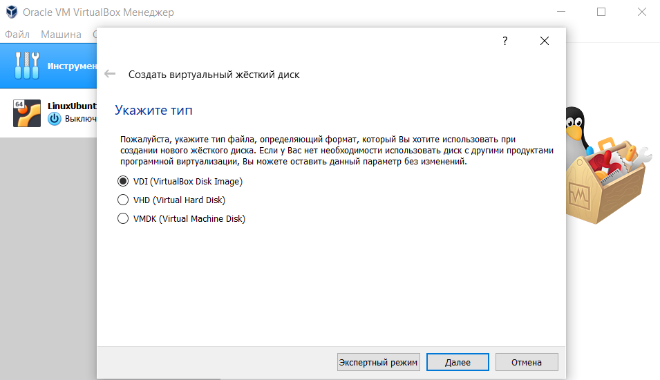
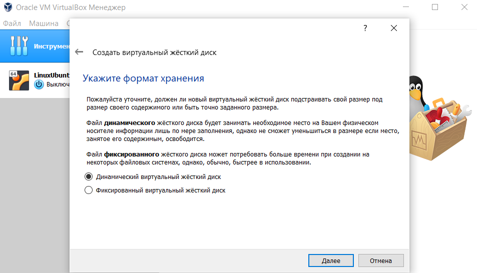
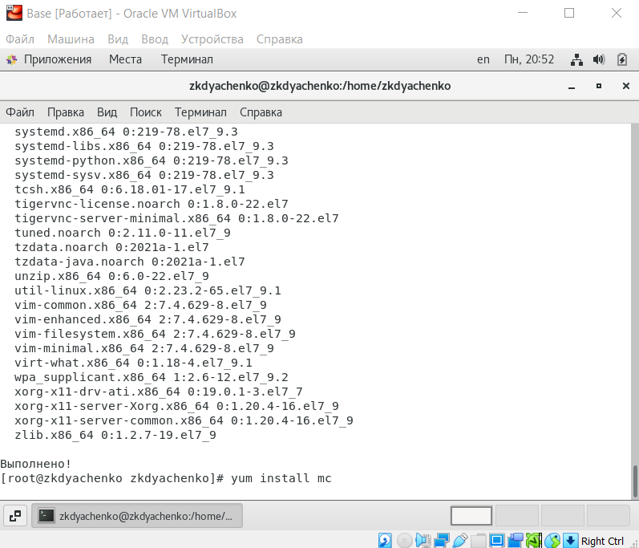
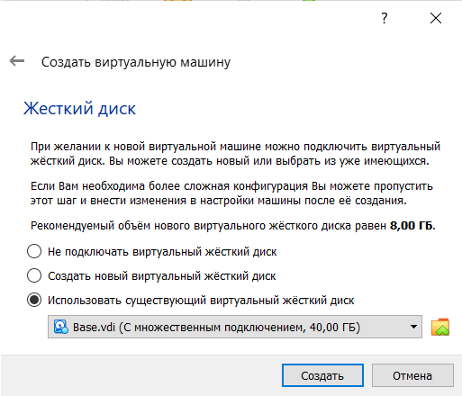

---
## Front matter
lang: ru-RU
title: "Отчет по лабораторной работе 1"
subtitle: "Дисциплина: Информационная безопасность"
author: "Дяченко Злата Константиновна, НФИбд-03-18"

## Formatting
mainfont: PT Serif
romanfont: PT Serif
sansfont: PT Serif
monofont: PT Serif
toc: false
slide_level: 2
theme: metropolis
header-includes: 
 - \metroset{progressbar=frametitle,sectionpage=progressbar,numbering=fraction}
 - '\makeatletter'
 - '\beamer@ignorenonframefalse'
 - '\makeatother'
aspectratio: 43
section-titles: true
---

## Прагматика выполнения лабораторной работы

 Данная лабораторная работа выполнялась мной для приобретения практических навыков установки операционной системы на виртуальную машину, настройки минимально необходимых для дальнейшей работы сервисов.

## Цель выполнения лабораторной работы

Установить на виртуальную машину VirtualBox операционную систему Linux, дистрибутив Centos.

## Задачи выполнения лабораторной работы

Создать виртуальную машину Base.

{#fig:001 width=90%}

## Задачи выполнения лабораторной работы

{#fig:002 width=90%}

## Задачи выполнения лабораторной работы

{#fig:003 width=90%}

## Задачи выполнения лабораторной работы

{#fig:004 width=90%}

## Задачи выполнения лабораторной работы

{#fig:005 width=90%}

## Задачи выполнения лабораторной работы

{#fig:006 width=90%}

## Задачи выполнения лабораторной работы

Добавить новый привод оптических дисков (рис. -@fig:007)

{#fig:007 width=90%}

## Задачи выполнения лабораторной работы

Установить на виртуальную машину операционную систему Linux, дистрибутив Centos.

{#fig:008 width=90%}

## Задачи выполнения лабораторной работы

{#fig:009 width=90%}

## Задачи выполнения лабораторной работы

{#fig:010 width=90%}

## Задачи выполнения лабораторной работы

Создать пользователя, задать root пароль (рис. -@fig:011)

{#fig:011 width=90%}

## Задачи выполнения лабораторной работы

Через вкладку Устройства подключить образ диска Дополнительной гостевой ОС (рис. -@fig:012)

{#fig:012 width=90%}

## Задачи выполнения лабораторной работы

Обновить системные файлы и установить *mc*

{#fig:013 width=90%}

## Задачи выполнения лабораторной работы

{#fig:014 width=70%}

## Задачи выполнения лабораторной работы

Изменить тип диска Base.vdi

{#fig:015 width=90%}

## Задачи выполнения лабораторной работы

Создать новую виртуальную машину с использованием существующего диска

{#fig:016 width=90%}

## Задачи выполнения лабораторной работы

{#fig:017 width=90%}

## Задачи выполнения лабораторной работы

{#fig:018 width=90%}

## Результаты выполнения лабораторной работы

Результатом выполнения работы стала созданная виртуальная машина Base с установленной и настроенной операционной системой, что отражает проделанную мной работу и полученные новые знания.
