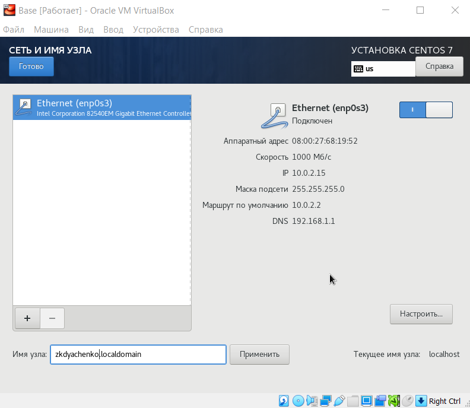
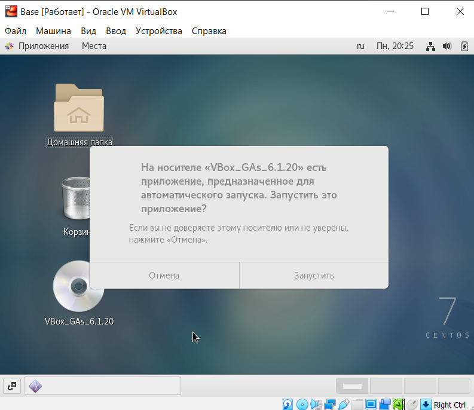
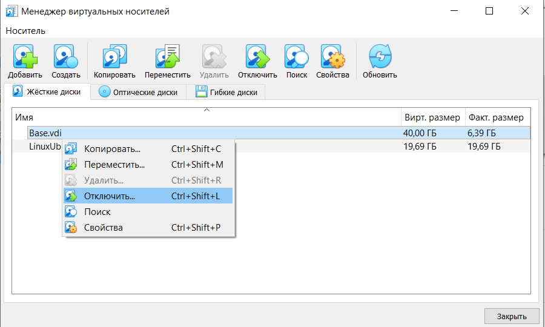

---
# Front matter
lang: ru-RU
title: "Отчет по лабораторной работе №1"
subtitle: "Дисциплина: Информационная безопасность"
author: "Выполнила Дяченко Злата Константиновна, НФИбд-03-18"
teacher: "Преподаватель: Кулябов Дмитрий Сергеевич"

# Formatting
toc-title: "Содержание"
toc: true # Table of contents
toc_depth: 2
lof: true # List of figures
lot: false # List of tables
fontsize: 12pt
linestretch: 1.5
papersize: a4paper
documentclass: scrreprt
polyglossia-lang: russian
polyglossia-otherlangs: english
mainfont: PT Serif
romanfont: PT Serif
sansfont: PT Serif
monofont: PT Serif
mainfontoptions: Ligatures=TeX
romanfontoptions: Ligatures=TeX
sansfontoptions: Ligatures=TeX,Scale=MatchLowercase
monofontoptions: Scale=MatchLowercase
indent: true
pdf-engine: lualatex
header-includes:
  - \linepenalty=10 # the penalty added to the badness of each line within a paragraph (no associated penalty node) Increasing the value makes tex try to have fewer lines in the paragraph.
  - \interlinepenalty=0 # value of the penalty (node) added after each line of a paragraph.
  - \hyphenpenalty=50 # the penalty for line breaking at an automatically inserted hyphen
  - \exhyphenpenalty=50 # the penalty for line breaking at an explicit hyphen
  - \binoppenalty=700 # the penalty for breaking a line at a binary operator
  - \relpenalty=500 # the penalty for breaking a line at a relation
  - \clubpenalty=150 # extra penalty for breaking after first line of a paragraph
  - \widowpenalty=150 # extra penalty for breaking before last line of a paragraph
  - \displaywidowpenalty=50 # extra penalty for breaking before last line before a display math
  - \brokenpenalty=100 # extra penalty for page breaking after a hyphenated line
  - \predisplaypenalty=10000 # penalty for breaking before a display
  - \postdisplaypenalty=0 # penalty for breaking after a display
  - \floatingpenalty = 20000 # penalty for splitting an insertion (can only be split footnote in standard LaTeX)
  - \raggedbottom # or \flushbottom
  - \usepackage{float} # keep figures where there are in the text
  - \floatplacement{figure}{H} # keep figures where there are in the text
---

# Цель работы

Приобретение практических навыков установки операционной системы на виртуальную машину, настройки минимально необходимых для дальнейшей работы сервисов.

# Задание

Установить на виртуальную машину VirtualBox операционную систему Linux, дистрибутив Centos.

# Выполнение лабораторной работы

## Шаг 1

В Свойствах VirtualBox выбрала месторасположение для виртуальных машин, что показано на Рисунке 1 (рис. -@fig:001)

{#fig:001 width=70%}

## Шаг 2

Создала новую виртуальную машину с именем Base, тип операционной системы — Linux, RedHat (рис. -@fig:002). Указала размер основной памяти виртуальной машины — 1024 МБ (рис. -@fig:003)

{#fig:002 width=70%}

{#fig:003 width=70%}

## Шаг 3

Задала конфигурацию жесткого диска - создала новый виртуальный жесткий диск (рис. -@fig:004) и (рис. -@fig:005)

{#fig:004 width=70%}

{#fig:005 width=70%}

## Шаг 3

Формат хранения - динамический (рис. -@fig:006), размер диска 40ГБ, а его расположение - D:\\VirtualBox VMs\\zkdyachenko\\Base\\Base.vdi (рис. -@fig:007)

{#fig:006 width=70%}

{#fig:007 width=70%}

## Шаг 4

Проверила, что папка для снимков виртуальной машины Base имеет путь D:\\VirtualBox VMs\\zkdyachenko\\Base\\Snapshots (рис. -@fig:008)

{#fig:008 width=70%}

## Шаг 5

Зашла в носители виртуальной машины Base и добавила новый привод оптических дисков, выбрав заранее скаченный образ (рис. -@fig:009)

{#fig:009 width=70%}

## Шаг 6

Запустила виртуальную машину Base и выбрала установку системы на жесткий диск (рис. -@fig:010)

{#fig:010 width=70%}

## Шаг 6

Для установки выбрала русский язык (рис. -@fig:011)

{#fig:011 width=70%}

## Шаг 6

Выбрала русскую раскладку клавиатуры, локальный носитель в качестве источника установки, вариант установки - Сервер с GUI и средства разработки, отключила KDUMP и подключила сеть (рис. -@fig:012). В качестве имени узла использовала свой логин (рис. -@fig:014)

{#fig:012 width=70%}

{#fig:013 width=70%}

## Шаг 6

Создала пользователя zkdyachenko и установила пароль (рис. -@fig:014), кроме того задала root пароль (рис. -@fig:015)

{#fig:014 width=70%}

{#fig:015 width=70%}

## Шаг 7

После завершения установки (рис. -@fig:016) перезагрузила виртуальную машину.

{#fig:016 width=70%}

## Шаг 8

Подключилась к виртуальной машине с помощью созданной учетной записи (рис. -@fig:017)

{#fig:017 width=70%}

## Шаг 9

Приступила к установки драйверов для более комфортной работы с виртуальной машиной. Через вкладку Устройства подключила образ диска Дополнительной гостевой ОС (рис. -@fig:018). После установки вновь перезагрузила виртуальную машину.

{#fig:018 width=70%}

## Шаг 10

Запустила терминал и перешла под учетную запись *root* с помощью команды *su*. С помощью команды *yum update* обновила системные файлы (рис. -@fig:019)

{#fig:019 width=70%}

## Шаг 10

Установила *mc* (рис. -@fig:020)

{#fig:020 width=70%}

## Шаг 11

Для того чтобы другие виртуальные машины могли использовать машину Base и её конфигурацию как базовую, в VirtualBox в меню выбрала Файл -> Менеджер виртуальных носителей -> Жёсткие диски и, выделив «Base.vdi», указала "Отключить" (рис. -@fig:021)

{#fig:021 width=70%}

## Шаг 11

Изменила тип носителя на *С множественным подключением* (рис. -@fig:022)

{#fig:022 width=70%}

## Шаг 11

Теперь на основе виртуальной машины Base создала машину Host2, выбрав в VirtualBox Машина -> Создать и в «Мастере создания новой виртуальной машины» указала в качестве имени машины Host2, в качестве типа операционной системы — Linux, версия «RedHat» (рис. -@fig:023), а при конфигурации виртуального жёсткого диска выбрав «Использовать существующий жёсткий диск» Base.vdi (рис. -@fig:024)

{#fig:023 width=70%}

{#fig:024 width=70%}

## Шаг 11

Указала диск Base.vdi в качестве носителя для машины Base (рис. -@fig:025), так как в начале шага отключала его, чтобы изменить тип подключения.

{#fig:025 width=70%}

# Выводы

Я приобрела практические навыки установки операционной системы на виртуальную машину, настройки минимально необходимых для дальнейшей работы сервисов. Результаты работы находятся в [репозитории на GitHub](https://github.com/ZlataDyachenko/workD), а также есть [скринкаст выполнения лабораторной работы](https://www.youtube.com/watch?v=kYHqWaCcI48).
