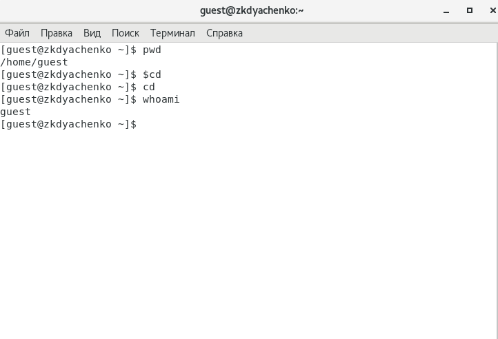

---
## Front matter
lang: ru-RU
title: "Отчет по лабораторной работе 2"
subtitle: "Дисциплина: Информационная безопасность"
author: "Дяченко Злата Константиновна, НФИбд-03-18"

## Formatting
mainfont: PT Serif
romanfont: PT Serif
sansfont: PT Serif
monofont: PT Serif
toc: false
slide_level: 2
theme: metropolis
header-includes:
 - \metroset{progressbar=frametitle,sectionpage=progressbar,numbering=fraction}
 - '\makeatletter'
 - '\beamer@ignorenonframefalse'
 - '\makeatother'
aspectratio: 43
section-titles: true
---

## Прагматика выполнения лабораторной работы

 Данная лабораторная работа выполнялась мной для приобретения практических навыков работы в консоли с атрибутами файлов, закрепления теоретических основ дискреционного разграничения доступа в современных системах с открытым кодом на базе ОС Linux.

## Цель выполнения лабораторной работы

Выполняя все задачи, определить опытным путем минимально необходимые права для выполнения операций внутри директории.

## Задачи выполнения лабораторной работы

В установленной при выполнении предыдущей лабораторной работы операционной системе создать учётную запись пользователя guest и задать пароль для этого пользователя (рис. -@fig:001)

{#fig:001 width=70%}

## Задачи выполнения лабораторной работы

Войти в систему от имени пользователя guest и определить директорию, в которой нахожусь - она является домашней (рис. -@fig:002).

{#fig:002 width=70%}

## Задачи выполнения лабораторной работы

Уточнить имя пользователя командой *whoami* (рис. -@fig:003)

{#fig:003 width=70%}

## Задачи выполнения лабораторной работы

С помощью команды *id* уточнить имя пользователя, его группу, а также группы, куда входит пользователь с помощью команд *id* и *groups* (рис. -@fig:004). Сравнить выведенные значения uid и gid пользователя с их значениями в файле */etc/passwd* (рис. -@fig:005)

{#fig:004 width=60%}

## Задачи выполнения лабораторной работы

{#fig:005 width=70%}

## Задачи выполнения лабораторной работы

Определить существующие в системе директории и права командой *ls -l /home/* (рис. -@fig:006).

{#fig:006 width=70%}

## Задачи выполнения лабораторной работы

Проверить, какие расширенные атрибуты установлены на поддиректориях, находящихся в директории /home, командой *lsattr /home* (рис. -@fig:007).

{#fig:007 width=70%}

## Задачи выполнения лабораторной работы

Создать в домашней директории поддиректорию dir1. Определить, какие права и атрибуты были выставлены (рис. -@fig:008)

{#fig:008 width=70%}

## Задачи выполнения лабораторной работы

Снять с директории dir1 все атрибуты (рис. -@fig:009). Попытаться создать файл (рис. -@fig:010).

{#fig:009 width=70%}

## Задачи выполнения лабораторной работы

{#fig:010 width=70%}

## Задачи выполнения лабораторной работы

Выполняя действия от имени владельца директории (файлов) (рис. -@fig:011), определить опытным путём, какие операции разрешены, а какие нет и заполнить на основе этого Таблицу 1.

{#fig:011 width=70%}

## Задачи выполнения лабораторной работы

{#fig:012 width=75%}

## Задачи выполнения лабораторной работы

{#fig:013 width=75%}

## Задачи выполнения лабораторной работы

{#fig:014 width=75%}

## Задачи выполнения лабораторной работы

{#fig:015 width=75%}

## Задачи выполнения лабораторной работы

На основании заполненной таблицы определила те или иные минимально необходимые права для выполнения операций внутри директории dir1 и заполнила Таблицу 2 (рис. -@fig:016)

{#fig:016 width=75%}

## Результаты выполнения лабораторной работы

Результатом выполнения работы стали заполненные опытным путем таблицы, которые отражают проделанную мной работу. Кроме того, были приобретены практические навыки работы в консоли с атрибутами файлов, закреплены теоретические основы дискреционного разграничения доступа в современных системах с открытым кодом на базе ОС Linux.
