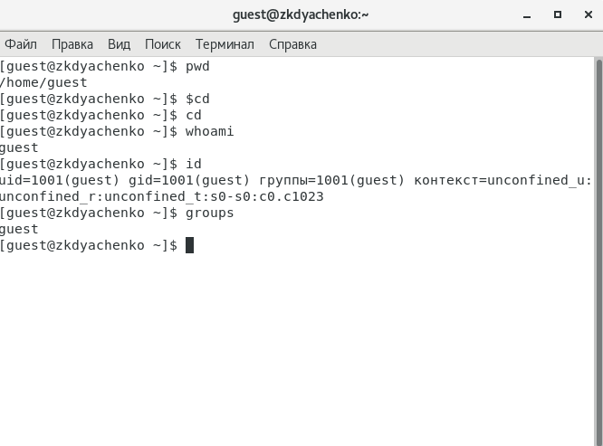
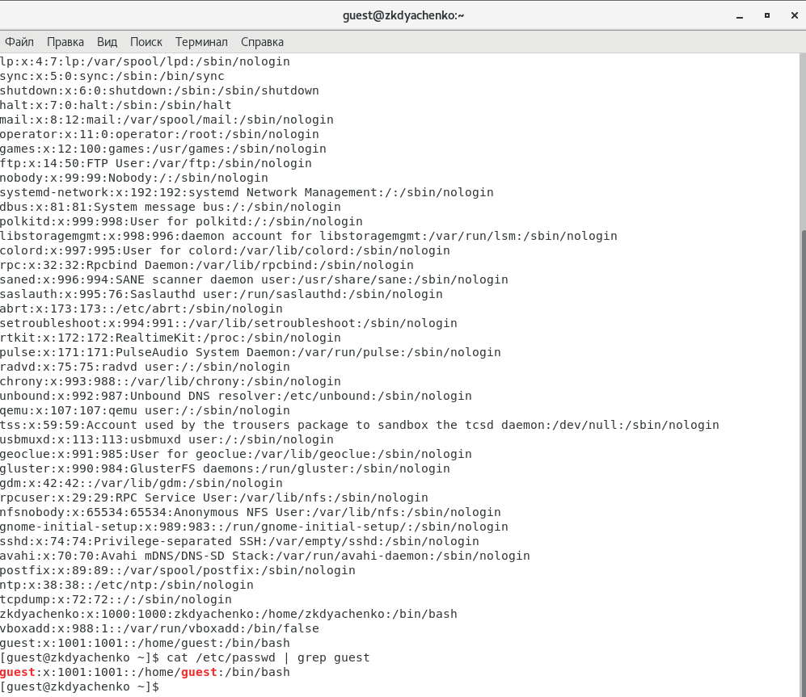
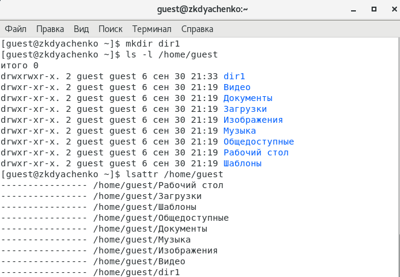
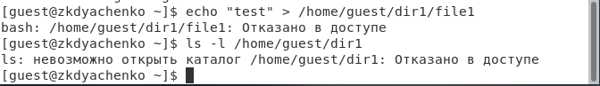
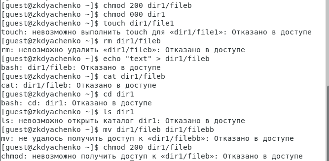
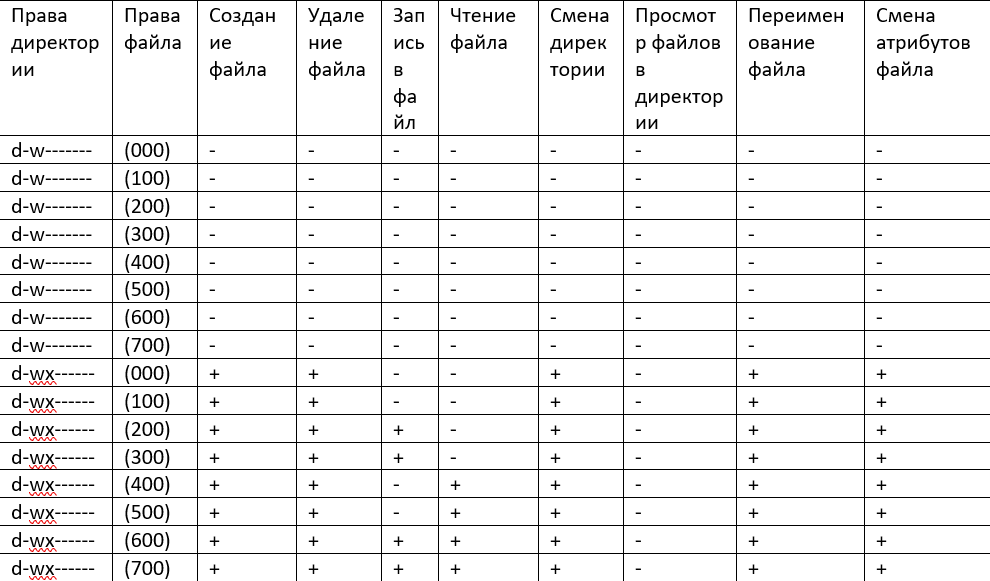
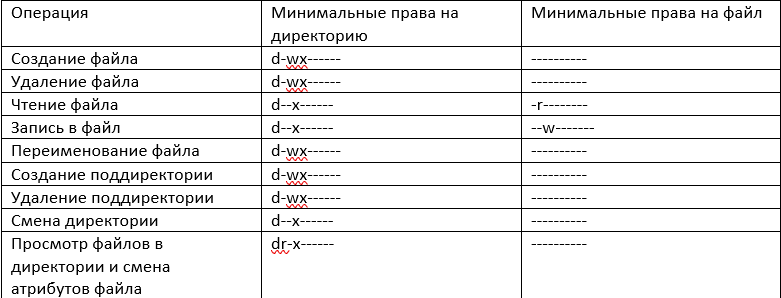

---
# Front matter
lang: ru-RU
title: "Отчет по лабораторной работе №2"
subtitle: "Дисциплина: Информационная безопасность"
author: "Выполнила Дяченко Злата Константиновна, НФИбд-03-18"
teacher: "Преподаватель: Кулябов Дмитрий Сергеевич"

# Formatting
toc-title: "Содержание"
toc: true # Table of contents
toc_depth: 2
lof: true # List of figures
lot: false # List of tables
fontsize: 12pt
linestretch: 1.5
papersize: a4paper
documentclass: scrreprt
polyglossia-lang: russian
polyglossia-otherlangs: english
mainfont: PT Serif
romanfont: PT Serif
sansfont: PT Serif
monofont: PT Serif
mainfontoptions: Ligatures=TeX
romanfontoptions: Ligatures=TeX
sansfontoptions: Ligatures=TeX,Scale=MatchLowercase
monofontoptions: Scale=MatchLowercase
indent: true
pdf-engine: lualatex
header-includes:
  - \linepenalty=10 # the penalty added to the badness of each line within a paragraph (no associated penalty node) Increasing the value makes tex try to have fewer lines in the paragraph.
  - \interlinepenalty=0 # value of the penalty (node) added after each line of a paragraph.
  - \hyphenpenalty=50 # the penalty for line breaking at an automatically inserted hyphen
  - \exhyphenpenalty=50 # the penalty for line breaking at an explicit hyphen
  - \binoppenalty=700 # the penalty for breaking a line at a binary operator
  - \relpenalty=500 # the penalty for breaking a line at a relation
  - \clubpenalty=150 # extra penalty for breaking after first line of a paragraph
  - \widowpenalty=150 # extra penalty for breaking before last line of a paragraph
  - \displaywidowpenalty=50 # extra penalty for breaking before last line before a display math
  - \brokenpenalty=100 # extra penalty for page breaking after a hyphenated line
  - \predisplaypenalty=10000 # penalty for breaking before a display
  - \postdisplaypenalty=0 # penalty for breaking after a display
  - \floatingpenalty = 20000 # penalty for splitting an insertion (can only be split footnote in standard LaTeX)
  - \raggedbottom # or \flushbottom
  - \usepackage{float} # keep figures where there are in the text
  - \floatplacement{figure}{H} # keep figures where there are in the text
---

# Цель работы

Получение практических навыков работы в консоли с атрибутами файлов, закрепление теоретических основ дискреционного разграничения доступа в современных системах с открытым кодом на базе ОС Linux.

# Задание

Выполнить все пункты из файла с указаниями к данной лабораторной работе.

# Выполнение лабораторной работы

## Шаг 1

В установленной при выполнении предыдущей лабораторной работы операционной системе создала учётную запись пользователя guest и задала пароль для этого пользователя, что видно на Рисунке 1 (рис. -@fig:001)

{#fig:001 width=70%}

## Шаг 2

Вошла в систему от имени пользователя guest и определила директорию, в которой нахожусь, командой *pwd* (рис. -@fig:002). Вывод совпадает с приглашением командной строки до знака @. При попытке зайти в домашнюю директорию с помощью команды *cd* (рис. -@fig:002), изменений не происходит. Значит, мы уже находимся в домашней директории.

{#fig:002 width=70%}

## Шаг 3

Уточнила имя пользователя командой *whoami* (рис. -@fig:003)

{#fig:003 width=70%}

## Шаг 3

С помощью команды *id* уточнила имя пользователя, его группу, а также группы, куда входит пользователь с помощью команд *id* и *groups*. Команда *groups* выела лишь название группы, куда входит пользователь, которое совпадает с названием группы, выведенным командой *id* (рис. -@fig:004). Выведенное командой *id* имя пользователя совпадает с приглашением командной строки до знака @ - именно там и указывается имя пользователя, а после знака @ - имя машины.

{#fig:004 width=70%}

## Шаг 4

Просмотрела файл */etc/passwd* командой *cat /etc/passwd* и нашла в нём свою учётную запись. Для вывода лишь строки с информацией о пользователе guest использовала программу grep (рис. -@fig:005). Записанные в этом файле значения uid и gid пользователя совпадают с полученными на предыдущем шаге. (рис. -@fig:005)

{#fig:005 width=70%}

## Шаг 5

Определила существующие в системе директории командой *ls -l /home/* (рис. -@fig:006). Удалось получить список поддиректорий директории /home и увидеть, какие права установлены на директориях. Только у владельцев этих директорий есть права на чтение, изменение и вход в соответствующие директории.

{#fig:006 width=70%}

## Шаг 6

Проверила, какие расширенные атрибуты установлены на поддиректориях, находящихся в директории /home, командой *lsattr /home* (рис. -@fig:007). Удалось увидеть расширенные атрибуты директории данного пользователя - их нет, но не директорий других пользователей - отказано в доступе.

{#fig:007 width=70%}

## Шаг 7

Создала в домашней директории поддиректорию dir1. Определила, что на эту директорию были выставлены права доступа drwxrwxr-x: у владельца папки и группы есть права на чтение, изменение и вход в директорию, у остальных  есть права только на чтение и вход - изменять директорию они не смогут. Расширенные атрибуты для директории dir1 отсутствуют. (рис. -@fig:008)

{#fig:008 width=70%}

## Шаг 8

Сняла с директории dir1 все атрибуты и проверьте правильность выполнения команды с помощью *ls -l* (рис. -@fig:009)

{#fig:009 width=70%}

## Шаг 9

Попыталась создать в директории dir1 файл file1 командой *echo "test" > /home/guest/dir1/file1* , но получила отказ в выполнении операции по созданию файла (рис. -@fig:010), так как нет прав на изменение данной директории. Проверить командой *ls -l /home/guest/dir1* действительно ли файл file1 не находится внутри директории dir1 невозможно, так как у нас нет прав на вход в директорию и просмотр содержимого.

{#fig:010 width=70%}

## Шаг 10

Выполняя действия от имени владельца директории (файлов) (рис. -@fig:011), определила опытным путём, какие операции разрешены, а какие нет и заполнила на основе этого Таблицу 1 (рис. -@fig:012 - рис. --@fig:015).

{#fig:011 width=70%}

{#fig:012 width=70%}

{#fig:013 width=70%}

{#fig:014 width=70%}

{#fig:015 width=70%}

## Шаг 11

На основании заполненной таблицы определила те или иные минимально необходимые права для выполнения операций внутри директории dir1 и заполнила Таблицу 2 (рис. -@fig:016)

{#fig:016 width=75%}

# Выводы

Я получила практические навыки работы в консоли с атрибутами файлов, закрепила теоретические основы дискреционного разграничения доступа в современных системах с открытым кодом на базе ОС Linux, опытным путем выяснила минимальные права на директорию и файлы для совершения операций. Результаты работы находятся в [репозитории на GitHub](https://github.com/ZlataDyachenko/workD), а также есть [скринкаст выполнения лабораторной работы](https://www.youtube.com/watch?v=dcHaduGT-44).
