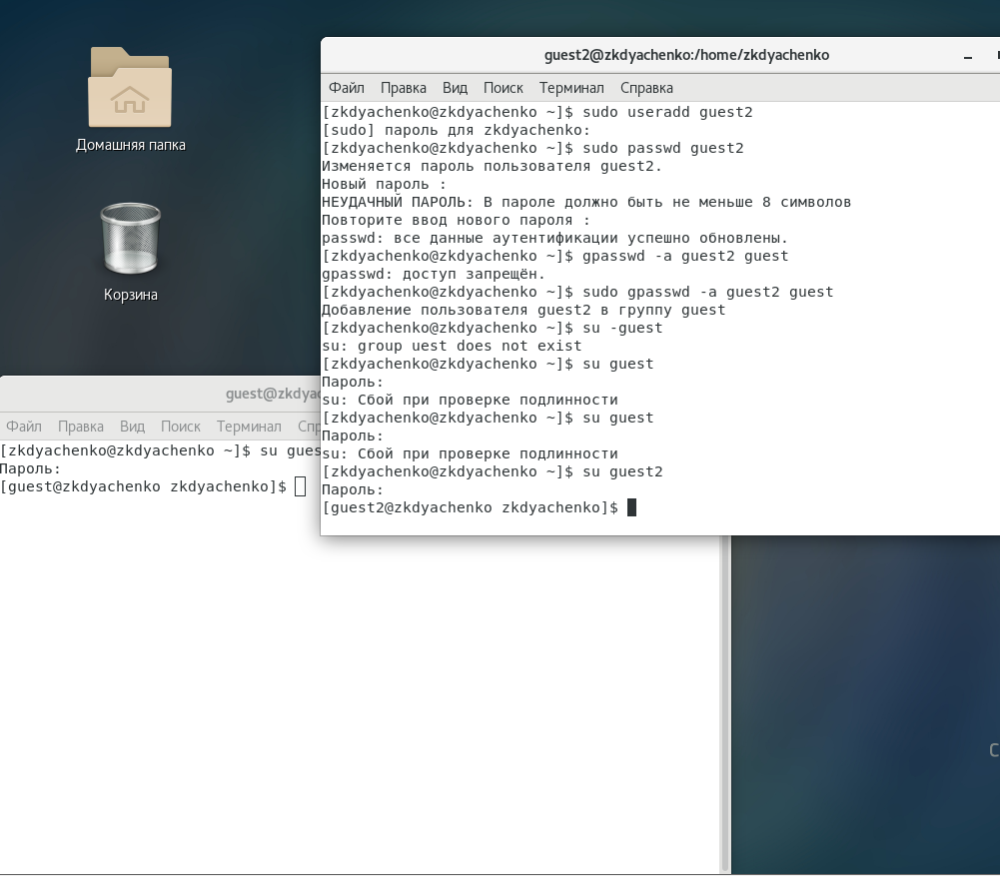

---
## Front matter
lang: ru-RU
title: "Отчет по лабораторной работе 3"
subtitle: "Дисциплина: Информационная безопасность"
author: "Дяченко Злата Константиновна, НФИбд-03-18"

## Formatting
mainfont: PT Serif
romanfont: PT Serif
sansfont: PT Serif
monofont: PT Serif
toc: false
slide_level: 2
theme: metropolis
header-includes:
 - \metroset{progressbar=frametitle,sectionpage=progressbar,numbering=fraction}
 - '\makeatletter'
 - '\beamer@ignorenonframefalse'
 - '\makeatother'
aspectratio: 43
section-titles: true
---

## Прагматика выполнения лабораторной работы

 Данная лабораторная работа выполнялась мной для приобретения практических навыков работы в консоли с атрибутами файлов для групп.

## Цель выполнения лабораторной работы

Выполняя все задачи, определить опытным путем минимально необходимые права для выполнения операций внутри директории.

## Задачи выполнения лабораторной работы

В установленной при выполнении предыдущей лабораторной работы операционной системе создать учётную запись пользователя guest2 и задать пароль для этого пользователя, что видно на Рисунке 1 (рис. -@fig:001)

{#fig:001 width=70%}

## Задачи выполнения лабораторной работы

Добавить пользователя guest2 в группу guest (рис. -@fig:002).

{#fig:002 width=70%}

## Задачи выполнения лабораторной работы

Осуществить вход в систему от двух пользователей на двух разных консолях: guest на первой консоли и guest2 на второй консоли и для обоих пользователей командой *pwd* определить директорию, в которой находимся (рис. -@fig:003).

{#fig:003 width=50%}

## Задачи выполнения лабораторной работы

Определите командами *groups guest* и *groups guest2*, в какие группы входят пользователи guest и guest2. Сравнить вывод команды groups с выводом команд id -Gn и id -G. (рис. -@fig:004)

{#fig:004 width=70%}

## Задачи выполнения лабораторной работы

С помощью команды cat /etc/group просмотреть файл /etc/group (рис. -@fig:005).  

{#fig:005 width=70%}

## Задачи выполнения лабораторной работы

От имени пользователя guest2 выполнить регистрацию пользователя guest2 в группе guest командой *newgrp guest* (рис. -@fig:006).

{#fig:006 width=70%}

## Задачи выполнения лабораторной работы

От имени пользователя guest изменить права директории /home/guest, разрешив все действия для пользователей группы и снять с директории /home/guest/dir1 все атрибуты (рис. -@fig:007)

{#fig:007 width=70%}

## Задачи выполнения лабораторной работы

Выполняя действия от имени владельца директории (файлов) (рис. -@fig:008), определить опытным путём, какие операции разрешены, а какие нет и заполнить на основе этого Таблицу 1.

{#fig:008 width=70%}

## Задачи выполнения лабораторной работы

{#fig:009 width=75%}

## Задачи выполнения лабораторной работы

{#fig:010 width=75%}

## Задачи выполнения лабораторной работы

{#fig:011 width=75%}

## Задачи выполнения лабораторной работы

{#fig:012 width=75%}

## Задачи выполнения лабораторной работы

На основании заполненной таблицы определить те или иные минимально необходимые права для выполнения операций внутри директории dir1 и заполнить Таблицу 2 (рис. -@fig:013)

{#fig:013 width=75%}

## Результаты выполнения лабораторной работы

Результатом выполнения работы стали заполненные опытным путем таблицы, которые отражают проделанную мной работу. Кроме того, были приобретены практические навыки работы в консоли с атрибутами файлов для групп, закреплены теоретические основы дискреционного разграничения доступа в современных системах с открытым кодом на базе ОС Linux.
