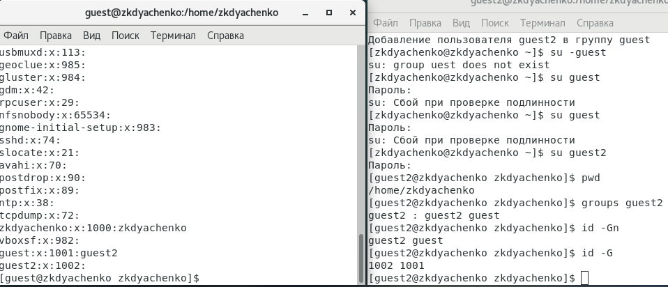
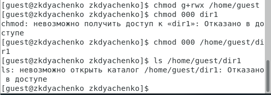
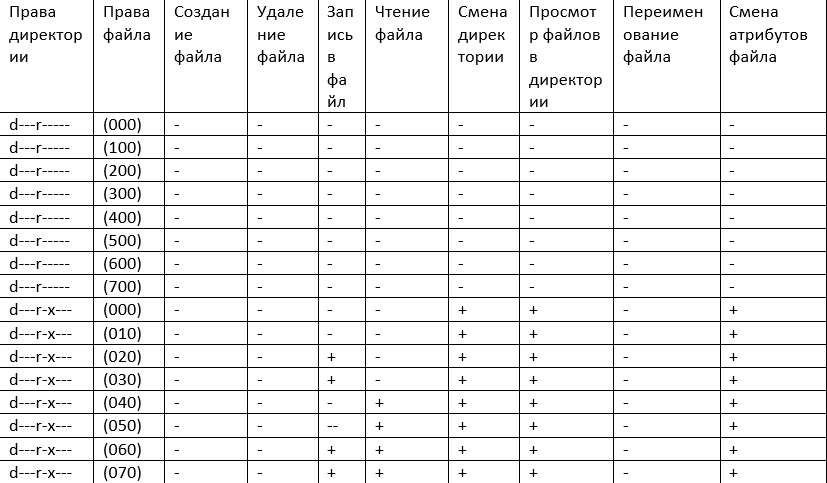
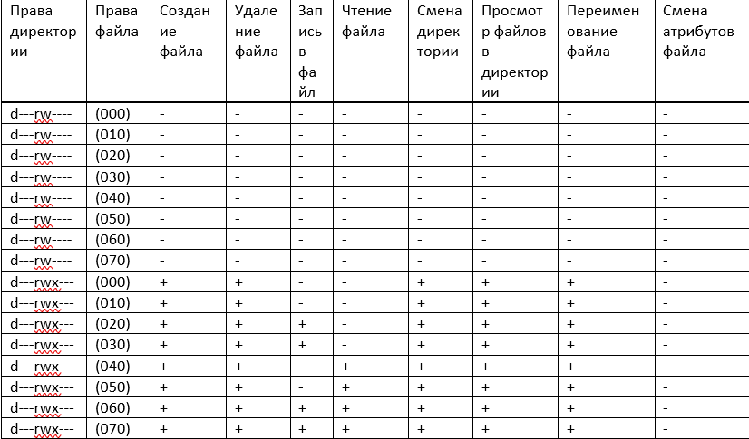

---
# Front matter
lang: ru-RU
title: "Отчет по лабораторной работе №3"
subtitle: "Дисциплина: Информационная безопасность"
author: "Выполнила Дяченко Злата Константиновна, НФИбд-03-18"
teacher: "Преподаватель: Кулябов Дмитрий Сергеевич"

# Formatting
toc-title: "Содержание"
toc: true # Table of contents
toc_depth: 2
lof: true # List of figures
lot: false # List of tables
fontsize: 12pt
linestretch: 1.5
papersize: a4paper
documentclass: scrreprt
polyglossia-lang: russian
polyglossia-otherlangs: english
mainfont: PT Serif
romanfont: PT Serif
sansfont: PT Serif
monofont: PT Serif
mainfontoptions: Ligatures=TeX
romanfontoptions: Ligatures=TeX
sansfontoptions: Ligatures=TeX,Scale=MatchLowercase
monofontoptions: Scale=MatchLowercase
indent: true
pdf-engine: lualatex
header-includes:
  - \linepenalty=10 # the penalty added to the badness of each line within a paragraph (no associated penalty node) Increasing the value makes tex try to have fewer lines in the paragraph.
  - \interlinepenalty=0 # value of the penalty (node) added after each line of a paragraph.
  - \hyphenpenalty=50 # the penalty for line breaking at an automatically inserted hyphen
  - \exhyphenpenalty=50 # the penalty for line breaking at an explicit hyphen
  - \binoppenalty=700 # the penalty for breaking a line at a binary operator
  - \relpenalty=500 # the penalty for breaking a line at a relation
  - \clubpenalty=150 # extra penalty for breaking after first line of a paragraph
  - \widowpenalty=150 # extra penalty for breaking before last line of a paragraph
  - \displaywidowpenalty=50 # extra penalty for breaking before last line before a display math
  - \brokenpenalty=100 # extra penalty for page breaking after a hyphenated line
  - \predisplaypenalty=10000 # penalty for breaking before a display
  - \postdisplaypenalty=0 # penalty for breaking after a display
  - \floatingpenalty = 20000 # penalty for splitting an insertion (can only be split footnote in standard LaTeX)
  - \raggedbottom # or \flushbottom
  - \usepackage{float} # keep figures where there are in the text
  - \floatplacement{figure}{H} # keep figures where there are in the text
---

# Цель работы

Получение практических навыков работы в консоли с атрибутами файлов для групп пользователей.

# Задание

Выполнить все пункты из файла с указаниями к данной лабораторной работе.

# Выполнение лабораторной работы

## Шаг 1

В установленной при выполнении предыдущей лабораторной работы операционной системе создала учётную запись пользователя guest2 и задала пароль для этого пользователя, что видно на Рисунке 1 (рис. -@fig:001)

{#fig:001 width=70%}

## Шаг 2

Добавила пользователя guest2 в группу guest (рис. -@fig:002).

{#fig:002 width=70%}

## Шаг 3

Осуществила вход в систему от двух пользователей на двух разных консолях: guest на первой консоли и guest2 на второй консоли (рис. -@fig:003).

{#fig:003 width=70%}

## Шаг 4
Для обоих пользователей командой *pwd* определила директорию, в которой нахожусь (рис. -@fig:004). Вывод не совпадает с приглашением командной строки до знака @ - это не домашние папки этих пользователей.

{#fig:004 width=70%}

## Шаг 5

Определила командами *groups guest* и *groups guest2*, в какие группы входят пользователи guest и guest2 (рис. -@fig:005). Пользователь guest входит в группу guest, а пользователь guest2 входит в группы guest2 и guest. Команда *id -Gn* выводит названия групп, в которые входит пользователь, а команда *id -G* выводит id этих групп.

{#fig:005 width=70%}

## Шаг 6

С помощью команды cat /etc/group просмотрела файл /etc/group (рис. -@fig:006). Там указаны названия групп guest и guest2, id этих групп и пользователи, которые входят в группу. Все совпадает с выводом команд на предыдущем шага.  

{#fig:006 width=70%}

## Шаг 7

От имени пользователя guest2 выполнила регистрацию пользователя guest2 в группе guest командой *newgrp guest* (рис. -@fig:007).

{#fig:007 width=70%}

## Шаг 8

От имени пользователя guest изменила права директории /home/guest, разрешив все действия для пользователей группы и сняла с директории /home/guest/dir1 все атрибуты (рис. -@fig:008). Теперь невозможно просмотреть содержимое директории dir1.

{#fig:008 width=70%}

## Шаг 9

Создала в папке dir1 file1(рис. -@fig:009). Меняя атрибуты у директории dir1 и файла file1 от имени пользователя guest и делая проверку от пользователя guest2 (рис. -@fig:010), заполнила Таблицу 3 (рис. -@fig:011 - рис. --@fig:014), определив опытным путём, какие операции разрешены, а какие нет. Таблицы из данной лабораторной работы и предыдущей идентичны, за исключением последнего столбца - у меня не получилось изменять права доступа на файл file1 через пользователя guest2.

{#fig:009 width=70%}

{#fig:010 width=70%}

{#fig:011 width=70%}

{#fig:012 width=70%}

{#fig:013 width=70%}

{#fig:014 width=70%}

## Шаг 11

На основании заполненной таблицы определила те или иные минимально необходимые права для выполнения операций внутри директории dir1 и заполнила Таблицу 2 (рис. -@fig:015)

{#fig:015 width=75%}

# Выводы

Я получила практические навыки работы в консоли с атрибутами файлов для групп, опытным путем выяснила минимальные права на директорию и файлы для совершения операций. Результаты работы находятся в [репозитории на GitHub](https://github.com/ZlataDyachenko/workD), а также есть [скринкаст выполнения лабораторной работы](https://www.youtube.com/watch?v=BUGFHr9tvGs).
