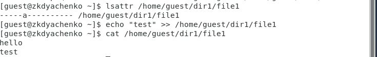
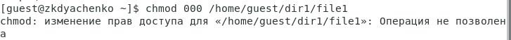
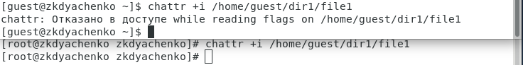
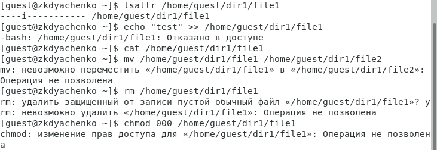

---
## Front matter
lang: ru-RU
title: "Отчет по лабораторной работе 4"
subtitle: "Дисциплина: Информационная безопасность"
author: "Дяченко Злата Константиновна, НФИбд-03-18"

## Formatting
mainfont: PT Serif
romanfont: PT Serif
sansfont: PT Serif
monofont: PT Serif
toc: false
slide_level: 2
theme: metropolis
header-includes:
 - \metroset{progressbar=frametitle,sectionpage=progressbar,numbering=fraction}
 - '\makeatletter'
 - '\beamer@ignorenonframefalse'
 - '\makeatother'
aspectratio: 43
section-titles: true
---

## Прагматика выполнения лабораторной работы

 Данная лабораторная работа выполнялась мной для приобретения практических навыков работы в консоли с расширенными атрибутами файлов.

## Цель выполнения лабораторной работы

Выполняя все задачи, познакомиться с раширенными атрибутами файлов.

## Задачи выполнения лабораторной работы

От имени пользователя *guest* определить расширенные атрибуты файла */home/guest/dir1/file1* командой *lsattr /home/guest/dir1/file1*. Установить на файл file1 права, разрешающие чтение и запись для владельца файла. Попытаться установить на файл */home/guest/dir1/file1* расширенный атрибут *a* от имени пользователя guest (рис. -@fig:001)

{#fig:001 width=70%}

## Задачи выполнения лабораторной работы

Зайти на вторую консоль с правами администратора и попробовать установить расширенный атрибут *a* на файл */home/guest/dir1/file1* от имени суперпользователя (рис. -@fig:002).

{#fig:002 width=70%}

## Задачи выполнения лабораторной работы

От пользователя guest проверить, что атрибут действительно был установлен. Выполнить дозапись в файл file1 слова «test», а после этого выполнить чтение файла, чтобы убедиться, что слово test было успешно записано в file1 (рис. -@fig:003).

{#fig:003 width=70%}

## Задачи выполнения лабораторной работы

Попробовать удалить файл и переименовать его (рис. -@fig:004).

{#fig:004 width=70%}

## Задачи выполнения лабораторной работы

Попробовать установить на файл file1 права, запрещающие чтение и запись для владельца файла (рис. -@fig:005).

{#fig:005 width=70%}

## Задачи выполнения лабораторной работы

Снять расширенный атрибут *a* с файла /home/guest/dirl/file1 от имени суперпользователя и повторить операции, которые ранее не удавалось выполнить (рис. -@fig:006).

{#fig:006 width=70%}

## Задачи выполнения лабораторной работы

Попробовать установить на файл */home/guest/dir1/file1* расширенный атрибут *i* от имени пользователя guest, установить этот атрибут от имени суперпользователя (рис. -@fig:007).

{#fig:007 width=70%}

## Задачи выполнения лабораторной работы

Попробовать выполнить запись в файл, чтение файла, переместить файл, переименовать, изменить права (рис. -@fig:008).

{#fig:008 width=70%}

## Результаты выполнения лабораторной работы

В результате выполнения работы я повысила свои навыки использования интерфейса командой строки, познакомилась на примерах с тем,
как используются расширенные атрибуты при разграничении доступа. Опробовала действие на практике расширенных атрибутов «а» и «i».
