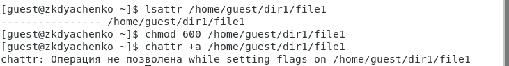
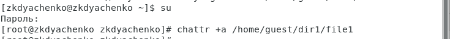
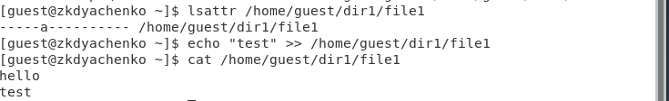
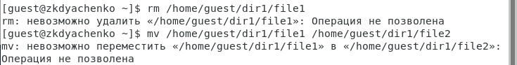
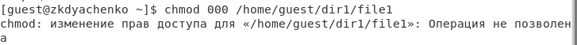
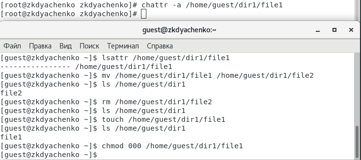
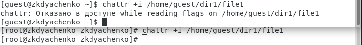
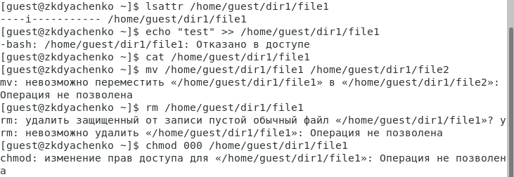

---
# Front matter
lang: ru-RU
title: "Отчет по лабораторной работе №4"
subtitle: "Дисциплина: Информационная безопасность"
author: "Выполнила Дяченко Злата Константиновна, НФИбд-03-18"
teacher: "Преподаватель: Кулябов Дмитрий Сергеевич"

# Formatting
toc-title: "Содержание"
toc: true # Table of contents
toc_depth: 2
lof: true # List of figures
lot: false # List of tables
fontsize: 12pt
linestretch: 1.5
papersize: a4paper
documentclass: scrreprt
polyglossia-lang: russian
polyglossia-otherlangs: english
mainfont: PT Serif
romanfont: PT Serif
sansfont: PT Serif
monofont: PT Serif
mainfontoptions: Ligatures=TeX
romanfontoptions: Ligatures=TeX
sansfontoptions: Ligatures=TeX,Scale=MatchLowercase
monofontoptions: Scale=MatchLowercase
indent: true
pdf-engine: lualatex
header-includes:
  - \linepenalty=10 # the penalty added to the badness of each line within a paragraph (no associated penalty node) Increasing the value makes tex try to have fewer lines in the paragraph.
  - \interlinepenalty=0 # value of the penalty (node) added after each line of a paragraph.
  - \hyphenpenalty=50 # the penalty for line breaking at an automatically inserted hyphen
  - \exhyphenpenalty=50 # the penalty for line breaking at an explicit hyphen
  - \binoppenalty=700 # the penalty for breaking a line at a binary operator
  - \relpenalty=500 # the penalty for breaking a line at a relation
  - \clubpenalty=150 # extra penalty for breaking after first line of a paragraph
  - \widowpenalty=150 # extra penalty for breaking before last line of a paragraph
  - \displaywidowpenalty=50 # extra penalty for breaking before last line before a display math
  - \brokenpenalty=100 # extra penalty for page breaking after a hyphenated line
  - \predisplaypenalty=10000 # penalty for breaking before a display
  - \postdisplaypenalty=0 # penalty for breaking after a display
  - \floatingpenalty = 20000 # penalty for splitting an insertion (can only be split footnote in standard LaTeX)
  - \raggedbottom # or \flushbottom
  - \usepackage{float} # keep figures where there are in the text
  - \floatplacement{figure}{H} # keep figures where there are in the text
---

# Цель работы

Получение практических навыков работы в консоли с расширенными атрибутами файлов.

# Задание

Выполнить все пункты из файла с указаниями к данной лабораторной работе.

# Выполнение лабораторной работы

## Шаг 1

От имени пользователя *guest* определила расширенные атрибуты файла */home/guest/dir1/file1* командой *lsattr /home/guest/dir1/file1* - они отсутствуют. Установила на файл file1 права, разрешающие чтение и запись для владельца файла. Попробовала установить на файл */home/guest/dir1/file1* расширенный атрибут *a* от имени пользователя guest, но в ответ получила отказ от выполнения операции, что видно на Рисунке 1 (рис. -@fig:001)

{#fig:001 width=70%}

## Шаг 2

Зашла на вторую консоль с правами администратора и попробовала установить расширенный атрибут *a* на файл */home/guest/dir1/file1* от имени суперпользователя (рис. -@fig:002).

{#fig:002 width=70%}

## Шаг 3

От пользователя guest проверила, что атрибут действительно был установлен. Выполнила дозапись в файл file1 слова «test», а после этого выполнила чтение файла, чтобы убедиться, что слово test было успешно записано в file1 (рис. -@fig:003).

{#fig:003 width=70%}

## Шаг 4

Попробовала удалить файл и переименовать его, но получила отказ (рис. -@fig:004).

{#fig:004 width=70%}

## Шаг 5

Попробовала установить на файл file1 права, запрещающие чтение и запись для владельца файла, но вновь получила отказ (рис. -@fig:005). Все потому что файл с установленным атрибутом *a* можно открыть только в режиме добавления для записи.

{#fig:005 width=70%}

## Шаг 6

Сняла расширенный атрибут *a* с файла /home/guest/dirl/file1 от имени суперпользователя и повторила операции, которые ранее не удавалось выполнить - теперь выполнилось все (рис. -@fig:006).

{#fig:006 width=70%}

## Шаг 7

Попробовала установить на файл */home/guest/dir1/file1* расширенный атрибут *i* от имени пользователя guest, но в ответ получила отказ от выполнения операции, поэтому установила этот атрибут от имени суперпользователя (рис. -@fig:007).

{#fig:007 width=70%}

## Шаг 8

Попробовала выполнить запись в файл, чтение файла, переместить файл, переименовать, изменить права, но на все получила отказ (рис. -@fig:008), потому что атрибут i делает файл неизменным, что может быть полезно для дополнительной защиты файлов.

{#fig:008 width=70%}

# Выводы

В результате выполнения работы я повысила свои навыки использования интерфейса командой строки, познакомилась на примерах с тем,
как используются расширенные атрибуты при разграничении доступа. Опробовала действие на практике расширенных атрибутов «а» и «i». Результаты работы находятся в [репозитории на GitHub](https://github.com/ZlataDyachenko/workD), а также есть [скринкаст выполнения лабораторной работы](https://www.youtube.com/watch?v=NCvghWVTjuY).
