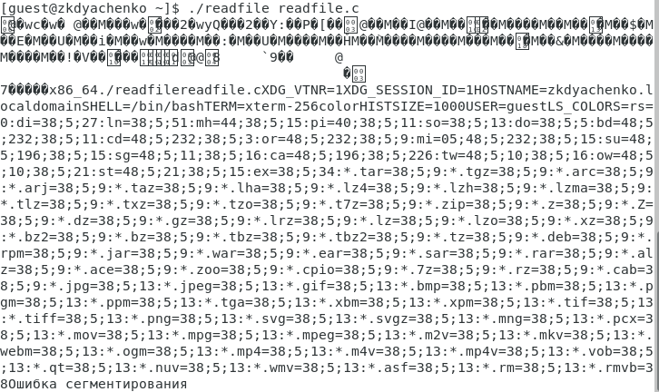

---
## Front matter
lang: ru-RU
title: "Отчет по лабораторной работе 5"
subtitle: "Дисциплина: Информационная безопасность"
author: "Дяченко Злата Константиновна, НФИбд-03-18"

## Formatting
mainfont: PT Serif
romanfont: PT Serif
sansfont: PT Serif
monofont: PT Serif
toc: false
slide_level: 2
theme: metropolis
header-includes:
 - \metroset{progressbar=frametitle,sectionpage=progressbar,numbering=fraction}
 - '\makeatletter'
 - '\beamer@ignorenonframefalse'
 - '\makeatother'
aspectratio: 43
section-titles: true
---

## Прагматика выполнения лабораторной работы

 Данная лабораторная работа выполнялась мной для приобретения практических навыков работы в консоли с дополнительными атрибутами файлов и исследования их влияния.

## Цель выполнения лабораторной работы

Изучить механизмы изменения идентификаторов, применения SetUID- и Sticky-битов. Получить практических навыков работы в консоли с дополнительными атрибутами. Рассмотреть работы механизма смены идентификатора процессов пользователей, а также влияние бита Sticky на запись и удаление файлов.

## Задачи выполнения лабораторной работы

Создать и скомпилировать программу simpleid.c и убедиться, что файл программы создан (рис. -@fig:001).

{#fig:001 width=70%}

## Задачи выполнения лабораторной работы

Выполнить программу simpleid и системную программу id (рис. -@fig:002).

{#fig:002 width=70%}

## Задачи выполнения лабораторной работы

Усложнить программу, добавив вывод действительных идентификаторов, назвать новую программу simpleid2.c. Скомпилировать и запустить simpleid2.c (рис. -@fig:003).

{#fig:003 width=70%}

## Задачи выполнения лабораторной работы

От имени суперпользователя выполнить команду chown, чтобы изменить владельца (пользователя и группу) файла simpleid2 и chmod u+s, чтобы установить SetUID (рис. -@fig:004).

{#fig:004 width=70%}

## Задачи выполнения лабораторной работы

Выполнить проверку правильности установки новых атрибутов и смены владельца файла simpleid2. А затем запустить simpleid2 и id (рис. -@fig:005).

{#fig:005 width=70%}

## Задачи выполнения лабораторной работы

Проделать тоже самое относительно SetGID-бита (рис. -@fig:006).

{#fig:006 width=70%}

## Задачи выполнения лабораторной работы

Создать программу readfile.c  и откомпилировать ее. Сменить владельца у файла readfile.c и изменить права так, чтобы только суперпользователь мог прочитать его, a guest не мог. Проверить, что пользователь guest не может прочитать файл readfile.c (рис. -@fig:007).

{#fig:007 width=70%}

## Задачи выполнения лабораторной работы

Сменить у программы readfile владельца и установить SetUID-бит (рис. -@fig:008).

{#fig:008 width=70%}

## Задачи выполнения лабораторной работы

Проверить, что программа readfile не может прочитать файл readfile.c (рис. -@fig:009).

{#fig:009 width=70%}

## Задачи выполнения лабораторной работы

Проверить, что программа readfile не может прочитать файл /etc/shadow (рис. -@fig:010).

{#fig:010 width=70%}

## Задачи выполнения лабораторной работы

Выяснить, что установлен атрибут Sticky на директории /tmp (рис. -@fig:011). От имени пользователя guest создать файл file01.txt в директории /tmp со словом test. Просмотреть атрибуты у только что созданного файла и разрешить чтение и запись для категории пользователей «все остальные».

{#fig:011 width=70%}

## Задачи выполнения лабораторной работы

От пользователя guest2 прочитать файл /tmp/file01.txt. Проверить, возможно ли дозаписать в файл слово test2, перезаписать файл словом test3 (рис. -@fig:012).

{#fig:012 width=70%}

## Задачи выполнения лабораторной работы

От пользователя guest2 попробовать удалить файл /tmp/file01.txt. Повысить свои права до суперпользователя и выполнить после этого команду, снимающую атрибут t (Sticky-бит) с директории /tmp. (рис. -@fig:013)

{#fig:013 width=70%}

## Задачи выполнения лабораторной работы

От пользователя guest2 проверить, что атрибута t у директории /tmp нет. От пользователя guest2 попробовать прочитать файл /tmp/file01.txt, дозаписать в файл слово test2, записать только слово test3, удалить файл от имени guest2 (рис. -@fig:014).

{#fig:014 width=70%}

## Задачи выполнения лабораторной работы

Повысить свои права до суперпользователя и вернуть атрибут t на директорию /tmp (рис. -@fig:015).

{#fig:015 width=70%}

## Результаты выполнения лабораторной работы

В результате выполнения работы я изучила механизмы изменения идентификаторов, применение SetUID- и Sticky-битов. Были получены практические навыки работы в консоли с дополнительными атрибутами и рассмотрена работа механизма смены идентификатора процессов пользователей, а также влияние бита Sticky на запись и удаление файлов.
