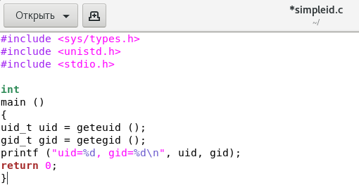
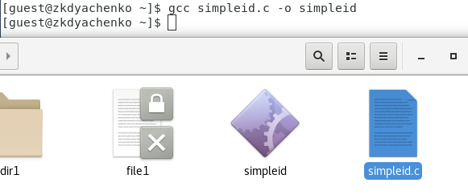
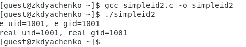
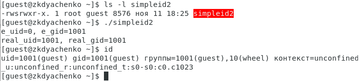
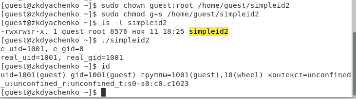
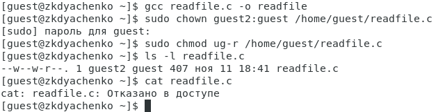
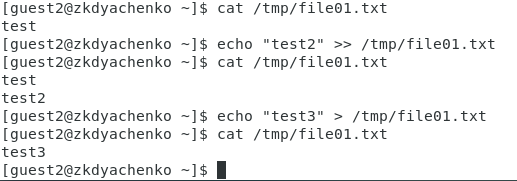
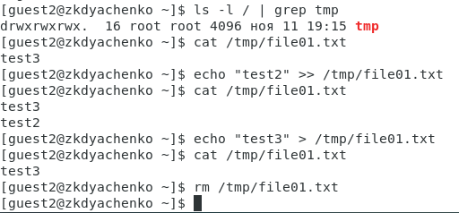

---
# Front matter
lang: ru-RU
title: "Отчет по лабораторной работе №5"
subtitle: "Дисциплина: Информационная безопасность"
author: "Выполнила Дяченко Злата Константиновна, НФИбд-03-18"
teacher: "Преподаватель: Кулябов Дмитрий Сергеевич"

# Formatting
toc-title: "Содержание"
toc: true # Table of contents
toc_depth: 2
lof: true # List of figures
lot: false # List of tables
fontsize: 12pt
linestretch: 1.5
papersize: a4paper
documentclass: scrreprt
polyglossia-lang: russian
polyglossia-otherlangs: english
mainfont: PT Serif
romanfont: PT Serif
sansfont: PT Serif
monofont: PT Serif
mainfontoptions: Ligatures=TeX
romanfontoptions: Ligatures=TeX
sansfontoptions: Ligatures=TeX,Scale=MatchLowercase
monofontoptions: Scale=MatchLowercase
indent: true
pdf-engine: lualatex
header-includes:
  - \linepenalty=10 # the penalty added to the badness of each line within a paragraph (no associated penalty node) Increasing the value makes tex try to have fewer lines in the paragraph.
  - \interlinepenalty=0 # value of the penalty (node) added after each line of a paragraph.
  - \hyphenpenalty=50 # the penalty for line breaking at an automatically inserted hyphen
  - \exhyphenpenalty=50 # the penalty for line breaking at an explicit hyphen
  - \binoppenalty=700 # the penalty for breaking a line at a binary operator
  - \relpenalty=500 # the penalty for breaking a line at a relation
  - \clubpenalty=150 # extra penalty for breaking after first line of a paragraph
  - \widowpenalty=150 # extra penalty for breaking before last line of a paragraph
  - \displaywidowpenalty=50 # extra penalty for breaking before last line before a display math
  - \brokenpenalty=100 # extra penalty for page breaking after a hyphenated line
  - \predisplaypenalty=10000 # penalty for breaking before a display
  - \postdisplaypenalty=0 # penalty for breaking after a display
  - \floatingpenalty = 20000 # penalty for splitting an insertion (can only be split footnote in standard LaTeX)
  - \raggedbottom # or \flushbottom
  - \usepackage{float} # keep figures where there are in the text
  - \floatplacement{figure}{H} # keep figures where there are in the text
---

# Цель работы

Изучение механизмов изменения идентификаторов, применения SetUID- и Sticky-битов. Получение практических навыков работы в консоли с дополнительными атрибутами. Рассмотрение работы механизма смены идентификатора процессов пользователей, а также влияние бита Sticky на запись и удаление файлов.

# Задание

Создать программы и исследовать SetUID- и Sticky-биты.

# Выполнение лабораторной работы

## Шаг 1

Вошла в систему от имени пользователя guest и создала программу simpleid.c, код которой представлен на Рисунке 1 (рис. -@fig:001)

{#fig:001 width=70%}

## Шаг 2

Скомпилировала программу и убедилась, что файл программы создан (рис. -@fig:002).

{#fig:002 width=70%}

## Шаг 3

Выполнила программу simpleid и системную программу id - получила одинаковые результаты (рис. -@fig:003).

{#fig:003 width=70%}

## Шаг 4

Усложнила программу, добавив вывод действительных идентификаторов, назвала новую программу simpleid2.c, а ее код предоставлен на Рисунке 4 (рис. -@fig:004).

{#fig:004 width=70%}

## Шаг 5

Скомпилировала и запустила simpleid2.c (рис. -@fig:005). Теперь мы получаем не только указание на «настоящих» пользователя и группу, «управляющих» процессом, но и на владельца файла.

{#fig:005 width=70%}

## Шаг 6

От имени суперпользователя выполнила команду chown, чтобы изменить владельца (пользователя и группу) файла simpleid2 и chmod u+s, чтобы установить SetUID (рис. -@fig:006).

{#fig:006 width=70%}

## Шаг 7

Выполнила проверку правильности установки новых атрибутов и смены владельца файла simpleid2. А затем запустила simpleid2 и id (рис. -@fig:007). Команда id показывает uid и gid текущего пользователя и группы, а программа simpleid2 показывает также uid и gid владельца файла - uid=0 так как файлом владеет пользователь root, группа совпадает с текущей.

{#fig:007 width=70%}

## Шаг 8

Проделала тоже самое относительно SetGID-бита (рис. -@fig:008).

{#fig:008 width=70%}

## Шаг 9

Создала программу readfile.c (рис. -@fig:009).

{#fig:009 width=70%}

## Шаг 10

Откомпилировала программу. Сменила владельца у файла readfile.c и изменила права так, чтобы только суперпользователь (root) мог прочитать его, a guest не мог. Проверила, что пользователь guest не может прочитать файл readfile.c (рис. -@fig:010).

{#fig:010 width=70%}

## Шаг 11

Сменила у программы readfile владельца и установила SetUID-бит (рис. -@fig:011).

{#fig:011 width=70%}

## Шаг 12

Проверила, что программа readfile не может прочитать файл readfile.c (рис. -@fig:012).

{#fig:012 width=70%}

## Шаг 13

Проверила, что программа readfile не может прочитать файл /etc/shadow, потому что владелец файла программы - guest2 (рис. -@fig:013).

{#fig:013 width=70%}

## Шаг 14

Выяснила, что установлен атрибут Sticky на директории /tmp - в конце списка атрибутов видим t (рис. -@fig:014). От имени пользователя guest создала файл file01.txt в директории /tmp со словом test. Просмотрела атрибуты у только что созданного файла и разрешила чтение и запись для категории пользователей «все остальные».

{#fig:014 width=70%}

## Шаг 15

От пользователя guest2 прочитала файл /tmp/file01.txt. Кроме того, удалось дозаписать в файл слово test2, записать слово test3, стерев при этом всю имеющуюся в файле информацию (рис. -@fig:015).

{#fig:015 width=70%}

## Шаг 16

От пользователя guest2 попробовала удалить файл /tmp/file01.txt, но сделать это не удалось. Повысила свои права до суперпользователя и выполнила после этого команду, снимающую атрибут t (Sticky-бит) с директории /tmp. Затем покинула режим суперпользователя (рис. -@fig:016)

{#fig:016 width=70%}

## Шаг 17

От пользователя guest2 проверила, что атрибута t у директории /tmp нет. От пользователя guest2 прочитала файл /tmp/file01.txt, дозаписала в файл слово test2, записала слово test3, стерев при этом всю имеющуюся в файле информацию. Кроме того, удалось удалить файл от имени guest2, хотя он не был владельцем файла (рис. -@fig:017).

{#fig:017 width=70%}

## Шаг 18

Повысила свои права до суперпользователя и вернула атрибут t на директорию /tmp (рис. -@fig:018).

{#fig:018 width=70%}

# Выводы

В результате работы я изучила механизмы изменения идентификаторов, применение SetUID- и Sticky-битов. Были получены практические навыки работы в консоли с дополнительными атрибутами и рассмотрена работа механизма смены идентификатора процессов пользователей, а также влияние бита Sticky на запись и удаление файлов. Результаты работы находятся в [репозитории на GitHub](https://github.com/ZlataDyachenko/workD), а также есть [скринкаст выполнения лабораторной работы](https://www.youtube.com/watch?v=OipLW7aKabU).
