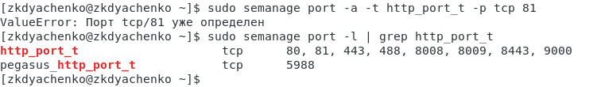
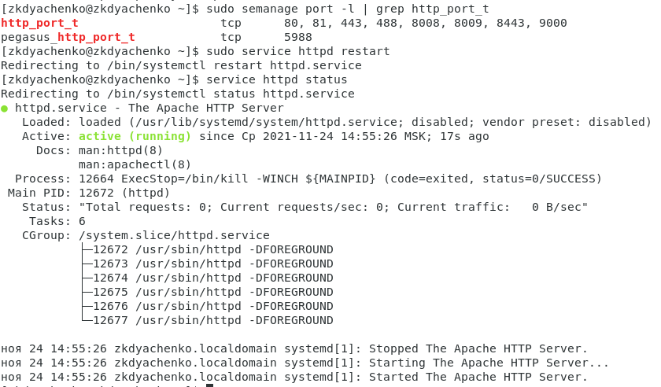
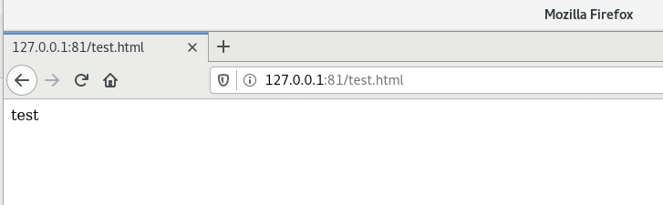
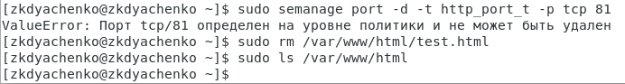

---
## Front matter
lang: ru-RU
title: "Отчет по лабораторной работе 6"
subtitle: "Дисциплина: Информационная безопасность"
author: "Дяченко Злата Константиновна, НФИбд-03-18"

## Formatting
mainfont: PT Serif
romanfont: PT Serif
sansfont: PT Serif
monofont: PT Serif
toc: false
slide_level: 2
theme: metropolis
header-includes:
 - \metroset{progressbar=frametitle,sectionpage=progressbar,numbering=fraction}
 - '\makeatletter'
 - '\beamer@ignorenonframefalse'
 - '\makeatother'
aspectratio: 43
section-titles: true
---

## Прагматика выполнения лабораторной работы

Данная лабораторная работа выполнялась мной для приобретения практических навыков администрирования ОС Linux и знакомства с работой SELinux.

## Цель выполнения лабораторной работы

Развить навыки администрирования ОС Linux. Получить первое практическое знакомство с технологией SELinux. Проверить работу SELinux на практике совместно с веб-сервером Apache.

## Задачи выполнения лабораторной работы

Войти в систему и убедиться, что SELinux работает в режиме enforcing политики targeted. Обратиться с помощью браузера к веб-серверу и запустить его. Найти веб-сервер Apache в списке процессов, определить его контекст безопасности (рис. -@fig:001)

{#fig:001 width=70%}

## Задачи выполнения лабораторной работы

Посмотреть текущее состояние переключателей SELinux для Apache с помощью команды sestatus -bigrep httpd (рис. -@fig:002).

{#fig:002 width=40%}

## Задачи выполнения лабораторной работы

Посмотреть статистику по политике с помощью команды seinfo (рис. -@fig:003).

{#fig:003 width=70%}

## Задачи выполнения лабораторной работы

Создать от имени суперпользователя html-файл /var/www/html/test.html (рис. -@fig:004).

{#fig:004 width=70%}

## Задачи выполнения лабораторной работы

Проверить контекст созданного файла (рис. -@fig:005).

{#fig:005 width=70%}

## Задачи выполнения лабораторной работы

Обратиться к файлу через веб-сервер (рис. -@fig:006).

{#fig:006 width=70%}

## Задачи выполнения лабораторной работы

Изменить контекст файла /var/www/html/test.html с httpd_sys_content_t на на samba_share_t, к которому процесс httpd не имеет доступа. Проверить, что контекст поменялся (рис. -@fig:007).

{#fig:007 width=70%}

## Задачи выполнения лабораторной работы

Попробовать ещё раз получить доступ к файлу через веб-сервер (рис. -@fig:008).

{#fig:008 width=70%}

## Задачи выполнения лабораторной работы

Просмотреть лог-файл tail /var/log/messages и /var/log/audit/audit.log

## Задачи выполнения лабораторной работы

Попробовать запустить веб-сервер Apache на прослушивание ТСР-порта 81 (рис. -@fig:009).

{#fig:009 width=70%}

## Задачи выполнения лабораторной работы

Выполнить перезапуск веб-сервера Apache (рис. -@fig:010).

{#fig:010 width=70%}

## Задачи выполнения лабораторной работы

Выполнить команду semanage port -a -t http_port_t -р tcp 81, после этого проверить список портов (рис. -@fig:011).

{#fig:011 width=70%}

## Задачи выполнения лабораторной работы

Попробовать запустить веб-сервер Apache ещё раз (рис. -@fig:012).

{#fig:012 width=70%}

## Задачи выполнения лабораторной работы

Вернуть контекст httpd_sys_cоntent__t к файлу /var/www/html/ test.html. Попробовать получить доступ к файлу через веб-сервер (рис. -@fig:013).

{#fig:013 width=70%}

## Задачи выполнения лабораторной работы

Исправить обратно конфигурационный файл apache, вернув Listen 80 (рис. -@fig:014).

{#fig:014 width=70%}

## Задачи выполнения лабораторной работы

Попытаться удалить привязку http_port_t к 81 порту. Удалить файл /var/www/html/test.html (рис. -@fig:015).

{#fig:015 width=70%}

## Результаты выполнения лабораторной работы

В результате выполнения работы я я развила навыки администрирования ОС Linux, получила первое практическое знакомство с технологией SELinux. Также я проверила работу SELinux на практике совместно с веб-сервером Apache.
