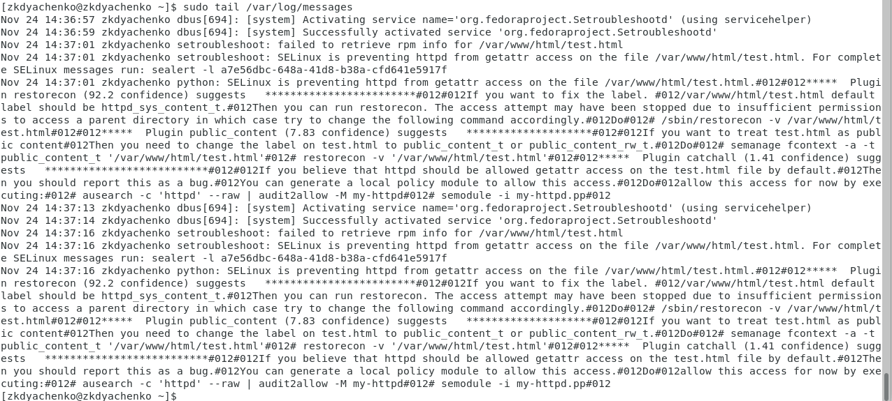

---
# Front matter
lang: ru-RU
title: "Отчет по лабораторной работе №6"
subtitle: "Дисциплина: Информационная безопасность"
author: "Выполнила Дяченко Злата Константиновна, НФИбд-03-18"
teacher: "Преподаватель: Кулябов Дмитрий Сергеевич"

# Formatting
toc-title: "Содержание"
toc: true # Table of contents
toc_depth: 2
lof: true # List of figures
lot: false # List of tables
fontsize: 12pt
linestretch: 1.5
papersize: a4paper
documentclass: scrreprt
polyglossia-lang: russian
polyglossia-otherlangs: english
mainfont: PT Serif
romanfont: PT Serif
sansfont: PT Serif
monofont: PT Serif
mainfontoptions: Ligatures=TeX
romanfontoptions: Ligatures=TeX
sansfontoptions: Ligatures=TeX,Scale=MatchLowercase
monofontoptions: Scale=MatchLowercase
indent: true
pdf-engine: lualatex
header-includes:
  - \linepenalty=10 # the penalty added to the badness of each line within a paragraph (no associated penalty node) Increasing the value makes tex try to have fewer lines in the paragraph.
  - \interlinepenalty=0 # value of the penalty (node) added after each line of a paragraph.
  - \hyphenpenalty=50 # the penalty for line breaking at an automatically inserted hyphen
  - \exhyphenpenalty=50 # the penalty for line breaking at an explicit hyphen
  - \binoppenalty=700 # the penalty for breaking a line at a binary operator
  - \relpenalty=500 # the penalty for breaking a line at a relation
  - \clubpenalty=150 # extra penalty for breaking after first line of a paragraph
  - \widowpenalty=150 # extra penalty for breaking before last line of a paragraph
  - \displaywidowpenalty=50 # extra penalty for breaking before last line before a display math
  - \brokenpenalty=100 # extra penalty for page breaking after a hyphenated line
  - \predisplaypenalty=10000 # penalty for breaking before a display
  - \postdisplaypenalty=0 # penalty for breaking after a display
  - \floatingpenalty = 20000 # penalty for splitting an insertion (can only be split footnote in standard LaTeX)
  - \raggedbottom # or \flushbottom
  - \usepackage{float} # keep figures where there are in the text
  - \floatplacement{figure}{H} # keep figures where there are in the text
---

# Цель работы

Развить навыки администрирования ОС Linux. Получить первое практическое знакомство с технологией SELinux. Проверить работу SELinux на практике совместно с веб-сервером Apache.

# Задание

Выполнить все пункты указания к лабораторной работе, чтобы достигнуть цель.

# Выполнение лабораторной работы

## Шаг 1

Вошла в систему и убедилась, что SELinux работает в режиме enforcing политики targeted. Обратилась с помощью браузера к веб-серверу и запустила его. Нашла веб-сервер Apache в списке процессов, определила его контекст безопасности: system_u:system_r:httpd_t:s0 . Использовала команду ps auxZ | grep httpd, результат представлен на Рисунке 1 (рис. -@fig:001)

{#fig:001 width=70%}

## Шаг 2

Посмотрела текущее состояние переключателей SELinux для Apache с помощью команды sestatus -bigrep httpd (рис. -@fig:002). Многие из них находятся в положении «off».

{#fig:002 width=70%}

## Шаг 3

Посмотрела статистику по политике с помощью команды seinfo (рис. -@fig:003).

{#fig:003 width=70%}

## Шаг 4

Определите тип файлов и поддиректорий, находящихся в директории /var/www - там находятся только две поддиректории (рис. -@fig:004). Директория /var/www/html пуста. Создавать файлы в директории /var/www/html может только владелец директории - root.

{#fig:004 width=70%}

## Шаг 5

Создала от имени суперпользователя html-файл /var/www/html/test.html следующего содержания (рис. -@fig:005).

{#fig:005 width=70%}

## Шаг 6

Проверила контекст созданного файла. По умолчанию это unconfined_u:object_r:httpd_sys_content_t:s0 (рис. -@fig:006).

{#fig:006 width=70%}

## Шаг 7

Обратилась к файлу через веб-сервер, введя в браузере адрес http://127.0.0.1/test.html. Файл был успешно отображён (рис. -@fig:007).

{#fig:007 width=70%}

## Шаг 8

Изучила справку man httpd_selinux и выяснила, какие контексты файлов определены для httpd (рис. -@fig:008). Так как по умолчанию пользователи CentOS являются свободными от типа, созданному файлу test.html был сопоставлен SELinux, пользователь unconfined_u. Это первая часть контекста. Далее политика ролевого разделения доступа RBAC используется процессами, но не файлами, поэтому роли не имеют никакого значения для файлов. Роль object_r используется по умолчанию для файлов на «постоянных» носителях и на сетевых файловых системах. Тип httpd_sys_content_t позволяет процессу httpd получить доступ к файлу. Благодаря наличию последнего типа возможно получить доступ к файлу при обращении к нему через браузер.

{#fig:008 width=70%}

## Шаг 9

Изменила контекст файла /var/www/html/test.html с httpd_sys_content_t на на samba_share_t, к которому процесс httpd не имеет доступа. После этого проверила, что контекст поменялся (рис. -@fig:009).

{#fig:009 width=70%}

## Шаг 10

Попробовала ещё раз получить доступ к файлу через веб-сервер, но получила сообщение об ошибке (рис. -@fig:010).

{#fig:010 width=70%}

## Шаг 11

Просмотрела лог-файл tail /var/log/messages (рис. -@fig:011) и /var/log/audit/audit.log (рис. -@fig:012).

{#fig:011 width=70%}

{#fig:012 width=70%}

## Шаг 12

Попробую запустить веб-сервер Apache на прослушивание ТСР-порта 81. Для этого в файле /etc/httpd/httpd.conf нашла строчку Listen 80 и заменила её на Listen 81 (рис. -@fig:013).

{#fig:013 width=70%}

## Шаг 13

Выполнила перезапуск веб-сервера Apache. Сбоя не произошло (рис. -@fig:014). Следуя указаниям к лабораторной, посмотрела файлы tail -nl /var/log/messages, /var/log/http/error_log, /var/log/http/access_log и /var/log/audit/audit.log (рис. -@fig:015)

{#fig:014 width=70%}

{#fig:015 width=70%}

## Шаг 14

Выполнила команду semanage port -a -t http_port_t -р tcp 81, после этого проверила список портов. Порт 81 есть в списке (рис. -@fig:016).

{#fig:016 width=70%}

## Шаг 15

Попробовала запустить веб-сервер Apache ещё раз. Он запустился (рис. -@fig:017).

{#fig:017 width=70%}

## Шаг 16

Вернула контекст httpd_sys_cоntent__t к файлу /var/www/html/ test.html. После этого попробовала получить доступ к файлу через веб-сервер и увидела содержимое файла — слово «test». (рис. -@fig:018)

{#fig:018 width=70%}

## Шаг 17

Исправила обратно конфигурационный файл apache, вернув Listen 80 (рис. -@fig:019).

{#fig:019 width=70%}

## Шаг 18

Попыталась удалить привязку http_port_t к 81 порту, но сделать это не удалось. Затем удалила файл /var/www/html/test.html (рис. -@fig:020).

{#fig:020 width=70%}

# Выводы

В результате работы я развила навыки администрирования ОС Linux, получила первое практическое знакомство с технологией SELinux. Также я проверила работу SELinux на практике совместно с веб-сервером Apache. Результаты работы находятся в [репозитории на GitHub](https://github.com/ZlataDyachenko/workD), а также есть [скринкаст выполнения лабораторной работы](https://www.youtube.com/watch?v=fbgxymqFADg).
