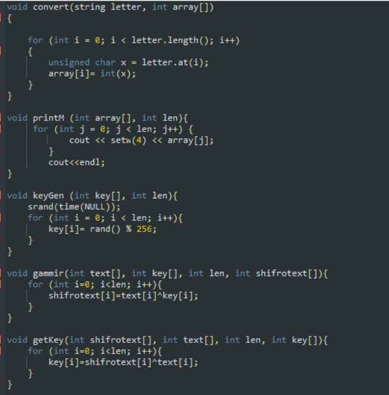
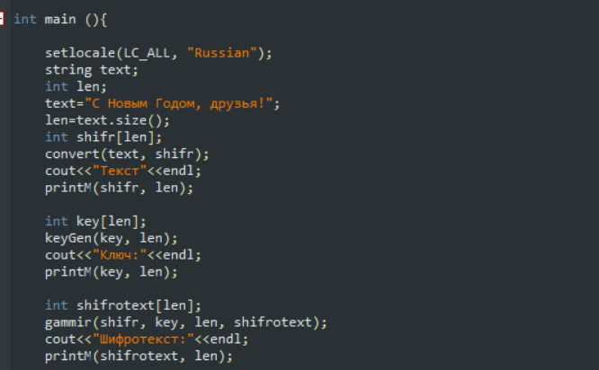
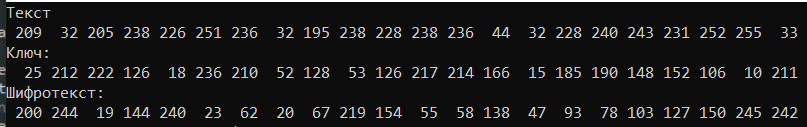
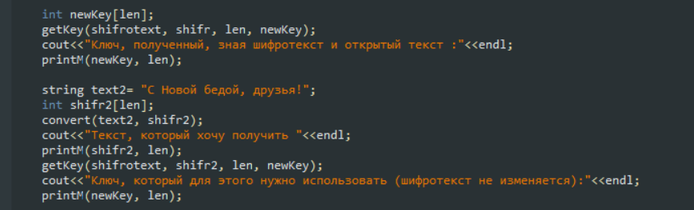
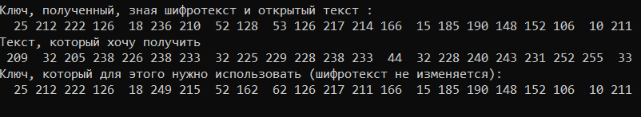

---
# Front matter
lang: ru-RU
title: "Отчет по лабораторной работе №7"
subtitle: "Дисциплина: Информационная безопасность"
author: "Выполнила Дяченко Злата Константиновна, НФИбд-03-18"
teacher: "Преподаватель: Кулябов Дмитрий Сергеевич"

# Formatting
toc-title: "Содержание"
toc: true # Table of contents
toc_depth: 2
lof: true # List of figures
lot: false # List of tables
fontsize: 12pt
linestretch: 1.5
papersize: a4paper
documentclass: scrreprt
polyglossia-lang: russian
polyglossia-otherlangs: english
mainfont: PT Serif
romanfont: PT Serif
sansfont: PT Serif
monofont: PT Serif
mainfontoptions: Ligatures=TeX
romanfontoptions: Ligatures=TeX
sansfontoptions: Ligatures=TeX,Scale=MatchLowercase
monofontoptions: Scale=MatchLowercase
indent: true
pdf-engine: lualatex
header-includes:
  - \linepenalty=10 # the penalty added to the badness of each line within a paragraph (no associated penalty node) Increasing the value makes tex try to have fewer lines in the paragraph.
  - \interlinepenalty=0 # value of the penalty (node) added after each line of a paragraph.
  - \hyphenpenalty=50 # the penalty for line breaking at an automatically inserted hyphen
  - \exhyphenpenalty=50 # the penalty for line breaking at an explicit hyphen
  - \binoppenalty=700 # the penalty for breaking a line at a binary operator
  - \relpenalty=500 # the penalty for breaking a line at a relation
  - \clubpenalty=150 # extra penalty for breaking after first line of a paragraph
  - \widowpenalty=150 # extra penalty for breaking before last line of a paragraph
  - \displaywidowpenalty=50 # extra penalty for breaking before last line before a display math
  - \brokenpenalty=100 # extra penalty for page breaking after a hyphenated line
  - \predisplaypenalty=10000 # penalty for breaking before a display
  - \postdisplaypenalty=0 # penalty for breaking after a display
  - \floatingpenalty = 20000 # penalty for splitting an insertion (can only be split footnote in standard LaTeX)
  - \raggedbottom # or \flushbottom
  - \usepackage{float} # keep figures where there are in the text
  - \floatplacement{figure}{H} # keep figures where there are in the text
---

# Цель работы

Освоить на практике применение режима однократного гаммирования.

# Задание

Нужно подобрать ключ, чтобы получить сообщение «С Новым Годом, друзья!». Требуется разработать приложение, позволяющее шифровать и дешифровать данные в режиме однократного гаммирования. Приложение должно:  
1. Определить вид шифротекста при известном ключе и известном открытом тексте.  
2. Определить ключ, с помощью которого шифротекст может быть преобразован в некоторый фрагмент текста, представляющий собой один из возможных вариантов прочтения открытого текста.

# Теоретические вводные данные

Гаммирование представляет собой наложение (снятие) на открытые (зашифрованные) данные последовательности элементов других данных, полученной с помощью некоторого криптографического алгоритма, для получения зашифрованных (открытых) данных. Иными словами, наложение гаммы — это сложение её элементов с элементами открытого (закрытого) текста по некоторому фиксированному модулю, значение которого представляет собой известную часть алгоритма шифрования.
В соответствии с теорией криптоанализа, если в методе шифрования используется однократная вероятностная гамма (однократное гаммирование) той же длины, что и подлежащий сокрытию текст, то текст нельзя раскрыть. Даже при раскрытии части последовательности гаммы нельзя получить информацию о всём скрываемом тексте. Наложение гаммы по сути представляет собой выполнение операции сложения по модулю 2 между элементами гаммы и элементами подлежащего сокрытию текста.
Если известны ключ и открытый текст, то задача нахождения шифротекста заключается в применении к каждому символу открытого текста следующего правила:
$$C_{i} = P_{i} ⊕ K_{i}$$
где $C_{i}$ — i-й символ получившегося зашифрованного послания, $P_{i}$ — i-й символ открытого текста, $K_{i}$ — i-й символ ключа. Размерности открытого текста и ключа должны совпадать, и полученный шифротекст будет такой же длины.
Если известны шифротекст и открытый текст, то, чтобы найти ключ, обе части равенства необходимо сложить по модулю 2 с $P{i}$:
$$C_{i} ⊕ P_{i} = P_{i} ⊕ K_{i} ⊕ P_{i} = K_{i},$$
$$K_{i} = C_{i} ⊕ P_{i}$$

К. Шеннон доказал абсолютную стойкость шифра в случае, когда однократно используемый ключ, длиной, равной длине исходного сообщения, является фрагментом истинно случайной двоичной последовательности с равномерным законом распределения. Криптоалгоритм не даёт никакой информации об открытом тексте: при известном зашифрованном сообщении C все различные ключевые последовательности K возможны и равновероятны, а значит, возможны и любые сообщения P.
Необходимые и достаточные условия абсолютной стойкости шифра:  
– полная случайность ключа;  
– равенство длин ключа и открытого текста;  
– однократное использование ключа.  

# Выполнение лабораторной работы

## Шаг 1

Писать программу решила на языке C++. Были написаны функции, показанные на Рисунке 1 (рис. -@fig:001). Функция convert преобразует символы открытого текста в их коды в ASCCI. Функция printM выводит массив данных (в нашем случае коды символов открытого текста, зашифрованный текст, ключ). Функция keyGen генерирует случайный ключ определенной длины (я генерировала ключ той же длины, что и открытый текст). Функция gammir осуществляет однократное гаммирование - в результате получаем шифротекст. Функция getKey получает ключ, зная шифротекст и открытый текст.

{#fig:001 width=70%}

## Шаг 2

В функции main создаем переменную text с открытым текстом "С Новым Годом, друзья!" (рис. -@fig:002). Применяя описанные ранее функции, генерируем ключ и получаем шифротекст.

{#fig:002 width=70%}

## Шаг 3

Результат шифрования представлен на Рисунке 3 (рис. -@fig:003).

{#fig:003 width=70%}

## Шаг 4

Функцию getKey можно проверить, передав в нее полученный ранее шифротекст и тот открытый текст, который был зашифрован. Получим тот же самый ключ (рис. -@fig:005). Также можем найти ключ, который необходим для того, чтобы расшифровать полученный шифротекст в открытый текст "С Новой бедой, друзья!" (рис. -@fig:004)

{#fig:004 width=70%}

## Шаг 4

Результаты выполнения функций представлены на Рисунке 5 (рис. -@fig:005).

{#fig:005 width=70%}

# Выводы

В результате работы я освоила на практике применение режима однократного гаммирования. Результаты работы находятся в [репозитории на GitHub](https://github.com/ZlataDyachenko/workD), а также есть [скринкаст выполнения лабораторной работы](https://www.youtube.com/watch?v=-JJetytTA5o).
