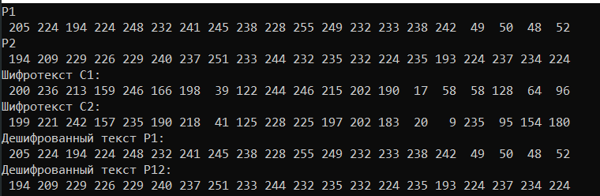
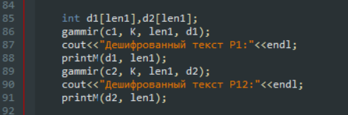
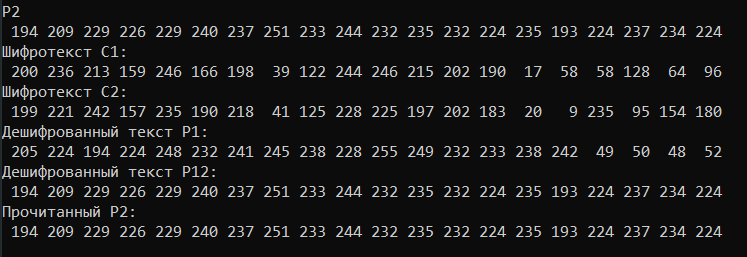

---
## Front matter
lang: ru-RU
title: "Отчет по лабораторной работе 8"
subtitle: "Дисциплина: Информационная безопасность"
author: "Дяченко Злата Константиновна, НФИбд-03-18"

## Formatting
mainfont: PT Serif
romanfont: PT Serif
sansfont: PT Serif
monofont: PT Serif
toc: false
slide_level: 2
theme: metropolis
header-includes:
 - \metroset{progressbar=frametitle,sectionpage=progressbar,numbering=fraction}
 - '\makeatletter'
 - '\beamer@ignorenonframefalse'
 - '\makeatother'
aspectratio: 43
section-titles: true
---

## Прагматика выполнения лабораторной работы

Данная лабораторная работа выполнялась мной для приобретения теоретических знаний и практических навыков применения однократного гаммирования на примере кодирования различных исходных текстов одним ключом.

## Цель выполнения лабораторной работы

Освоить на практике применение режима однократного гаммирования на примере кодирования различных исходных текстов одним ключом.

## Задачи выполнения лабораторной работы

Осуществить шифрование и дешифрование текстов P1 и P2 в режиме однократного гаммирования. (рис. -@fig:001).

{#fig:001 width=70%}

## Задачи выполнения лабораторной работы

{#fig:002 width=40%}

## Задачи выполнения лабораторной работы

{#fig:003 width=70%}

## Задачи выполнения лабораторной работы

{#fig:004 width=70%}

## Задачи выполнения лабораторной работы

Определить и выразить аналитически способ, при котором злоумышленник может прочитать оба текста, не зная ключа и не стремясь его определить (рис. -@fig:005).

{#fig:005 width=70%}

## Задачи выполнения лабораторной работы

{#fig:006 width=70%}

## Результаты выполнения лабораторной работы

В результате выполнения работы я освоила на практике применение режима однократного гаммирования на примере кодирования различных исходных текстов одним ключом.
