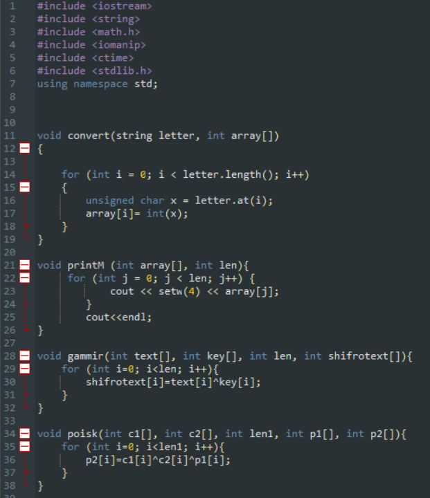
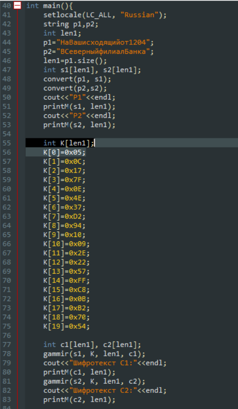
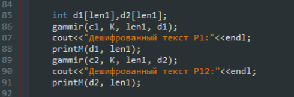
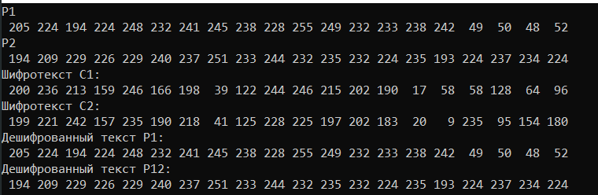
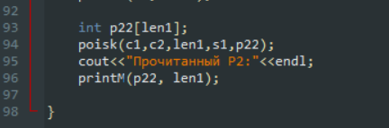
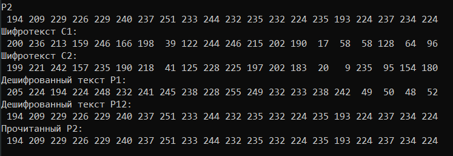

---
# Front matter
lang: ru-RU
title: "Отчет по лабораторной работе №8"
subtitle: "Дисциплина: Информационная безопасность"
author: "Выполнила Дяченко Злата Константиновна, НФИбд-03-18"
teacher: "Преподаватель: Кулябов Дмитрий Сергеевич"

# Formatting
toc-title: "Содержание"
toc: true # Table of contents
toc_depth: 2
lof: true # List of figures
lot: false # List of tables
fontsize: 12pt
linestretch: 1.5
papersize: a4paper
documentclass: scrreprt
polyglossia-lang: russian
polyglossia-otherlangs: english
mainfont: PT Serif
romanfont: PT Serif
sansfont: PT Serif
monofont: PT Serif
mainfontoptions: Ligatures=TeX
romanfontoptions: Ligatures=TeX
sansfontoptions: Ligatures=TeX,Scale=MatchLowercase
monofontoptions: Scale=MatchLowercase
indent: true
pdf-engine: lualatex
header-includes:
  - \linepenalty=10 # the penalty added to the badness of each line within a paragraph (no associated penalty node) Increasing the value makes tex try to have fewer lines in the paragraph.
  - \interlinepenalty=0 # value of the penalty (node) added after each line of a paragraph.
  - \hyphenpenalty=50 # the penalty for line breaking at an automatically inserted hyphen
  - \exhyphenpenalty=50 # the penalty for line breaking at an explicit hyphen
  - \binoppenalty=700 # the penalty for breaking a line at a binary operator
  - \relpenalty=500 # the penalty for breaking a line at a relation
  - \clubpenalty=150 # extra penalty for breaking after first line of a paragraph
  - \widowpenalty=150 # extra penalty for breaking before last line of a paragraph
  - \displaywidowpenalty=50 # extra penalty for breaking before last line before a display math
  - \brokenpenalty=100 # extra penalty for page breaking after a hyphenated line
  - \predisplaypenalty=10000 # penalty for breaking before a display
  - \postdisplaypenalty=0 # penalty for breaking after a display
  - \floatingpenalty = 20000 # penalty for splitting an insertion (can only be split footnote in standard LaTeX)
  - \raggedbottom # or \flushbottom
  - \usepackage{float} # keep figures where there are in the text
  - \floatplacement{figure}{H} # keep figures where there are in the text
---

# Цель работы

Освоить на практике применение режима однократного гаммирования на примере кодирования различных исходных текстов одним ключом.

# Задание

Два текста кодируются одним ключом (однократное гаммирование). Требуется не зная ключа и не стремясь его определить, прочитать оба текста. Необходимо разработать приложение, позволяющее шифровать и дешифровать тексты P1 и P2 в режиме однократного гаммирования. Приложение должно определить вид шифротекстов C1 и C2 обоих текстов P1 и P2 при известном ключе; Необходимо определить и выразить аналитически способ, при котором злоумышленник может прочитать оба текста, не зная ключа и не стремясь его определить.

# Теоретические вводные данные

Шифротексты обеих телеграмм можно получить по формулам режима однократного гаммирования:
$$C_{1} = P_{1} ⊕ K$$
$$C_{2} = P_{2} ⊕ K$$

Открытый текст можно найти, зная шифротекст двух телеграмм, зашифрованных одним ключом.  
$$C_{1} ⊕ C_{2} = P_{1} ⊕ P_{2}$$

Предположим, что одна из телеграмм является шаблоном — т.е. имеет текст фиксированный формат, в который вписываются значения полей. Допустим, что злоумышленнику этот формат известен. Тогда он получает достаточно много пар C1 XOR C2 (известен вид обеих шифровок). Тогда зная P1, имеем:  
$$C_{1} ⊕ C_{2} ⊕ P_{1} = P_{2}$$

Таким образом, злоумышленник получает возможность определить те символы сообщения P2, которые находятся на позициях известного шаблона сообщения P1. В соответствии с логикой сообщения P2, злоумышленник имеет реальный шанс узнать ещё некоторое количество символов сообщения P2. Затем вновь используется формула с подстановкой вместо P1 полученных на предыдущем шаге новых символов сообщения P2. И так далее. Действуя подобным образом, злоумышленник даже если не прочитает оба сообщения, то значительно уменьшит пространство их поиска.

# Выполнение лабораторной работы

## Шаг 1

Писать программу решила на языке C++. Были написаны функции, показанные на Рисунке 1 (рис. -@fig:001). Функция convert преобразует символы открытого текста в их коды в ASCCI. Функция printM выводит массив данных (в нашем случае коды символов открытого текста, зашифрованный текст, ключ). Функция gammir осуществляет однократное гаммирование. Функция poisk находит открытый текст P2, если известны шифротексты C1, C2 и открытый текст P1.

{#fig:001 width=70%}

## Шаг 2

В функции main создаем переменные p1 и p2, содержащие открытый текст (рис. -@fig:002). Применяя описанную ранее функцию convert, переводим символы в их коды. С помощью массива K задаем ключ K = 05 0C 17 7F 0E 4E 37 D2 94 10 09 2E 22 57 FF C8 OB B2 70 54. С помощью однократного гаммирования шифруем сообщения.

{#fig:002 width=70%}

## Шаг 3

С помощью функции gammir осуществляем также дешифрование сообщений (рис. -@fig:003).

{#fig:003 width=70%}

## Шаг 3

Результаты выполнения функций представлены на Рисунке 4 (рис. -@fig:004).

{#fig:004 width=70%}

## Шаг 4

Для того, чтобы прочитать один из текстов, зная другой, применим функцию poisk (рис. -@fig:005).

{#fig:005 width=70%}

## Шаг 4

Мы получили верный текст P2, что видно на Рисунке 6 (рис. -@fig:006).

{#fig:006 width=70%}

# Выводы

В результате работы я освоила на практике применение режима однократного гаммирования на примере кодирования различных исходных текстов одним ключом. Результаты работы находятся в [репозитории на GitHub](https://github.com/ZlataDyachenko/workD), а также есть [скринкаст выполнения лабораторной работы](https://www.youtube.com/watch?v=1qykNYRhPjY).
