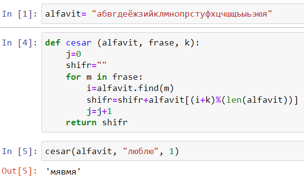
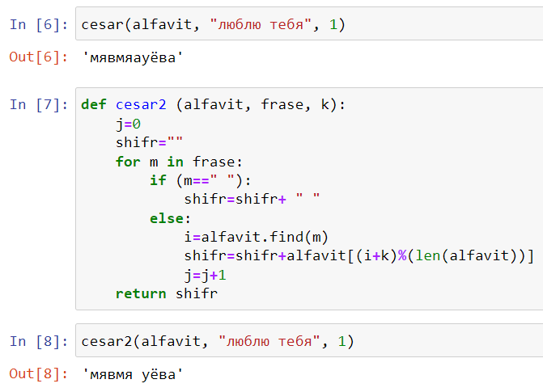
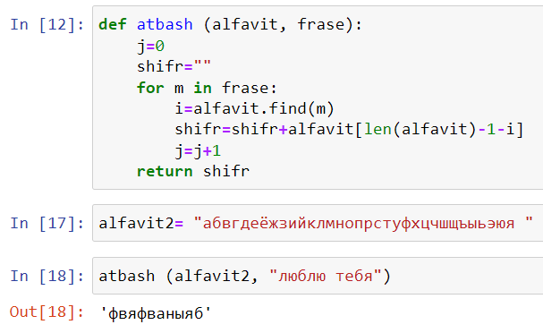

---
## Front matter
lang: ru-RU
title: "Отчет по лабораторной работе 1"
subtitle: "Дисциплина: Математические основы защиты информации и информационной безопасности"
author:
  - Дяченко З. К.
institute:
  - Российский университет дружбы народов, Москва, Россия
date: 15 сентября 2022

## i18n babel
babel-lang: russian
babel-otherlangs: english

## Formatting pdf
toc: false
toc-title: Содержание
slide_level: 2
aspectratio: 169
section-titles: true
theme: metropolis
header-includes:
 - \metroset{progressbar=frametitle,sectionpage=progressbar,numbering=fraction}
 - '\makeatletter'
 - '\beamer@ignorenonframefalse'
 - '\makeatother'
---

## Прагматика выполнения лабораторной работы

 Данная лабораторная работа выполнялась мной для приобретения практических навыков шифрования с использованием шифров простой замены.

## Цель выполнения лабораторной работы

Ознакомится и реализовать шифры простой замены, такие как шифр Цезаря и шифр Атбаш.

## Задачи выполнения лабораторной работы

Реализовать шифр Цезаря с произвольным ключом k (рис. -@fig:001 и -@fig:002).

{#fig:001 width=70%}

## Задачи выполнения лабораторной работы

{#fig:002 width=70%}

## Задачи выполнения лабораторной работы

Реализовать шифр Атбаш (рис. -@fig:003).

{#fig:003 width=70%}

## Результаты выполнения лабораторной работы

Результатом выполнения работы стала реализация шифра Цезаря и шифра Атбаш на Python, что отражает проделанную мной работу и полученные новые знания.
