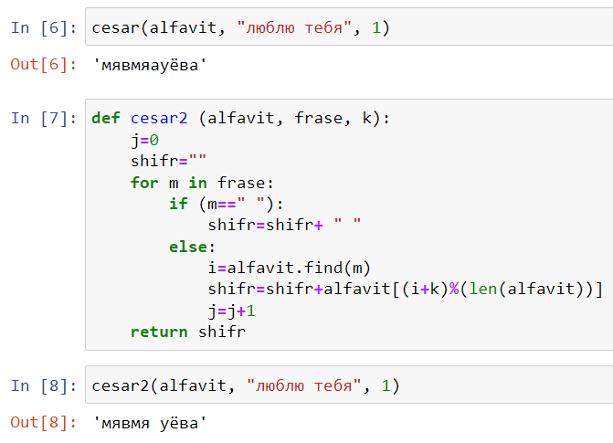

---
# Front matter
lang: ru-RU
title: "Отчет по лабораторной работе №1"
subtitle: "Дисциплина: Математические основы защиты информации и информационной безопасности"
author: "Выполнила Дяченко Злата Константиновна, НПМмд-02-22"
teacher: "Преподаватель: Кулябов Дмитрий Сергеевич"

# Formatting
toc-title: "Содержание"
toc: true # Table of contents
toc_depth: 2
lof: true # List of figures
lot: false # List of tables
fontsize: 12pt
linestretch: 1.5
papersize: a4paper
documentclass: scrreprt
polyglossia-lang: russian
polyglossia-otherlangs: english
mainfont: Times New Roman
romanfont: Times New Roman
sansfont: Arial
monofont: Consolas
mainfontoptions: Ligatures=TeX
romanfontoptions: Ligatures=TeX
sansfontoptions: Ligatures=TeX,Scale=MatchLowercase
monofontoptions: Scale=MatchLowercase
indent: true
pdf-engine: lualatex
header-includes:
  - \linepenalty=10 # the penalty added to the badness of each line within a paragraph (no associated penalty node) Increasing the value makes tex try to have fewer lines in the paragraph.
  - \interlinepenalty=0 # value of the penalty (node) added after each line of a paragraph.
  - \hyphenpenalty=50 # the penalty for line breaking at an automatically inserted hyphen
  - \exhyphenpenalty=50 # the penalty for line breaking at an explicit hyphen
  - \binoppenalty=700 # the penalty for breaking a line at a binary operator
  - \relpenalty=500 # the penalty for breaking a line at a relation
  - \clubpenalty=150 # extra penalty for breaking after first line of a paragraph
  - \widowpenalty=150 # extra penalty for breaking before last line of a paragraph
  - \displaywidowpenalty=50 # extra penalty for breaking before last line before a display math
  - \brokenpenalty=100 # extra penalty for page breaking after a hyphenated line
  - \predisplaypenalty=10000 # penalty for breaking before a display
  - \postdisplaypenalty=0 # penalty for breaking after a display
  - \floatingpenalty = 20000 # penalty for splitting an insertion (can only be split footnote in standard LaTeX)
  - \raggedbottom # or \flushbottom
  - \usepackage{float} # keep figures where there are in the text
  - \floatplacement{figure}{H} # keep figures where there are in the text
---

# Цель работы

Ознакомится и реализовать шифры простой замены.

# Задание

1. Реализовать шифр Цезаря с произвольным ключом k.
2. Реализовать шифр Атбаш.

# Выполнение лабораторной работы

## Шаг 1

Ознакомилась с предоставленными теоретическими данными. Для выполнения задания решила использовать язык Python. Создала переменную типа строка, содержащую русский алфавит, что видно на Рисунке 1 (рис. -@fig:001)

{#fig:001 width=70%}

## Шаг 2

Написала функцию, выполняющую шифрование с помощью шифра Цезаря. Код функции и результат ее использования представлен на Рисунке 2 (рис. -@fig:002). Функция принимает на вход алфавит, фразу, которую нужно зашифровать, и величину сдвига *k*. Для каждого символа сообщения сначала производится поиск его порядкового номера в алфавите, обозначаемый *i*. Затем по формуле *(i+k) mod l*, где *l* - число символов в алфавите, определяется на символ с каким номером будет заменен данный. Этот символ добавляется к уже зашифрованным ранее символам. Функция возвращает получившуюся строку.

{#fig:002 width=70%}

## Шаг 3

При использовании данной функции для шифрования фразы символ пробела заменяется буквой "а". Чтобы пробел при шифровании сохранялся, в функцию было добавлено новое условие. На Рисунке 3 (рис. -@fig:003) представлена новая функция и результат ее использования для шифрования фразы.

{#fig:003 width=70%}

## Шаг 4

Для реализации шифра Атбаш добавила создала переменную, содержащую все символы русского алфавита и символ пробела в конце, что видно на Рисунке 4 (рис. -@fig:004).

{#fig:004 width=70%}

## Шаг 5

Написала функцию, реализующую шифр Атбаш, код которой и пример выполнения показан на Рисунке 5 (рис. -@fig:005). Функция принимает на вход алфавит, фразу, которую нужно зашифровать. Для каждого символа сообщения сначала производится поиск его порядкового номера в алфавите, обозначаемый *i*. Поиск номера нового символа осуществляется по формуле *l -1 -i*, где *l* - число символов в алфавите.

{#fig:005 width=70%}

# Выводы

Я ознакомилась с двумя типами шифров простой замены и реализовала их. Результаты работы находятся в [репозитории на GitHub](https://github.com/ZlataDyachenko/workD), а также есть [скринкаст выполнения лабораторной работы](https://youtu.be/75rpMm6mq3Y).
