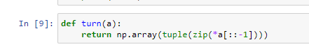
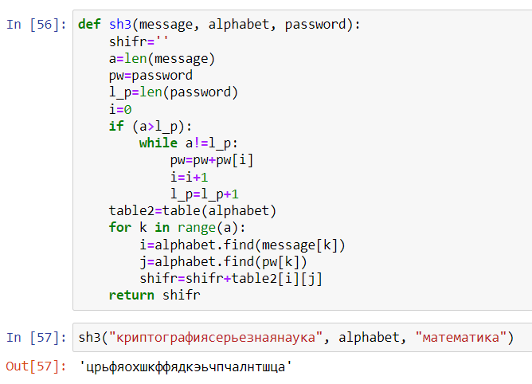

---
# Front matter
lang: ru-RU
title: "Отчет по лабораторной работе №2"
subtitle: "Дисциплина: Математические основы защиты информации и информационной безопасности"
author: "Выполнила Дяченко Злата Константиновна, НПМмд-02-22"
teacher: "Преподаватель: Кулябов Дмитрий Сергеевич"

# Formatting
toc-title: "Содержание"
toc: true # Table of contents
toc_depth: 2
lof: true # List of figures
lot: false # List of tables
fontsize: 12pt
linestretch: 1.5
papersize: a4paper
documentclass: scrreprt
polyglossia-lang: russian
polyglossia-otherlangs: english
mainfont: Times New Roman
romanfont: Times New Roman
sansfont: Arial
monofont: Consolas
mainfontoptions: Ligatures=TeX
romanfontoptions: Ligatures=TeX
sansfontoptions: Ligatures=TeX,Scale=MatchLowercase
monofontoptions: Scale=MatchLowercase
indent: true
pdf-engine: lualatex
header-includes:
  - \linepenalty=10 # the penalty added to the badness of each line within a paragraph (no associated penalty node) Increasing the value makes tex try to have fewer lines in the paragraph.
  - \interlinepenalty=0 # value of the penalty (node) added after each line of a paragraph.
  - \hyphenpenalty=50 # the penalty for line breaking at an automatically inserted hyphen
  - \exhyphenpenalty=50 # the penalty for line breaking at an explicit hyphen
  - \binoppenalty=700 # the penalty for breaking a line at a binary operator
  - \relpenalty=500 # the penalty for breaking a line at a relation
  - \clubpenalty=150 # extra penalty for breaking after first line of a paragraph
  - \widowpenalty=150 # extra penalty for breaking before last line of a paragraph
  - \displaywidowpenalty=50 # extra penalty for breaking before last line before a display math
  - \brokenpenalty=100 # extra penalty for page breaking after a hyphenated line
  - \predisplaypenalty=10000 # penalty for breaking before a display
  - \postdisplaypenalty=0 # penalty for breaking after a display
  - \floatingpenalty = 20000 # penalty for splitting an insertion (can only be split footnote in standard LaTeX)
  - \raggedbottom # or \flushbottom
  - \usepackage{float} # keep figures where there are in the text
  - \floatplacement{figure}{H} # keep figures where there are in the text
---

# Цель работы

Ознакомится и реализовать шифры перестановки.

# Задание

1. Реализовать маршрутное шифрование.
2. Реализовать шифрование с помощью решеток.
3. Реализовать шифр Виженера.

# Теоретическое введение

Шифры перестановки преобразуют открытый текст в криптограмму путем перестановки его символов. Способ, каким при шифровании переставляются буквы открытого текста, и является ключом шифра. Важным требованием является равенство длин ключа и исходного текста.

Маршрутное шифрование разработал французский математик Франсуа Виет. Открытый текст записывают в некоторую геометрическую фигуру (обычно прямоугольник) по некоторому пути, а затем, выписывая символы по другому пути, получают шифртекст. Пусть *m* и *n* – целые положительные числа, большие 1. Открытый текст разбивается на блоки равной длины, состоящие из числа символов, равному произведению *mn*. Если последний блок получится меньше остальных, то в него следует дописать требуемое количество произвольных символов. Составляется таблица размерности *mn*. Блоки вписывается построчно в таблицу. Криптограмма получается выписыванием букв из таблицы в соответствии с некоторым маршрутом. Ключом такой криптограммы является маршрут и числа *m* и *n*. Обычно буквы выписывают по столбцам, которые упорядочивают согласно паролю: внизу таблицы приписывается слово из *n* неповторяющихся букв и столбцы нумеруются по алфавитному порядку букв пароля.

Шифрование с помощью решеток предложил австрийский криптограф Эдуард Флейснер в 1881 году. Суть этого способа заключается в следующем. Выбирается натуральное число k > 1, строится квадрат размерности k и построчно заполняется числами 1, 2, …, $k^2$. Этот квадрат поворачивается по часовой стрелке на 90° и присоединяется к исходному квадрату справа. Данная процедура проделывается еще дважды, получившиеся квадраты приписываются снизу. Получается квадрат размерности 2k. Далее из большого квадрата вырезаются клетки, содержащие числа от 1 до $k^2$. В каждой клетке должно быть только одно число. Получается своего рода решето. Шифрование осуществляется следующим образом. Решето накладывается на чистый квадрат 2k × 2k и в прорези вписываются буквы исходного текста по порядку их следования. Когда заполнятся все прорези, решето поворачивается на 90° и вписывание букв продолжается. После третьего поворота все клетки большого квадрата окажутся заполненными. Подобрав подходящий пароль (число букв пароля должно равняться $k^2$ и они не должны повторяться), выписываются буквы по столбцам. Очередность столбцов определяется алфавитным порядком букв пароля.

В 1585 году французский криптограф Блез Виженер опубликовал свой метод шифрования в «Трактате о шифрах». Шифр считался нераскрываемым до 1863 года, когда австриец Фридрих Казиски взломал его. Открытый текст разбивается на блоки длины n. Ключ представляет собой последовательность из n натуральных чисел: $a_1, a_2, a_3, ..., a_n$. Далее в каждом блоке первая буква циклически сдвигается вправо по алфавиту на $a_i$ позиций, вторая буква – на $a_2$ позиций, последняя – на $a_n$ позиций. Для лучшего запоминания в качестве ключа можно взять осмысленное слово, а алфавитные номера входящих в него букв использовать для осуществления сдвигов.

# Выполнение лабораторной работы

## Шаг 1

Ознакомилась с предоставленными теоретическими данными. Для выполнения задания решила использовать язык Python. Подключила библиотеку numpy. В качестве сообщения выбрала фразу "осенняя депрессия". Написала функцию, выполняющую маршрутное шифрование. Код функции и результат ее использования представлен на Рисунке 1 (рис. - @fig:001). Функция принимает на вход фразу, которую нужно зашифровать, размерности *n* и *m* и пароль. Вначале если длина сообщения не кратна размерности *n*, в конец сообщения дописывается необходимое количество символов *а*. Затем сообщение переформировывается в матрицу размером *m×n*. Если длина пароля соответствует размерности *n*, то буквы пароля сортируются по алфавиту и этот порядок запоминается в переменной *b*. Затем для каждого символа из *b* в переменную *n_col* запоминается его порядковый номер в пароле. В соответствии с этими номерами в результирующую криптограмму выписываются поочередно столбцы матрицы.   

{#fig:001 width=70%}

На Рисунке 2 (рис. - @fig:002) показан результат работы функции.

{#fig:002 width=70%}

## Шаг 2

На Рисунке 3 (рис. - @fig:003) представлена реализация функции поворота матрицы на 90° для осуществления шифрования с помощью решеток.

{#fig:003 width=70%}

Функция для шифрования с помощью решеток показана на Рисунке 4 (рис. - @fig:004). Функция принимает на вход сообщение и пароль. Размерность *k* считается равной 2. Создается массив из чисел от 1 до $k^2$, затем он переформируется в квадрат со стороной k. Последовательно применяя функцию поворота и соединение массивов, получается квадрат размером 2k × 2k. Определенные числа в получившейся матрицы заменила нулями. В цикле, который пройдет 4 раза, значения матрицы *res* проверяются на равенство 0 и в случае, если это так, в матрицу *krypt* в этой позиции записывается буква сообщения; после решетка *res* поворачивается и начинается новая итерация. Затем, аналогично реализации маршрутного шифрования, получившаяся матрица сопоставляется с порядком букв в пароле и выписывается получившаяся криптограмма. Результат показан на Рисунке 5 (рис. - @fig:005).

{#fig:004 width=70%}

{#fig:005 width=70%}

## Шаг 3

Для реализации шифра Виженера создала переменную, содержащую русский алфавит, и написала вспомогающую функцию, создающую матрицу, где строки - русский алфавит, где все буквы сдвинуты на i, где i - номер строки (рис. - @fig:006).  

{#fig:006 width=70%}

Сама функция реализации принимает на вход сообщение, алфавит и пароль (рис. - @fig:007). Если длина сообщения больше длины пароля, то пароль увеличивается с помощью последовательного повторения его букв до длины сообщения. Затем производится поиск номера буквы сообщения в алфавите и номера буквы в пароле в алфавите. В результат криптограммы добавляется буква, находящаяся в созданной таблице на месте, соответствующем полученным номерам. Результат работы функции представлен на Рисунке 7 (рис. - @fig:007).

{#fig:007 width=70%}

# Выводы

Я ознакомилась с тремя типами шифров перестановки и реализовала их. Результаты работы находятся в [репозитории на GitHub](https://github.com/ZlataDyachenko/workD), а также есть [скринкаст выполнения лабораторной работы](https://www.youtube.com/watch?v=oa9RRMDSglg).
