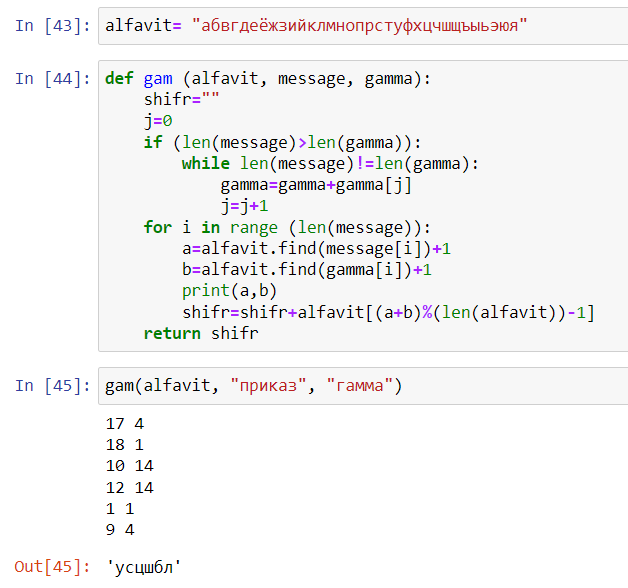
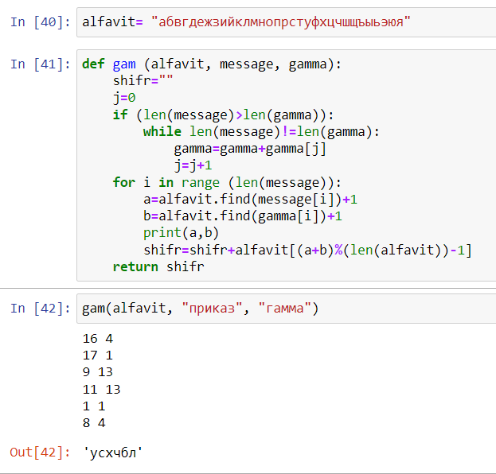

---
# Front matter
lang: ru-RU
title: "Отчет по лабораторной работе №3"
subtitle: "Дисциплина: Математические основы защиты информации и информационной безопасности"
author: "Выполнила Дяченко Злата Константиновна, НПМмд-02-22"
teacher: "Преподаватель: Кулябов Дмитрий Сергеевич"

# Formatting
toc-title: "Содержание"
toc: true # Table of contents
toc_depth: 2
lof: true # List of figures
lot: false # List of tables
fontsize: 12pt
linestretch: 1.5
papersize: a4paper
documentclass: scrreprt
polyglossia-lang: russian
polyglossia-otherlangs: english
mainfont: Times New Roman
romanfont: Times New Roman
sansfont: Arial
monofont: Consolas
mainfontoptions: Ligatures=TeX
romanfontoptions: Ligatures=TeX
sansfontoptions: Ligatures=TeX,Scale=MatchLowercase
monofontoptions: Scale=MatchLowercase
indent: true
pdf-engine: lualatex
header-includes:
  - \linepenalty=10 # the penalty added to the badness of each line within a paragraph (no associated penalty node) Increasing the value makes tex try to have fewer lines in the paragraph.
  - \interlinepenalty=0 # value of the penalty (node) added after each line of a paragraph.
  - \hyphenpenalty=50 # the penalty for line breaking at an automatically inserted hyphen
  - \exhyphenpenalty=50 # the penalty for line breaking at an explicit hyphen
  - \binoppenalty=700 # the penalty for breaking a line at a binary operator
  - \relpenalty=500 # the penalty for breaking a line at a relation
  - \clubpenalty=150 # extra penalty for breaking after first line of a paragraph
  - \widowpenalty=150 # extra penalty for breaking before last line of a paragraph
  - \displaywidowpenalty=50 # extra penalty for breaking before last line before a display math
  - \brokenpenalty=100 # extra penalty for page breaking after a hyphenated line
  - \predisplaypenalty=10000 # penalty for breaking before a display
  - \postdisplaypenalty=0 # penalty for breaking after a display
  - \floatingpenalty = 20000 # penalty for splitting an insertion (can only be split footnote in standard LaTeX)
  - \raggedbottom # or \flushbottom
  - \usepackage{float} # keep figures where there are in the text
  - \floatplacement{figure}{H} # keep figures where there are in the text
---

# Цель работы

Ознакомится и реализовать шифрование гаммированием.

# Задание

Реализовать алгоритм шифрования гаммированием конечной гаммой.

# Теоретическое введение

Гаммирование – процедура наложения при помощи некоторой функции *F* на исходный текст гаммы шифра, т.е. псевдослучайной последовательности (ПСП) с  выходов генератора *G*. Псевдослучайная последовательность по своим  статистическим свойствам неотличима от случайной последовательности, но является детерминированной, т.е. известен алгоритм ее формирования. Чаще  Обычно в качестве функции *F* берется операция поразрядного сложения по модулю два или по модулю *N* ( *N* – число букв алфавита открытого текста).

При использовании генератора ПСП получаем бесконечную гамму. Однако, возможен режим шифрования конечной гаммы. В роли конечной гаммы может выступать фраза. Как и ранее, используется алфавитный порядок букв, т.е. буква «а» имеет порядковый номер 1, «б» – 2 и т.д.

Например, зашифруем слово «ПРИКАЗ» («16 17 09 11 01 08») гаммой «ГАММА» («04 01 13 13 01»). Будем использовать операцию побитового  сложения по модулю 33 (*mod 33*). Получаем:
$c_1$ = 16 + 4(*mod 33*) = 20   
$c_2$ = 17 + 1(*mod 33*) = 18   
$c_3$ = 9 + 13(*mod 33*) = 22  
$c_4$ = 11 + 13(*mod 33*) = 24  
$c_5$ = 1 + 1(*mod 33*) = 2  
$c_6$ = 8 + 4(*mod 33*) = 12      
Криптограмма: «УСХЧБЛ» («20 18 22 24 02 12»)

# Выполнение лабораторной работы

## Шаг 1

Ознакомилась с предоставленными теоретическими данными. Для выполнения задания решила использовать язык Python. Создала переменную типа строка, содержащую русский алфавит. Написала функцию, выполняющую шифрование гаммированием конечной гаммой. Код функции и результат ее использования представлен на Рисунке 1 (рис. - @fig:001). Функция принимает на вход алфавит, фразу, которую нужно зашифровать, и гамму. Вначале если длина сообщения не совпадает с длинной гаммы, в конец гаммы дописывается необходимое количество символов гаммы, начиная с первого. Затем поочередно осуществляется поиск позиции i-го символа сообщения и гаммы в алфавите, к полученным значениям прибавляется 1 (так как индексация в переменной, содержащей алфавит начинается с 0, а мы условились, что буква "а" имеет индекс 1) и они запоминаются в переменные *a* и *b* соответственно. К строке *shifr* прибавляется символ, находящийся в алфавите на позиции *(a+b) mod(длина алфавита) -1* (вычитание 1 необходимо для соответствия условию, что буква "а" имеет индекс 1). Функция возвращает получившуюся криптограмму.   

{#fig:001 width=70%}

## Шаг 2

Получившаяся криптограмма не соответствует данной в примере, так как в примере на самом деле используется алфавит, не содержащий буквы "ё". Для проверки изменила алфавит и вновь осуществила гаммирование конечной гаммой. Результат представлен на Рисунке 2 (рис. - @fig:002) и он совпадает с примером.

{#fig:002 width=70%}

# Выводы

Я ознакомилась с шифрованием гаммирования конечной гаммой и реализовала его. Результаты работы находятся в [репозитории на GitHub](https://github.com/ZlataDyachenko/workD), а также есть [скринкаст выполнения лабораторной работы](https://www.youtube.com/watch?v=74bUrp5uaDU).
