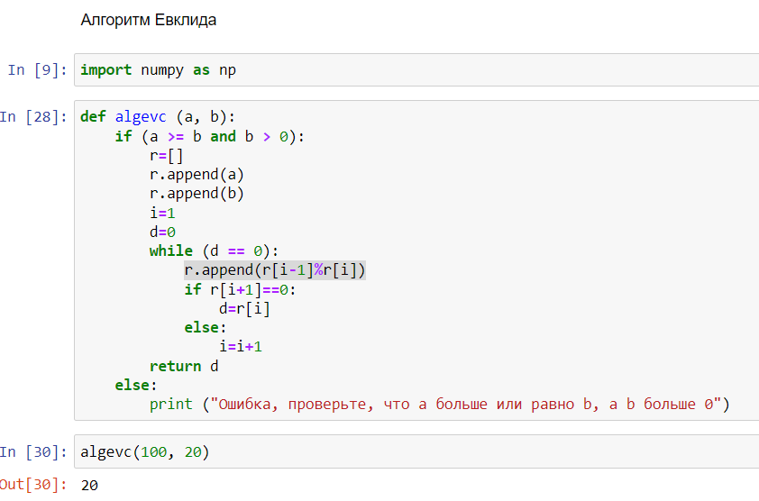
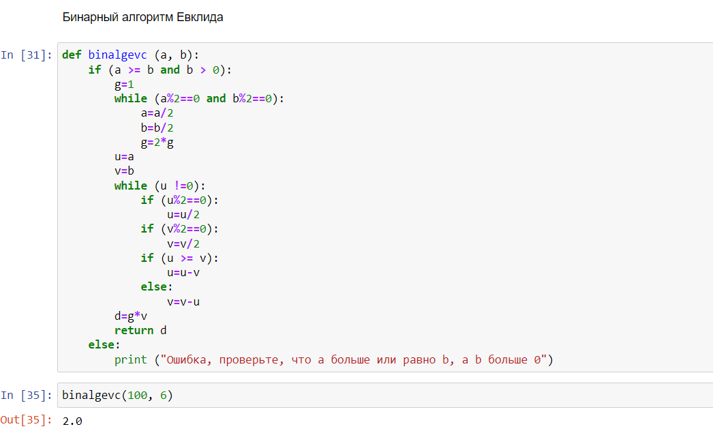
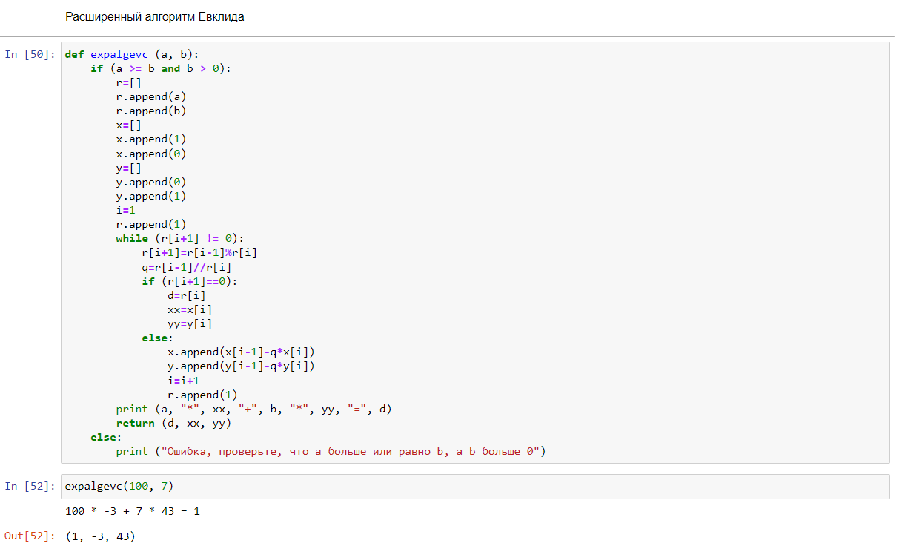
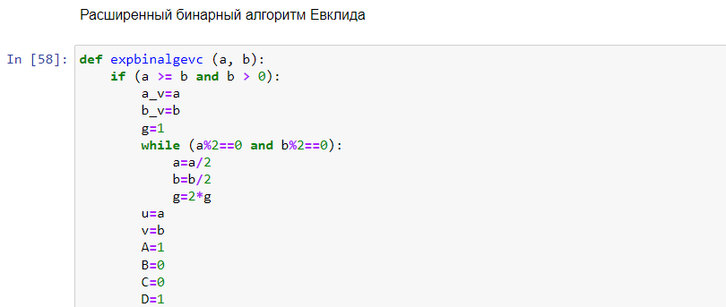
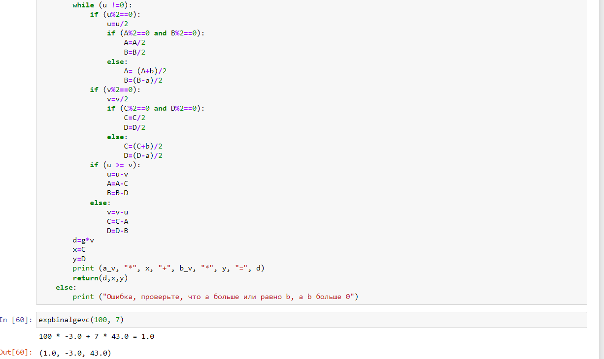

---
# Front matter
lang: ru-RU
title: "Отчет по лабораторной работе №4"
subtitle: "Дисциплина: Математические основы защиты информации и информационной безопасности"
author: "Выполнила Дяченко Злата Константиновна, НПМмд-02-22"
teacher: "Преподаватель: Кулябов Дмитрий Сергеевич"

# Formatting
toc-title: "Содержание"
toc: true # Table of contents
toc_depth: 2
lof: true # List of figures
lot: false # List of tables
fontsize: 12pt
linestretch: 1.5
papersize: a4paper
documentclass: scrreprt
polyglossia-lang: russian
polyglossia-otherlangs: english
mainfont: Times New Roman
romanfont: Times New Roman
sansfont: Arial
monofont: Consolas
mainfontoptions: Ligatures=TeX
romanfontoptions: Ligatures=TeX
sansfontoptions: Ligatures=TeX,Scale=MatchLowercase
monofontoptions: Scale=MatchLowercase
indent: true
pdf-engine: lualatex
header-includes:
  - \linepenalty=10 # the penalty added to the badness of each line within a paragraph (no associated penalty node) Increasing the value makes tex try to have fewer lines in the paragraph.
  - \interlinepenalty=0 # value of the penalty (node) added after each line of a paragraph.
  - \hyphenpenalty=50 # the penalty for line breaking at an automatically inserted hyphen
  - \exhyphenpenalty=50 # the penalty for line breaking at an explicit hyphen
  - \binoppenalty=700 # the penalty for breaking a line at a binary operator
  - \relpenalty=500 # the penalty for breaking a line at a relation
  - \clubpenalty=150 # extra penalty for breaking after first line of a paragraph
  - \widowpenalty=150 # extra penalty for breaking before last line of a paragraph
  - \displaywidowpenalty=50 # extra penalty for breaking before last line before a display math
  - \brokenpenalty=100 # extra penalty for page breaking after a hyphenated line
  - \predisplaypenalty=10000 # penalty for breaking before a display
  - \postdisplaypenalty=0 # penalty for breaking after a display
  - \floatingpenalty = 20000 # penalty for splitting an insertion (can only be split footnote in standard LaTeX)
  - \raggedbottom # or \flushbottom
  - \usepackage{float} # keep figures where there are in the text
  - \floatplacement{figure}{H} # keep figures where there are in the text
---

# Цель работы

Ознакомится и реализовать алгоритмы вычисления наибольшего общего делителя.

# Задание

Реализовать такие алгоритмы вычисления наибольшего общего делителя, как алгоритм Евклида, бинарный алгоритм Евклида, расширенный алгоритм Евклида и расширенный бинарный алгоритм Евклида.

# Теоретическое введение

Пусть числа $a$ и $b$ целые и $b ≠ 0$. Разделить $a$ на $b$ с остатком – значит представить $a$ в виде $a=qb+r$,где $q,r ∈ Z$ и $0 ≤ r ≤ |b|$ Число $q$ называется неполным частным, число $r$ – неполным остатком от деления  $a$ на $b$.
Целое число $d ≠ 0$ называется наибольшим общим делителем целых чисел $a_1, a_2, ..., a_k$ (обозначается d = НОД($a_1, a_2, ..., a_k$)), если выполняются следующие условия:
1. каждое из чисел $a_1, a_2, ..., a_k$ делится на $d$;  
2. если $d_1 ≠ 0$ – другой общий делитель чисел ܽ$a_1, a_2, ..., a_k$, то $d$ делится на $d_1$.

Для вычисления наибольшего общего делителя двух целых чисел  применяется способ повторного деления с остатком, называемый алгоритмом Евклида.

1. Алгоритм Евклида.  
    *Вход*. Целые числа $a,b; 0 < b ≤ a$.  
    *Выход*. $d = НОД(a, b)$.  
    1. Положить $r_0 ← a, r_1 ← b, i ← 1$.
    2. Найти остаток $r_{i+1}$ от деления $r_{i-1}$ на $r_i$.
    3. Если $r_{i+1} = 0$, то положить $d ← r_i$. В противном случае положить $i ← i+1$ и вернуться на шаг 2.
    4. Результат: $d$.  
2. Бинарный алгоритм Евклида.  
    *Вход*. Целые числа $a,b; 0 < b ≤ a$.    
    *Выход*. $d = НОД(a, b)$.   
    1. Положить $g ← 1$.
    2. Пока оба числа $a$ и $b$ четные, выполнять  $a ← \frac{a}{2}, b ← \frac{b}{2}, g ← 2g$ до получения хотя бы одного нечетного значения $a$ или $b$.
    3. Положить $u ← a, v ← b$.
    4. Пока $u ≠ 0$ выполнять следующие действия:
        1. Пока $u$ четное, полагать $u ← \frac{u}{2}$.
        2. Пока $v$ четное, полагать $v ← \frac{v}{2}$.
        3. При $u ≥ v$ положить $u ← u - v $. В противном случае положить $v ← v - u $.
    5. Положить $d ← gv$.
    6. Результат: $d$.
3. Расширенный алгоритм Евклида.   
    *Вход*. Целые числа $a,b; 0 < b ≤ a$.   
    *Выход*. $d = НОД(a, b)$; такие целые числа $x, y$, что $ax + by = d$.   
    1. Положить $r_0 ← a, r_1 ← b, x_0 ← 1, x_1 ← 0, y_0 ← 0, y_1 ← 1, i ← 1$.
    2. Разделить с остатком $r_{i-1}$ на $r_i$: $r_{i-1} = q_{i}r_i + r_{i+1}$.
    3. Если $r_{i+1} = 0$, то положить $d ← r_i, x ← x_i, y ← y_i$. В противном случае положить $x_{i+1} ← x_{i-1} - q_{i}x_i, y_{i+1} ← y_{i-1} - q_{i}y_i, i ← i+1$ и вернуться на шаг 2.
    4. Результат: $d, x, y$.
4. Расширенный бинарный алгоритм Евклида.   
    *Вход*. Целые числа $a,b; 0 < b ≤ a$.   
    *Выход*. $d = НОД(a, b)$.   
    1. Положить $g ← 1$.
    2. Пока оба числа $a$ и $b$ четные, выполнять  $a ← \frac{a}{2}, b ← \frac{b}{2}, g ← 2g$ до получения хотя бы одного нечетного значения $a$ или $b$.
    3. Положить $u ← a, v ← b, A ← 1, B ← 0, C ← 0, D ← 1$.
    4. Пока $u ≠ 0$ выполнять следующие действия:
        1. Пока $u$ четное:
            1. Положить $u ← \frac{u}{2}$.
            2. Если оба числа $A$ и $B$ четные, то положить $A ← \frac{A}{2}, B ← \frac{B}{2}$. В противном случае положить $A ← \frac{A+b}{2}, B ← \frac{B-a}{2}$.  
        2. Пока $v$ четное:
            1. Положить $v ← \frac{v}{2}$.
            2. Если оба числа $C$ и $D$ четные, то положить $C ← \frac{C}{2}, D ← \frac{D}{2}$. В противном случае положить $C ← \frac{C+b}{2}, D ← \frac{D-a}{2}$.
        3. При $u ≥ v$ положить $u ← u - v, A ← A - C, B ← B - D$. В противном случае положить $v ← v - u, C ← C - A, D ← D - B$.
    5. Положить $d ← gv, x ← C, y ← D$.
    6. Результат: $d, x, y$.

# Выполнение лабораторной работы

## Шаг 1

Ознакомилась с предоставленными теоретическими данными. Для выполнения задания решила использовать язык Python. Написала функцию, выполняющую поиск НОД с помощью алгоритма Евклида. Код функции и результат ее использования представлен на Рисунке 1 (рис. - @fig:001). Функция принимает на вход числа $a$ и $b$. При условии, что $0 < b ≤ a$ реализуется алгоритм, представленный в теоретическом введении и функция возвращает НОД. Если условие $0 < b ≤ a$ не выполняется, функция ничего не вернет, будет выведено соответствующее сообщение. Пример выполнения функции также показан на Рисунке 1 (рис. - @fig:001).

{#fig:001 width=70%}

## Шаг 2

На Рисунке 2 (рис. - @fig:002) представлен код функции, реализующий бинарный алгоритм Евклида, и пример выполнения.

{#fig:002 width=70%}

## Шаг 3

На Рисунке 3 (рис. - @fig:003) представлен код функции, реализующий расширенный алгоритм Евклида, и пример выполнения. Данная функция в случае нахождения НОД выводит не только сам НОД, но и числа $x$ и $y$, являющиеся коэффициентами уравнения $ax + by = d$.

{#fig:003 width=70%}

## Шаг 4

На Рисунке 4 (рис. - @fig:004) и Рисунке 5 (рис. - @fig:005) представлен код функции, реализующий расширенный бинарный алгоритм Евклида, и пример выполнения. Данная функция в случае нахождения НОД выводит не только сам НОД, но и числа $x$ и $y$, являющиеся коэффициентами уравнения $ax + by = d$.

{#fig:004 width=70%}

{#fig:005 width=70%}

# Выводы

Я ознакомилась с алгоритмами нахождения НОД и реализовала их. Результаты работы находятся в [репозитории на GitHub](https://github.com/ZlataDyachenko/workD), а также есть [скринкаст выполнения лабораторной работы](https://www.youtube.com/watch?v=H_SXHqZuYsM).
