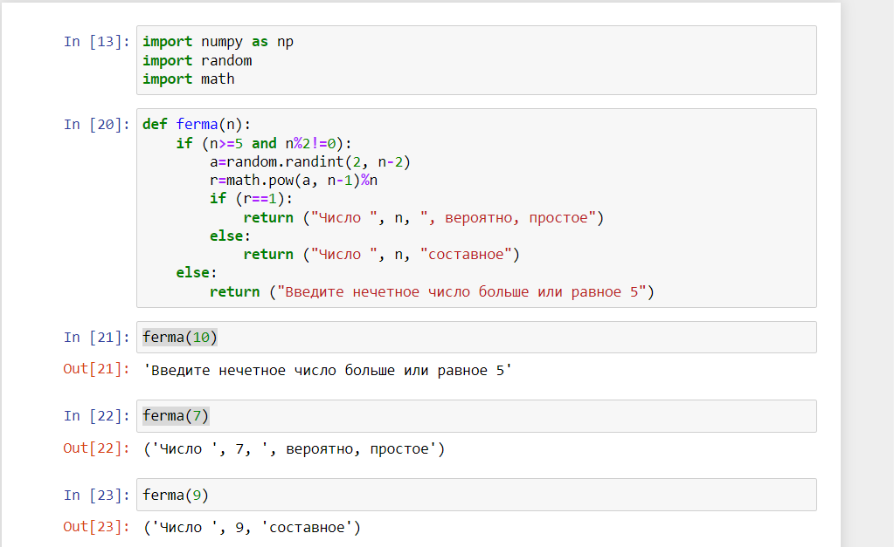
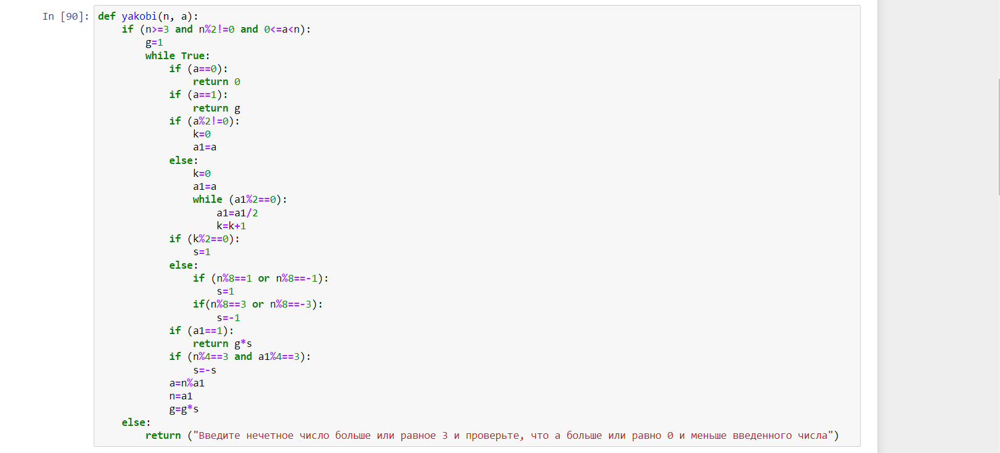
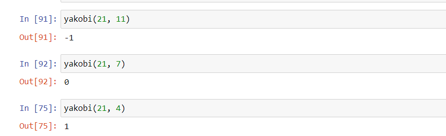
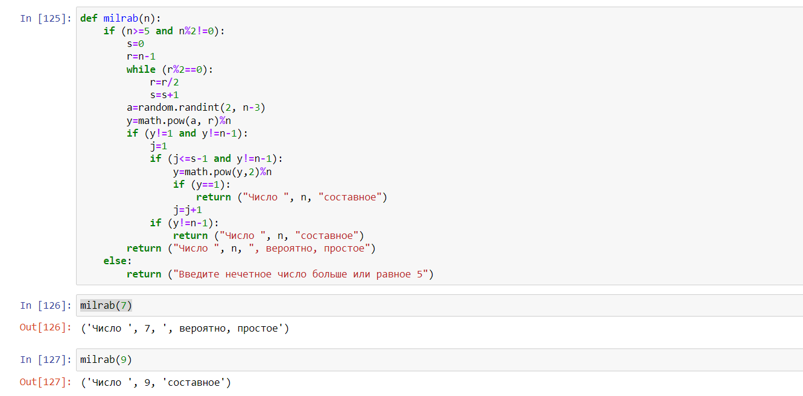

---
# Front matter
lang: ru-RU
title: "Отчет по лабораторной работе №5"
subtitle: "Дисциплина: Математические основы защиты информации и информационной безопасности"
author: "Выполнила Дяченко Злата Константиновна, НПМмд-02-22"
teacher: "Преподаватель: Кулябов Дмитрий Сергеевич"

# Formatting
toc-title: "Содержание"
toc: true # Table of contents
toc_depth: 2
lof: true # List of figures
lot: false # List of tables
fontsize: 12pt
linestretch: 1.5
papersize: a4paper
documentclass: scrreprt
polyglossia-lang: russian
polyglossia-otherlangs: english
mainfont: Times New Roman
romanfont: Times New Roman
sansfont: Arial
monofont: Consolas
mainfontoptions: Ligatures=TeX
romanfontoptions: Ligatures=TeX
sansfontoptions: Ligatures=TeX,Scale=MatchLowercase
monofontoptions: Scale=MatchLowercase
indent: true
pdf-engine: lualatex
header-includes:
  - \linepenalty=10 # the penalty added to the badness of each line within a paragraph (no associated penalty node) Increasing the value makes tex try to have fewer lines in the paragraph.
  - \interlinepenalty=0 # value of the penalty (node) added after each line of a paragraph.
  - \hyphenpenalty=50 # the penalty for line breaking at an automatically inserted hyphen
  - \exhyphenpenalty=50 # the penalty for line breaking at an explicit hyphen
  - \binoppenalty=700 # the penalty for breaking a line at a binary operator
  - \relpenalty=500 # the penalty for breaking a line at a relation
  - \clubpenalty=150 # extra penalty for breaking after first line of a paragraph
  - \widowpenalty=150 # extra penalty for breaking before last line of a paragraph
  - \displaywidowpenalty=50 # extra penalty for breaking before last line before a display math
  - \brokenpenalty=100 # extra penalty for page breaking after a hyphenated line
  - \predisplaypenalty=10000 # penalty for breaking before a display
  - \postdisplaypenalty=0 # penalty for breaking after a display
  - \floatingpenalty = 20000 # penalty for splitting an insertion (can only be split footnote in standard LaTeX)
  - \raggedbottom # or \flushbottom
  - \usepackage{float} # keep figures where there are in the text
  - \floatplacement{figure}{H} # keep figures where there are in the text
---

# Цель работы

Ознакомится и реализовать вероятностные алгоритмы проверки чисел на простоту.

# Задание

Реализовать алгоритм, реализующий тест Ферма; алгоритм вычисления символа Якоби; алгоритм, реализующий тест Соловэя-Штрассена; алгоритм, реализующий тест Миллера-Рабина.

# Теоретическое введение

Пусть $a$ – целое число. Числа ±1, ±$a$ называются тривиальными делителями числа $a$.
Целое число $p ∈ Z/{0}$ называется простым, если оно не является делителем единицы и не имеет других делителей, кроме тривиальных. В противном случае число  $p ∈ Z/{-1, 0, 1}$ называется составным.
Проверка чисел на простоту является составной частью алгоритмов генерации простых чисел, применяемых в криптографии с открытым ключом.  Алгоритмы проверки на простоту можно разделить на вероятностные и  детерминированные. Детерминированный алгоритм всегда действует по одной и той же схеме и гарантированно решает поставленную задачу (или не дает никакого ответа). Вероятностный алгоритм использует генератор случайных чисел и дает не гарантированно точный ответ. Вероятностные алгоритмы в общем случае не менее эффективны, чем детерминированные (если используемый генератор случайных чисел всегда дает набор одних и тех же чисел, зависящих от входных данных, то вероятностный алгоритм становится детерминированным).

Тест Ферма основан на малой теореме Ферма: для простого числа $p$ и произвольного числа $a$, 1 ≤ $a$ ≤ p − 1, выполняется сравнение
$$a^{p-1}≡1(mod p)$$
Следовательно, если для нечетного $n$ существует такое целое $a$, что 1 ≤ $a$ < n, НОД($a, n$) = 1 и $a^{n-1}≠1(mod n)$, то число $n$ составное. Отсюда получаем следующий вероятностный алгоритм проверки числа на простоту.

1. Алгоритм, реализующий тест Ферма.  
    *Вход*. Нечетное целое число $n≥5$.  
    *Выход*. «Число $n$, вероятно, простое» или «Число $n$ составное».  
    1. Выбрать случайное целое число $a$, 2 ≤ $a$ ≤ n − 2.
    2. Вычислить $r ← a^{n-1}(mod n)$.
    3. При $r=1$ результат: «Число $n$, вероятно, простое». В противном случае результат: «Число $n$ составное».

Тест Соловэя-Штрассена. Основан на критерии Эйлера: нечетное число ݊является простым тогда и только тогда, когда для любого целого числа $a$, 1 ≤ $a$ ≤ n − 1, взаимно простого с $n$, выполняется сравнение:
$$a^{\frac{n-1}{2}}≡(\frac{a}{n})(mod n)$$
где $(\frac{a}{n})$ – символ Якоби.
Пусть $m, n ∈ Z$, где $n=p_{1}p_{2}...p_{r}$ и числа $p_i≠2$ простые (не обязательно различные). Символ Якоби $(\frac{m}{n})$ определяется равенством
$$(\frac{m}{n})=(\frac{m}{p_1})(\frac{m}{p_2})...(\frac{m}{p_r})$$

2. Алгоритм вычисления символа Якоби.  
    *Вход*. Нечетное целое число $n≥3$, целое число $a$, 0 ≤ $a$ < n.    
    *Выход*. Символ Якоби $(\frac{a}{n})$.   
    1. Положить $g ← 1$.
    2. При $a=0$ результат: 0.
    3. При $a=1$ результат: g.
    4. Представить $a$ в виде $a=2^{k}a_{1}$, где число $a_1$ нечетное.
    5. При четном $k$ положить $s ← 1$, при нечетном $k$ положить $s ← 1$, если $n≡±1(mod 8)$; положить $s ← -1$, если $n≡±3(mod 8)$.
    6. При $a_1=1$ результат: g*s.
    7. Если $n≡3(mod 4)$ и $a_1≡3(mod 4)$, то $s ← -s$.
    8. Положить $a ← n(mod a_1)$, $n ← a_1$, $g ← g*s$ и вернуться на шаг 2.
3. Алгоритм, реализующий тест Соловэя-Штрассена.   
    *Вход*. Нечетное целое число $n≥5$.   
    *Выход*. «Число $n$, вероятно, простое» или «Число $n$ составное».   
    1. Выбрать случайное целое число $a$, 2 ≤ $a$ < n − 2.
    2. Вычислить $r ← a^{\frac{n-1}{2}}(mod n)$.
    3. При $r≠1$ и $r≠n-1$ результат: «Число $n$ составное».
    4. Вычислить символ Якоби $s ← (\frac{a}{n})$
    5. При $r≡s(mod n)$ результат: «Число $n$ составное». В противном случае результат: «Число $n$, вероятно, простое».

На сегодняшний день для проверки чисел на простоту чаще всего используется тест Миллера-Рабина, основанный на следующем наблюдении. Пусть число $n$ нечетное и $n-1=2^{s}r$,где $r$ – нечетное. Если $n$ простое, то для любого $a$ ≥ 2, взаимно простого с $n$, выполняется условие $a_{p-1}≡1(mod p)$.

4. Алгоритм, реализующий тест Миллера-Рабина.   
    *Вход*. Нечетное целое число $n≥5$.   
    *Выход*. «Число $n$, вероятно, простое» или «Число $n$ составное».
    1. Представить $n-1$ в виде $n-1=2^{s}r$, где число $r$ нечетное.
    2. Выбрать случайное целое число $a$, 2 ≤ $a$ < n − 2.
    3. Вычислить $y ← a^{r}(mod n)$.
    4. При $y ≠ 1$ и $y ≠ n-1$ выполнять следующие действия:
        1. Положить $j ← 1$.  
        2. Если $j≤s-1$ и $y ≠ n-1$:
            1. Положить $y ← y^{2}(mod n)$.
            2. При $y=1$ результат: «Число $n$ составное».
            3. Положить $j ← j+1$
        3. При $y ≠ n-1$ результат: «Число $n$ составное».
    5. Результат: «Число $n$, вероятно, простое».

# Выполнение лабораторной работы

## Шаг 1

Ознакомилась с предоставленными теоретическими данными. Для выполнения задания решила использовать язык Python. Написала функцию, выполняющую проверку числа на простоту с использованием теста Ферма. Код функции и результат ее использования представлен на Рисунке 1 (рис. - @fig:001). Функция принимает на вход число $n$. При условии, что $n≥5$ реализуется алгоритм, представленный в теоретическом введении и функция возвращает отчет. Если условие не выполняется, будет выведено соответствующее сообщение.

{#fig:001 width=70%}

## Шаг 2

На Рисунке 2 (рис. - @fig:002) представлен код функции, реализующий алгоритм вычисления символа Якоби. Пример выполнения показан на Рисунке 3 (рис. - @fig:003).

{#fig:002 width=70%}

{#fig:003 width=70%}

## Шаг 3

На Рисунке 3 (рис. - @fig:003) представлен код функции, реализующий тест Соловэя-Штрассена.

{#fig:004 width=70%}

## Шаг 4

На Рисунке 4 (рис. - @fig:004) представлен код функции, реализующий тест Миллера-Рабина, и пример выполнения.

{#fig:005 width=70%}

# Выводы

Я ознакомилась с алгоритмами проверки чисел на простоту и реализовала их. Результаты работы находятся в [репозитории на GitHub](https://github.com/ZlataDyachenko/workD), а также есть [скринкаст выполнения лабораторной работы](https://www.youtube.com/watch?v=Sg-IUSGijSI).
