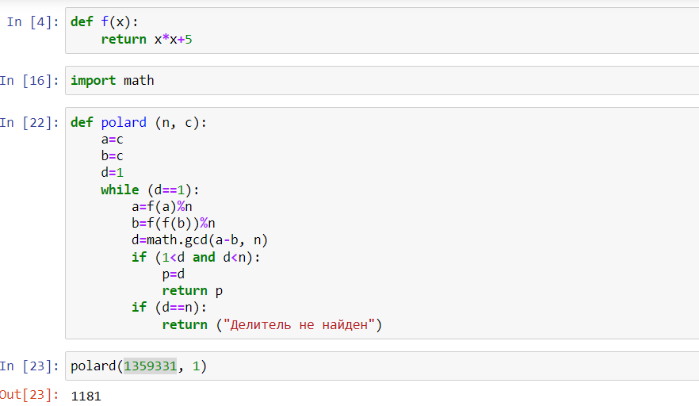
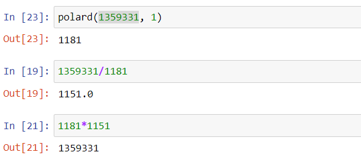

---
# Front matter
lang: ru-RU
title: "Отчет по лабораторной работе №6"
subtitle: "Дисциплина: Математические основы защиты информации и информационной безопасности"
author: "Выполнила Дяченко Злата Константиновна, НПМмд-02-22"
teacher: "Преподаватель: Кулябов Дмитрий Сергеевич"

# Formatting
toc-title: "Содержание"
toc: true # Table of contents
toc_depth: 2
lof: true # List of figures
lot: false # List of tables
fontsize: 12pt
linestretch: 1.5
papersize: a4paper
documentclass: scrreprt
polyglossia-lang: russian
polyglossia-otherlangs: english
mainfont: Times New Roman
romanfont: Times New Roman
sansfont: Arial
monofont: Consolas
mainfontoptions: Ligatures=TeX
romanfontoptions: Ligatures=TeX
sansfontoptions: Ligatures=TeX,Scale=MatchLowercase
monofontoptions: Scale=MatchLowercase
indent: true
pdf-engine: lualatex
header-includes:
  - \linepenalty=10 # the penalty added to the badness of each line within a paragraph (no associated penalty node) Increasing the value makes tex try to have fewer lines in the paragraph.
  - \interlinepenalty=0 # value of the penalty (node) added after each line of a paragraph.
  - \hyphenpenalty=50 # the penalty for line breaking at an automatically inserted hyphen
  - \exhyphenpenalty=50 # the penalty for line breaking at an explicit hyphen
  - \binoppenalty=700 # the penalty for breaking a line at a binary operator
  - \relpenalty=500 # the penalty for breaking a line at a relation
  - \clubpenalty=150 # extra penalty for breaking after first line of a paragraph
  - \widowpenalty=150 # extra penalty for breaking before last line of a paragraph
  - \displaywidowpenalty=50 # extra penalty for breaking before last line before a display math
  - \brokenpenalty=100 # extra penalty for page breaking after a hyphenated line
  - \predisplaypenalty=10000 # penalty for breaking before a display
  - \postdisplaypenalty=0 # penalty for breaking after a display
  - \floatingpenalty = 20000 # penalty for splitting an insertion (can only be split footnote in standard LaTeX)
  - \raggedbottom # or \flushbottom
  - \usepackage{float} # keep figures where there are in the text
  - \floatplacement{figure}{H} # keep figures where there are in the text
---

# Цель работы

Ознакомится и реализовать алгоритм разложения чисел на множители.

# Задание

Реализовать программно алгоритм, реализующий p-метод Полларда.

# Теоретическое введение

Задача разложения составного числа на множители формулируется следующим образом: для данного положительного целого числа $n$ найти его каноническое разложение $n=p_1^{\alpha_1}p_2^{\alpha_2}...p_s^{\alpha_s}$, где $p_i$ – попарно различные простые числа, $\alpha_i ≥ 1$.
На практике не обязательно находить каноническое разложение числа $n$. Достаточно найти его разложение на два нетривиальных сомножителя: $n=pq, 1≤p≤q<n$.
*p–Метод Полларда*. Пусть $n$ – нечетное составное число, S = {0, 1, … , n − 1} и $f: S→S$– случайное отображение, обладающее сжимающими свойствами, например $f(x)≡x^2+1(mod n)$. ݀Основная идея метода состоит в следующем.
Выбираем случайный элемент $x_0 ∈ S$ и строим последовательность $x_0,x_1,x_2,...$, определяемую рекуррентным соотношением
$$x_{i+1}=f(x_i)$$,
где i ≥ 0, до тех пор, пока не найдем такие числа $i,j$, что $i<j$ и $x_i=x_j$.
Поскольку множество $S$ конечно, такие индексы $i,j$ существуют (последовательность «зацикливается»). Последовательность ${x_i}$ будет состоять из «хвоста» $x_0,x_1,..., x_{i-1}$ длины $O(\sqrt{\frac{\pi n}{8}})$ и цикла $x_i=x_j,x_{i+1},..., x_{j-1}$ той же длины.

Алгоритм, реализующий p-метод Полларда.
  *Вход*. Число $n$, начальное значение $c$, функция $f$, обладающая сжимающими свойствами.
  *Выход*. Нетривиальный делитель числа $n$.
  1. Положить $a←c, b←c$.
  2. Вычислить $a ← f(a)(mod n), b ← f(f(b))(mod n)$.
  3. Найти $d ←НОД(a-b, n)$.
  4. Если $1 < d < n$, то положить $p ← d$ и результат: $p$. При $d=n$ результат: «Делитель не найден»; при $d=1$ вернуться на шаг 2.

# Выполнение лабораторной работы

## Шаг 1

Ознакомилась с предоставленными теоретическими данными. Для выполнения задания решила использовать язык Python. Подключила библиотеку math. Написала функцию, реализующую поиск нетривиального делителя с помощью p-метода Полларда. Код функции и результат ее использования представлен на Рисунке 1 (рис. - @fig:001). Функция принимает на вход число $n$ и число $c$. Фукнцию $f$ реализовала как отдельную функцию и не передавала ее функции алгоритма. Пример работы алгоритма для числа из представленых для лабораторной работы материалов также представлен на рисунке.

{#fig:001 width=70%}

## Шаг 2

Так как результатом выполнения функции является нетривиальный делитель, для разложения числа 1359331 на множители разделила его на найденный делитель для нахождения второго множителя. Так, 1359331=1181*1151 (рис. - @fig:002).

{#fig:002 width=70%}

# Выводы

Я ознакомилась с алгоритмом, реализующем p-метод Полларда, и реализовала его программно. Результаты работы находятся в [репозитории на GitHub](https://github.com/ZlataDyachenko/workD), а также есть [скринкаст выполнения лабораторной работы](https://youtu.be/1mD8BJZiB4w).
