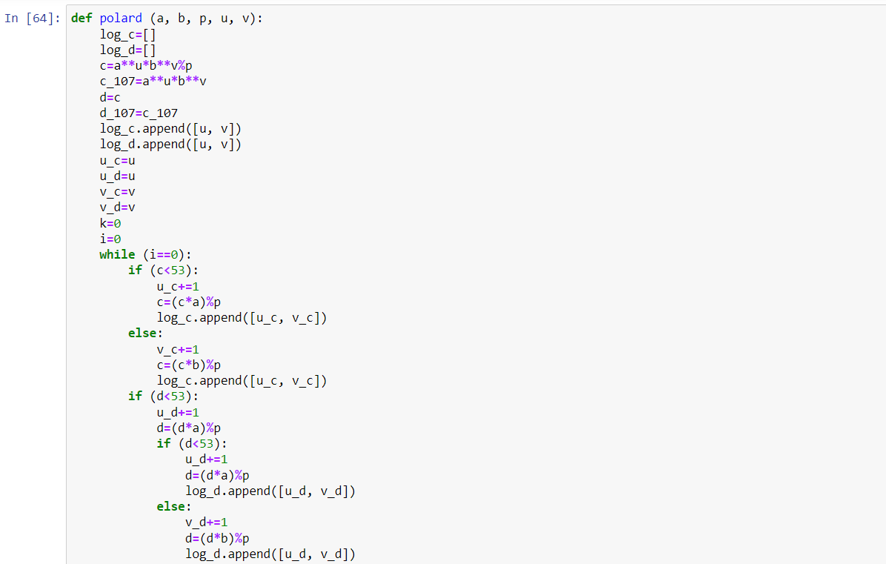
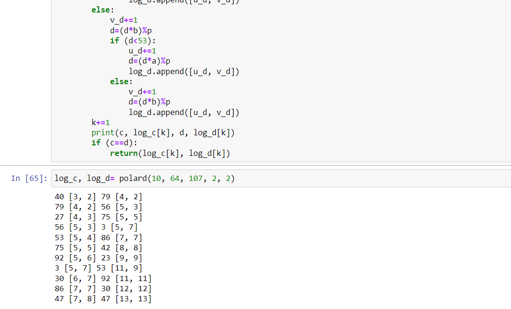
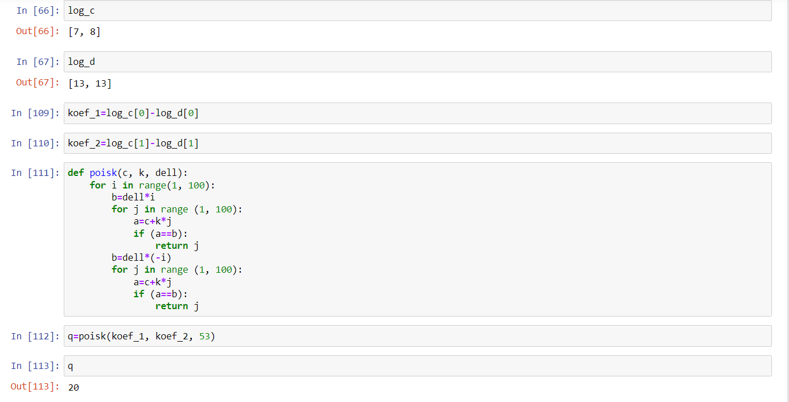

---
# Front matter
lang: ru-RU
title: "Отчет по лабораторной работе №7"
subtitle: "Дисциплина: Математические основы защиты информации и информационной безопасности"
author: "Выполнила Дяченко Злата Константиновна, НПМмд-02-22"
teacher: "Преподаватель: Кулябов Дмитрий Сергеевич"

# Formatting
toc-title: "Содержание"
toc: true # Table of contents
toc_depth: 2
lof: true # List of figures
lot: false # List of tables
fontsize: 12pt
linestretch: 1.5
papersize: a4paper
documentclass: scrreprt
polyglossia-lang: russian
polyglossia-otherlangs: english
mainfont: PT Serif
romanfont: PT Serif
sansfont: PT Sans
monofont: PT Sans
mainfontoptions: Ligatures=TeX
romanfontoptions: Ligatures=TeX
sansfontoptions: Ligatures=TeX,Scale=MatchLowercase
monofontoptions: Scale=MatchLowercase
indent: true
pdf-engine: lualatex
header-includes:
  - \linepenalty=10 # the penalty added to the badness of each line within a paragraph (no associated penalty node) Increasing the value makes tex try to have fewer lines in the paragraph.
  - \interlinepenalty=0 # value of the penalty (node) added after each line of a paragraph.
  - \hyphenpenalty=50 # the penalty for line breaking at an automatically inserted hyphen
  - \exhyphenpenalty=50 # the penalty for line breaking at an explicit hyphen
  - \binoppenalty=700 # the penalty for breaking a line at a binary operator
  - \relpenalty=500 # the penalty for breaking a line at a relation
  - \clubpenalty=150 # extra penalty for breaking after first line of a paragraph
  - \widowpenalty=150 # extra penalty for breaking before last line of a paragraph
  - \displaywidowpenalty=50 # extra penalty for breaking before last line before a display math
  - \brokenpenalty=100 # extra penalty for page breaking after a hyphenated line
  - \predisplaypenalty=10000 # penalty for breaking before a display
  - \postdisplaypenalty=0 # penalty for breaking after a display
  - \floatingpenalty = 20000 # penalty for splitting an insertion (can only be split footnote in standard LaTeX)
  - \raggedbottom # or \flushbottom
  - \usepackage{float} # keep figures where there are in the text
  - \floatplacement{figure}{H} # keep figures where there are in the text
---

# Цель работы

Ознакомится и реализовать алгоритм, реализующий p-метод Полларда для задач дискретного логарифмирования.

# Задание

Реализовать программно алгоритм, реализующий p-метод Полларда для задач дискретного логарифмирования.

# Теоретическое введение

Алгоритм, реализующий p-метод Полларда.
  *Вход*. Простое число $p$,число $a$ порядка $r$ по модулю $p$, целое число $b$, 1<b<p; отображение $f$ обладающее сжимающими свойствами и сохраняющее вычислимость логарифма.
  *Выход*. Показатель x для которого $a^x≡b(mod p)$ если такой показатель существует.
  1. Выбрать произвольные целые числа $u, v$ и положить $c←a^ub^v(mod p), d←c$.
  2. Выполнять $c ← f(c)(mod p), d ← f(f(d))(mod p)$, вычисляя при этом логарифмы для $c$ и $d$ как линейные функции от x по модулю $r$, до получения $c≡d(modp)$.
  3. Приравняв логарифмы для $c$ и $d$, вычислить логарифм x решением сравнения по модулю $r$. Результат: x или "Решений нет"

# Выполнение лабораторной работы

## Шаг 1

Ознакомилась с предоставленными теоретическими данными. Для выполнения задания решила использовать язык Python. Написала функцию, реализующую 1-2 шаг алгоритма p-метода Полларда для задач дискретного логарифмирования. Код функции и результат ее использования представлен на Рисунке 1 (рис. - @fig:001) и Рисунке 2 (рис. - @fig:002). Функция принимает на вход число $a, b, p, u, v$ и число $c$. Пример работы алгоритма для числа из представленых для лабораторной работы материалов также представлен на рисунке.

{#fig:001 width=70%}

{#fig:002 width=70%}

## Шаг 2

Реализовала 3 шаг алгоритма, написав функцию *poisk*. Код функции и результат ее использования представлен на Рисунке 3 (рис. - @fig:003). Полученный ответ совпадает с ответом, представленным в теоретических материалах.

{#fig:003 width=70%}

# Выводы

Я ознакомилась с алгоритмом, реализующем p-метод Полларда для задач дискретного логарифмирования, и реализовала его программно. Результаты работы находятся в [репозитории на GitHub](https://github.com/ZlataDyachenko/workD), а также есть [скринкаст выполнения лабораторной работы](https://www.youtube.com/watch?v=Zj6k0AjUHYA).
