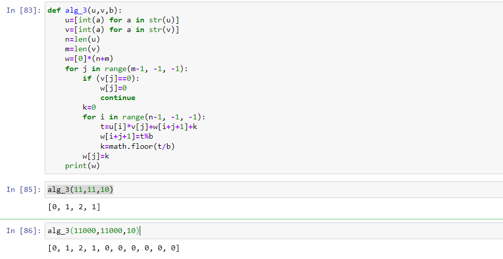

---
## Front matter
lang: ru-RU
title: "Отчет по лабораторной работе 8"
subtitle: "Дисциплина: Математические основы защиты информации и информационной безопасности"
author:
  - Дяченко З. К.
institute:
  - Российский университет дружбы народов, Москва, Россия
date: 23 декабря 2022

## i18n babel
babel-lang: russian
babel-otherlangs: english

## Formatting pdf
toc: false
toc-title: Содержание
slide_level: 2
aspectratio: 169
section-titles: true
theme: metropolis
header-includes:
 - \metroset{progressbar=frametitle,sectionpage=progressbar,numbering=fraction}
 - '\makeatletter'
 - '\beamer@ignorenonframefalse'
 - '\makeatother'
---

## Прагматика выполнения лабораторной работы

Данная лабораторная работа выполнялась мной для приобретения практических навыков реализации алгоритмов целочисленной арифметики многократной точности.

## Цель выполнения лабораторной работы

Ознакомится и реализовать программно алгоритмы целочисленной арифметики многократной точности.

## Задачи выполнения лабораторной работы

Реализовать программно алгоритм сложения неотрицательных чисел (рис. - @fig:001).

{#fig:001 width=70%}

## Задачи выполнения лабораторной работы

Реализовать программно алгоритм вычитания неотрицательных чисел (рис. - @fig:002).

{#fig:002 width=70%}

## Задачи выполнения лабораторной работы

Реализовать программно алгоритм умножения неотрицательных целых чисел столбиком (рис. - @fig:003).

{#fig:003 width=70%}

## Задачи выполнения лабораторной работы

Реализовать программно алгоритм быстрого столбика (рис. - @fig:004).

{#fig:004 width=70%}

## Задачи выполнения лабораторной работы

Реализовать программно алгоритм деления многоразрядных целых чисел (рис. - @fig:005).

{#fig:005 width=70%}

## Результаты выполнения лабораторной работы

Результатом выполнения работы стала реализация алгоритмов целочисленной арифметики многократной точности, что отражает проделанную мной работу и полученные новые знания.
