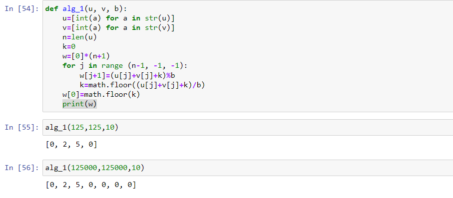
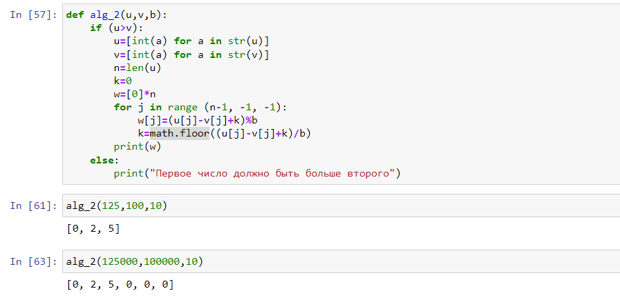
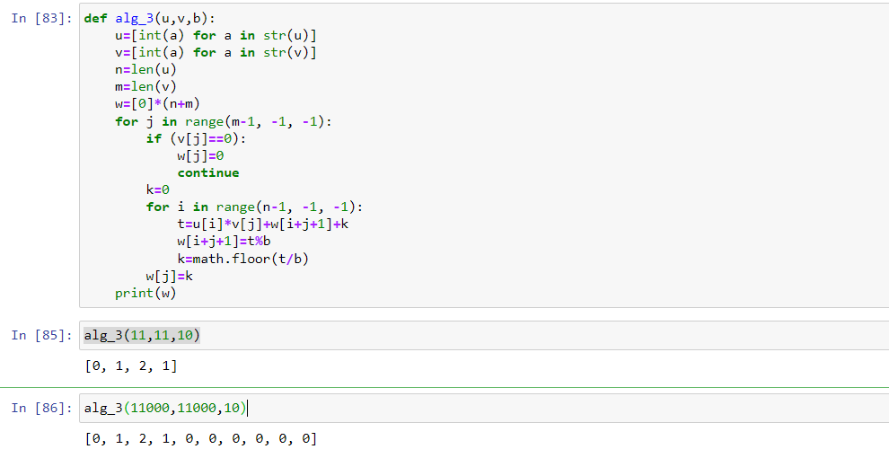
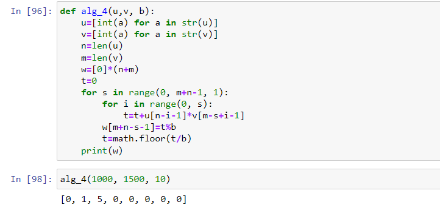
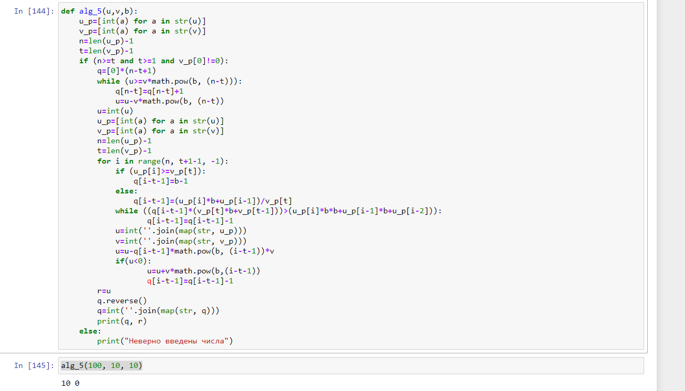

---
# Front matter
lang: ru-RU
title: "Отчет по лабораторной работе №8"
subtitle: "Дисциплина: Математические основы защиты информации и информационной безопасности"
author: "Выполнила Дяченко Злата Константиновна, НПМмд-02-22"
teacher: "Преподаватель: Кулябов Дмитрий Сергеевич"

# Formatting
toc-title: "Содержание"
toc: true # Table of contents
toc_depth: 2
lof: true # List of figures
lot: false # List of tables
fontsize: 12pt
linestretch: 1.5
papersize: a4paper
documentclass: scrreprt
polyglossia-lang: russian
polyglossia-otherlangs: english
mainfont: PT Serif
romanfont: PT Serif
sansfont: PT Sans
monofont: PT Sans
mainfontoptions: Ligatures=TeX
romanfontoptions: Ligatures=TeX
sansfontoptions: Ligatures=TeX,Scale=MatchLowercase
monofontoptions: Scale=MatchLowercase
indent: true
pdf-engine: lualatex
header-includes:
  - \linepenalty=10 # the penalty added to the badness of each line within a paragraph (no associated penalty node) Increasing the value makes tex try to have fewer lines in the paragraph.
  - \interlinepenalty=0 # value of the penalty (node) added after each line of a paragraph.
  - \hyphenpenalty=50 # the penalty for line breaking at an automatically inserted hyphen
  - \exhyphenpenalty=50 # the penalty for line breaking at an explicit hyphen
  - \binoppenalty=700 # the penalty for breaking a line at a binary operator
  - \relpenalty=500 # the penalty for breaking a line at a relation
  - \clubpenalty=150 # extra penalty for breaking after first line of a paragraph
  - \widowpenalty=150 # extra penalty for breaking before last line of a paragraph
  - \displaywidowpenalty=50 # extra penalty for breaking before last line before a display math
  - \brokenpenalty=100 # extra penalty for page breaking after a hyphenated line
  - \predisplaypenalty=10000 # penalty for breaking before a display
  - \postdisplaypenalty=0 # penalty for breaking after a display
  - \floatingpenalty = 20000 # penalty for splitting an insertion (can only be split footnote in standard LaTeX)
  - \raggedbottom # or \flushbottom
  - \usepackage{float} # keep figures where there are in the text
  - \floatplacement{figure}{H} # keep figures where there are in the text
---

# Цель работы

Ознакомится и реализовать алгоритмы целочисленной арифметики многократной точности.

# Задание

Реализовать программно пять алгоритмов: алгоритм сложения неотрицательных чисел, алгоритм вычитания неотрицательных чисел, алгоритм умножения неотрицательных чисел, алгоритм быстрого столбика, алгоритм деления многоразрядных целых чисел.

# Теоретическое введение

Алгоритм сложения неотрицательных чисел.  
  *Вход*. Два неотрицательных числа $u=u_1u_2...u_n, v=v_1v_2...v_n$; разрядность чисел $n$; основание системы счисления $b$.  
  *Выход*. Сумма $w=w_0w_1...w_n$, где $w_0$ – цифра переноса – всегда равная 0 либо 1.  
  1. Присвоить $j:=n, k:=0$ (j идет по разрядам, k следит за переносом).  
  2. Присвоить $w_j=(u_j+v_j+k)(mod b)$, где $w_j$ - наименьший неотрицательный вычет в данном классе вычетов; $k= [\frac{u_j+v_j+k}{b}]$.  
  3. Присвоить $j≔j − 1$. Если j>0, то возвращаемся на шаг 2; если j = 0, то присвоить $w_0$:=k и результат: $w$.  

Алгоритм вычитания неотрицательных чисел.  
    *Вход*. Два неотрицательных числа $u=u_1u_2...u_n, v=v_1v_2...v_n$, u>v; разрядность чисел $n$; основание системы счисления $b$.  
    *Выход*. Разность $w=w_1w_2...w_n=u-v$.    
    1. Присвоить $j:=n, k:=0$ (k заем из старшего разряда).  
    2. Присвоить $w_j=(u_j-v_j+k)(mod b)$, где $w_j$ - наименьший неотрицательный вычет в данном классе вычетов; $k= [\frac{u_j-v_j+k}{b}]$.  
    3. Присвоить $j≔j − 1$. Если j>0, то возвращаемся на шаг 2; если j = 0, то присвоить $w_0$:=k и результат: $w$.

Алгоритм умножения неотрицательных целых чисел столбиком.  
    *Вход*. Числа $u=u_1u_2...u_n, v=v_1v_2...v_m$; основание системы счисления $b$.  
    *Выход*. Произведение $w=uv=w_1w_2...w_{m+n}$
    1. Выполнить присвоения: $w{m+1}:=0, w{m+2}:=0, ..., w{m+n}:=0,$ j≔m (j перемещается по номерам разрядов числа v от младших к старшим).  
    2. Если $v_j=0$, то присвоить $w_j:=0$ и перейти на шаг 6.  
    3. Присвоить i≔n, k≔ 0 (Значение i идет по номерам разрядов числа u, k отвечает за перенос).  
    4. Присвоить $t:=u_i*v_j+w_{i+j}+k, w_{i+j}:=t(mod b), k:=\frac{t}{b}$, где $w_{i+j}$ – наименьший неотрицательный вычет в данном классе вычетов.  
    5. Присвоить i≔ i− 1. Если i>0, то возвращаемся на шаг 4, иначе присвоить $w_j:=k$.    
    6. Присвоить j≔ j− 1. Если j > 0, то вернуться на шаг 2. Если j = 0, то результат w.  

Алгоритм быстрого столбика.  
    *Вход*. Числа $u=u_1u_2...u_n, v=v_1v_2...v_m$; основание системы счисления $b$.  
    *Выход*. Произведение $w=uv=w_1w_2...w_{m+n}$  
    1. Присвоить t:=0.  
    2. Для s от 0 до m+n-1 с шагом 1 выполнить шаги 3 и 4.  
    3. Для i от 0 до s с шагом 1 выполнить присвоение t:=t+u_{n-i}*v_{m-s+i}.
    4. Присвоить $w_{m+n-s}:=t(mod b), t:=\frac{t}{b}$, где $w_{m+n-s}$ – наименьший неотрицательный вычет по модулю $b$. Результат: w.  

Алгоритм деления многоразрядных целых чисел.  
    *Вход*. Числа $u=u_n...u_1u_0, v=v_t...v_1v_0$, n⩾t⩾1, $v_t≠0$; разрядность чисел соответственно $n$ и $t$.  
    *Выход*. Частное $q=q_{n-t}...q_0$, остаток $r=r_t...r_0$.  
    1. Для j от 0 n-t присвоить $q_j:=0$.  
    2. Пока $u⩾vb^{n-t}$, выполнять $q_{n-t}:=q_{n-t}+1, u:=u-vb^{n-t}$.   
    3. Для $i=n,n-1,...,t+1$ выполнить пункты 3.1-3.4.  
          3.1 если $u_i⩾v_t$, то присвоить $q_{i-t-1}:=b-1$, иначе присвоить $q_{i-t-1}:=\frac{u_ib+u_{i-1}}{v_t}$  
          3.2 пока $q_{i-t-1}(v_tb+v_{t-1})>u_ib^2+u_{i-1}b+u_{i-2}$ выполнять $q_{i-t-1}:=q_{i-t-1}-1$.  
          3.3 присвоить $u:=u-q_{i-t-1}b^{i-t-1}v$  
          3.4 если u<0, то присвоить $u:=u+vb^{i-t-1}, q_{i-t-1}:=q_{i-t-1}-1$.  
    4. r:=u. Результат: q и r.  

# Выполнение лабораторной работы

## Шаг 1

Ознакомилась с предоставленными теоретическими данными. Для выполнения задания решила использовать язык Python. Написала функцию, реализующую алгоритм сложения неотрицательных чисел. Код функции и результат ее использования представлен на Рисунке 1 (рис. - @fig:001). Функция принимает на вход числа $u, v, b$. Пример работы алгоритма для числа из представленных для лабораторной работы материалов также представлен на рисунке.

{#fig:001 width=70%}

## Шаг 2

Реализовала алгоритм вычитания неотрицательных чисел, написав функцию. Код функции и результат ее использования представлен на Рисунке 2 (рис. - @fig:002).

{#fig:002 width=70%}

## Шаг 3

Реализовала алгоритм умножения неотрицательных целых чисел столбиком, написав функцию. Код функции и результат ее использования представлен на Рисунке 3 (рис. - @fig:003).

{#fig:003 width=70%}

## Шаг 4

Реализовала алгоритм быстрого столбика. Код функции и результат ее применения представлен на Рисунке 4 (рис. - @fig:004).

{#fig:004 width=70%}

## Шаг 5

Реализовала алгоритм деления многоразрядных целых чисел. Код функции и результат ее применения представлен на Рисунке 5 (рис. - @fig:005).

{#fig:005 width=70%}

# Выводы

Я ознакомилась с алгоритмами целочисленной арифметики многократной точности и реализовала их программно. Результаты работы находятся в [репозитории на GitHub](https://github.com/ZlataDyachenko/workD), а также есть [скринкаст выполнения лабораторной работы](https://www.youtube.com/watch?v=-mz40_pEyak).
